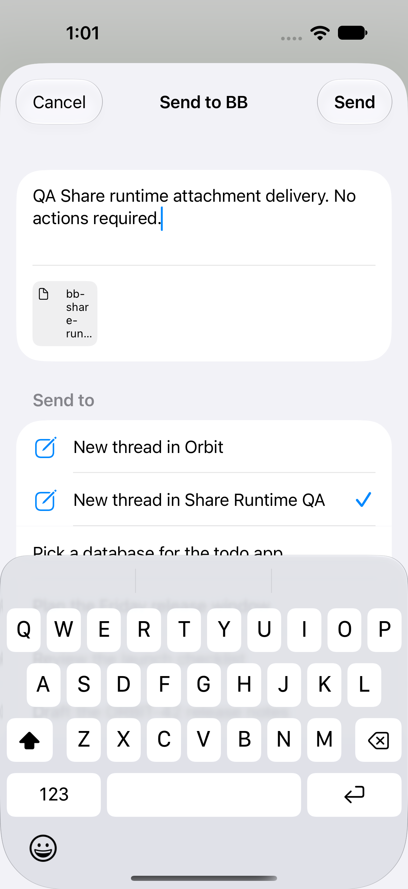
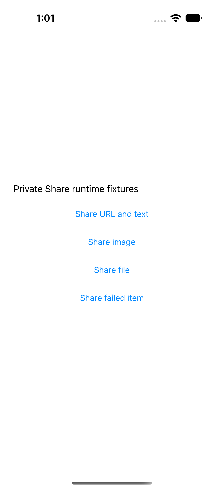

# Share extension runtime verification

The Share extension was exercised through the actual iOS system share sheet in
another signed simulator app on 3 October 2026. This complements the input
recovery and image-bound unit tests in [share-inputs.md](../share-inputs.md).

The private device was created empty with `simctl create`, not copied from a
user device. It ran iPhone 18 Pro / iOS 27.0. Xcode used
`DEVELOPER_DIR=/Applications/Xcode.app/Contents/Developer`. BB's normal app and
embedded Share extension were built with simulator signing enabled. The fixture
host presents `UIActivityViewController`; it does not instantiate ShareModel or
ShareView and does not replace the extension's network transport.

Both global preference domains and the installed app/app-group preference
files were pinned to `http://127.0.0.1:49486` before the first app or extension
launch. XCTest verifies Settings shows that origin before each case. The shared
container retained that staged origin through Xcode's app reinstalls. No default
server restoration or user simulator access occurred.

## Verified cases

- URL and text: the extension receives both the fixture sentence and
  `https://example.com/bb-share-runtime` in its message field.
- Image: the extension displays the blue fixture thumbnail. It now exposes
  `Shared image: <filename>` to VoiceOver and XCTest.
- File: the extension displays `bb-share-runtime-fixture.txt` and exposes
  `Shared file: bb-share-runtime-fixture.txt`.
- Failed file provider: the host registers a real PDF file representation that
  fails when loaded. The extension shows the failed-item section, says nothing
  has been sent, and disables Send while retaining valid text.
- Destination: successful presentation cases select the dedicated staged
  `Share Runtime QA` project, assert the selection, and cancel.

The final labeled build passed **4 presentation tests with no failures**. The
separate Send test passed once; it is skipped by the ordinary harness.
[Presentation summary](presentation-summary.json) records the final results.
The final screenshots and accessibility trees are saved alongside this report:
[URL and text](url-and-text.png), [image](image.png), [file](file.png),
[failed item](failed-item.png), and [system sheet](system-sheet-Share-URL-and-text.png).

The labels fix an accessibility gap found during the live review: the image
thumbnail had no accessible name. Files now have an explicit description too.
The input loader and send logic retain the earlier recovery fixes.

## Actual staged Send

One Send used the real file fixture with this message:

> QA Share runtime attachment delivery. No actions required.

The dedicated project `proj_4a8meviq3r` had no threads before the action. It then
contained exactly one new thread, `thr_p4iwdi4iy5`, with the exact message and one
local-file attachment. The uploaded server file and thread-context file both
contained the exact 40 fixture bytes. Their SHA-256 was
`639f2f89a3a6b26977485110687a460fdc15b82cba2a8541d4114c55d90395b3`.
The thread's assistant acknowledged receipt and took no action. After evidence
export, the QA project and its thread were deleted from the staged server. The
private simulator was shut down and deleted. Other fixtures and simulators
were untouched.

[Send verification](send-verification.json) records those assertions.
[Send test summary](send-summary.json) records the isolated XCTest result.
The Send completed before the descriptive-label change; the final presentation
checks use the rebuilt extension with those labels.





## Repeat the presentation checks

Create a project named `Share Runtime QA` on the staged server at port 49486.
Use that server's registered machine and an empty temporary project directory.
Then run from the repository:

```sh
BB_SHARE_QA_SERVER_URL=http://127.0.0.1:49486 apps/ios/scripts/share-runtime.sh
```

The harness creates a fresh private simulator, builds the normal app and the
fixture host, installs both, pins and verifies both preference domains and
container files, and runs only `ShareRuntimeUITests`. It never runs the existing
UI test suite. It deletes only its own simulator and leaves logs, screenshots,
and its result bundle under the printed temporary directory. The recorded run
used the same commands in separate build and test steps; the wrapper received
a shell syntax check. The ordinary
harness cancels each share. Its optional Send test skips unless the exact
historical QA project ID is explicitly supplied in the xctestrun environment;
that test is evidence for this run, not an instruction to reuse a destination.

The fixture source lives in [fixture-host](fixture-host). An early fixture-host
launch failed because iOS 27 requires scene lifecycle adoption; the host now
uses `UISceneDelegate`. An early failing data-only provider was not offered to
file-sharing extensions. The final fixture uses a declared file representation
and verifies the actual extension failure UI. Selector corrections followed
live accessibility trees. No failed assertion was removed or weakened.

## Remaining boundaries

This proves simulator registration, real extension presentation, provider
handling, destination selection, cancellation, and one file upload/send into a
new staged destination. Physical-device extension memory limits, iCloud or
other cloud-provider file availability, Safari-specific sharing, multiple
attachments, and an actual image Send remain separate checks.
