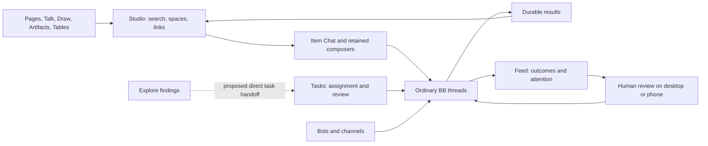

# BB Studio codebase and product review — 2 October 2026

This report records the first review pass. The repair goal remains active;
see the [issue and evidence ledger](review-issues.md) for subsequent fixes and
open verification. The priorities below describe findings at that checkpoint.

BB Studio has a sound foundation for an agent workspace: plugins own durable
items, ordinary BB threads perform the work, Studio connects and searches the
items, and Feed reports outcomes. The shared kit, typed provider contracts,
native thread composers, and stable-release checks are worth preserving.

The largest quality problems found in this review were at boundaries: a save
failed but the item appeared finished; a provider was temporarily unavailable
but its indexed content was treated as deleted; a notification outlived its
original approval; or a phone switched servers while work remained queued.
The review concentrated fixes on those concrete failure paths. It also covered
product fit, all 17 installed plugins, the shared kit, and the native mobile app.
This is a substantial review and repair pass, not evidence that every feature
is bug-free.

Four bounded review lanes covered foundations and interop, content and work
management, native mobile, and product experience. Existing owners handled
channel layouts, drag behavior, settings, and their live verification. Changes
were reviewed and committed separately on main; concurrent work was left intact.

The intended product flow is already largely present:

**What was fixed.** These are behavior changes backed by regressions or live
checks, rather than general cleanup:

| Area | Failure found | Result |
| --- | --- | --- |
| Decisions | An edited queued message could receive an earlier steering decision; a timed-out decision could block subsequent work. | Stale results are discarded and later steering can proceed. |
| Studio search | Changes arriving during initial indexing could be missed. Offline, truncated, or failed provider reads could remove valid content. | Rebuilds and change replay are serialized; incomplete reads preserve searchable content and are retried. |
| Plugin discovery | Failed dynamic discovery could be mistaken for an uninstall, even after restart. | Reconciliation records discovery completeness, keeps affected index rows, coalesces delayed retries, and still removes confirmed uninstalls. |
| Studio references | Composer mention namespaces could become phantom item references. | References resolve to the owning plugin and real item ID. |
| Studio spaces | Explicitly removed inherited membership could return after restart. | The inheritance decision is persisted atomically with membership. |
| Pages | Failed persistence could clear dirty state and strand unsaved edits. | Dirty documents remain pending with bounded automatic retries and unload handling. The editor also has an accessible name, “Page content.” |
| Draw | A failed autosave could drop pending changes. | The latest drawing remains queued; bounded retries, a persistent error, and Retry save support recovery. The status indicator distinguishes failed, pending, and saved changes. |
| Tables | A failed or superseded load could leave the wrong state visible. | Successful loads clear earlier errors and stale responses are ignored. |
| Tasks | Bot handoffs did not consistently enter the normal task/thread lifecycle. | Both handoff paths track working, review, follow-up, and thread reuse with ownership checks. |
| Talk server | Concurrent uploads could collide on temporary audio files. | Each request uses its own temporary file and cleans it up in a finally block. |
| Talk browser | Local audio persistence errors only produced a toast while capture continued. | Capture stops, retains affected chunks including the final chunk, prevents incomplete automatic dictation insertion, and offers retry or download. |
| Feed | Reloading after three 40-post pages exceeded the RPC's 100-post request limit. | Refresh loads bounded cursor pages and ignores superseded requests. |
| Feed attention | Reading an urgent post removed it from Needs you, and older alerts outside the loaded feed were absent. | A separate paginated query includes unresolved alerts regardless of read state, topic, or newer story updates. Explicit Resolve/Reopen changes only resolution. |
| Mobile approvals | An old notification could fall back to a different pending interaction. | Actions require the exact interaction and a permitted decision. |
| Mobile server switching | Queued text, audio, and recording-finish operations could follow the newly selected client. | Queues retain their original server and in-flight requests retain their original client. Unknown legacy origins require explicit recovery. |
| Native Talk persistence | Failed file/metadata writes silently counted as successful handoffs, allowing incomplete recording finalization. | Enqueue preserves source audio until its files commit. Failed and missing handoffs block finalization and dismissal, with explicit retry and microphone cleanup. |
| Mobile push relay | Lookup failures looked like deletions; failed clear pushes lost their retry state; delivery counts included failures. | Transient errors retain tracking, failed clears retry, and counts represent successful unmuted delivery. |
| Mobile navigation | Page links appended to the wrong navigation stack. | Links open in the visible tab. |
| Packaging | CI did not check that the distributed kit matched its source. | CI now runs `check:kit` alongside contract, compatibility, documentation, and marketplace checks. |

The coordinated owners also delivered channel Merged/Grid/Active/Focus views,
drag-to-channel creation without nesting ordinary threads, drag cleanup,
retained Pages conversation composers, Talk model selection, Explore scheduling
controls, and Pages version retention. Those features were already in progress;
they are included in the integration assessment rather than attributed solely
to this review. See the [settings audit](settings-audit.md),
[Teams documentation](../packages/bb-studio-teams/README.md), and
[Pages documentation](../packages/bb-studio-pages/README.md).

New channel messages now keep routing metadata in agent-only context. The
native conversation shows the owner's request. Historical visible envelopes
remain: the current stable `ThreadChat` API has no safe public message-transform
hook. Rewriting stored conversations was deliberately avoided.

**Architecture assessment.** Plugin ownership is mostly clear. The
[provider contract](../packages/bb-studio-kit/src/contract.ts) describes kinds
and capabilities; the [server helpers](../packages/bb-studio-kit/src/server)
connect optional Studio services; the hub owns shared links, activity, spaces,
and search. This lets individual content plugins remain useful without Studio.
Keep these boundaries. Moving all data into the hub would weaken independent
installation and make lifecycle coupling harder to reason about.

The packed kit is a practical response to Git installation running npm inside
one package. The repository correctly distinguishes workspace development from
the distributed tarball. Generated contracts, the marketplace parity check,
exact SDK pins, and stable staging catch different classes of integration
failure; none is redundant.

The next engineering improvements should make these boundaries easier to test:

| Improvement | Why it matters | Completion criterion |
| --- | --- | --- |
| Reusable provider conformance tests | Providers implement the same list/get/read/change behavior, but failure semantics must remain consistent. | Run one fixture suite against each provider: deletion, truncated snapshots, disabled/offline states, changed IDs, and installation without Studio. |
| Explicit provider result states | An empty result can mean missing content or an unavailable provider. Search now guards that distinction separately. | One internal availability/completeness/data result shared by the hub and picker index; retain their different storage and retention policies. |
| Targeted background search recovery | Repairing one provider can currently list all providers on an interactive search. | Coalesced provider-specific retries, freshness indicators, and pagination for truncated provider listings. |
| A shared persistence-state pattern | Pages, Draw, browser Talk, and native Talk all need honest saved/pending/failed states. Their storage engines differ. | Shared behavioral requirements and fault tests; each implementation preserves work, exposes retry, and blocks false completion. Avoid forcing Yjs, IndexedDB, and files into one storage abstraction. |
| Shared reference parsing | Mention IDs, item links, plugin IDs, and route IDs meet in several plugins. | One canonical conversion contract in the kit, with compatibility cases for older links and provider-defined namespaces. |
| Smaller host adapters | Reactions and workbench-related UI have host DOM and registration dependencies. | Keep those dependencies in thin adapters with supported SDK APIs and stable-BB integration tests, separate from product state. |
| Mobile contract coverage | Generated Swift contracts cover many providers; Feed's native integration is still handwritten. | Document every handwritten endpoint and add generation or parity checks for the gaps. |

**Product assessment.** The suite already has enough major surfaces. The next
step is a shorter, more legible path through them. Retained composers are a
particularly useful choice: people can inspect an item, draft a request, switch
views, and return without rebuilding their context. Channels being views of
ordinary threads also avoids a second execution model. Preserve both.

Add the following in priority order. These are remaining work, not features
claimed by this patch series:

| Priority | Next change | User outcome and acceptance test |
| --- | --- | --- |
| P1 | Namespace ordinary mobile caches, drafts, widget snapshots, and share destinations by server. | Switching from A to B while offline never shows A's cached content or restores A's draft into B. Capture the origin for in-flight cache writes; do not guess legacy origins. Relevant code: `Shared/AppGroup.swift`, `Thread/Drafts.swift`, Work widget, share extension. |
| P1 | Complete the device failure matrix. | Physical iPhone interruption/background/low-storage recording, APNs action and clear, server switch during upload, share extension, VoiceOver, and large Dynamic Type all have recorded pass/fail results. Simulator and relay tests do not prove these behaviors. |
| P2 | Turn an Explore finding into a linked Task with one explicit action. | Repeated activation creates one task; its source, project, and space remain attached; the task follows its agent thread to review and its resulting item. Make Tasks an optional capability. |
| P2 | Expose Feed search, unread and date filters, and preserve reader position. | Find an older result without scrolling through every story, then return from its discussion to the same context. The list RPC already supports these filters. |
| P2 | Add pagination to the Tables agent tool. | An agent can traverse a table larger than 100 rows without filtering tricks. `tables_query` currently slices to 100 with no cursor; the separate RPC limit does not solve tool access. |
| P2 | Consolidate Reactions configuration and apply feedback. | One understandable editor, clear saved/applied/error states, and no risk of leaving the plugin disabled after a failed refresh. The current custom editor overlaps host settings and uses a disable/enable cycle. |
| P2 | Add durable recovery for browser editor drafts where appropriate. | Closing or crashing with unsaved Draw edits or native page drafts can be recovered on return. The new in-memory retries and unload warnings improve recovery but do not make volatile memory durable. |

Remove duplicated choices and hidden state before removing whole plugins.
Consolidate duplicate settings controls, keep navigation adapters thin, and
stop exposing transport metadata as conversation text. Avoid another generic
inbox: Studio Home already aggregates work that needs attention, Tasks owns
assignment and review, and Feed owns reports and their resolution. These can
share links and actions while retaining their distinct purpose. No whole
plugin was removed on the basis of this review; usage evidence would be needed
to justify that decision.

**Coverage.** Every installed plugin had a source/configuration review and a
rendered stable-BB surface check. Depth varied; a screenshot proves the seeded
workflow rendered, not that every interaction is correct.

| Component | Review and verification emphasis |
| --- | --- |
| Studio + kit | Provider lifecycle, references, search reconciliation, space inheritance, contracts, distribution; live collection and space filter. |
| Pages | Persistence failures, editor accessibility, retained companion integration; live document, desktop/phone companion and restored draft/file checks. |
| Draw | Save queue and recovery; real canvas edit, blocked save RPC, retry, and full reload. |
| Artifacts | Store/import/content/link tests and source sampling; rendered collection and file preview. No exhaustive binary-format or large-file audit. |
| Talk | Browser outbox, upload concurrency, model routing; live recording/settings surface and phone-width model settings. No physical microphone/quota test. |
| Tasks | Bot and ordinary-thread handoff lifecycle, ownership and review; rendered board. |
| Tables | Load recovery, row store and tool contract; rendered typed table. Large-table performance remains unmeasured. |
| Chat | Item/thread linking and retained composer integration; rendered item chat and coordinated companion checks. |
| Explore | Finding/explainer flow, digest scheduling and timeout controls; rendered findings and settings. |
| Feed | Cursor limits, read/resolved semantics, stories and discussions; rendered feed and unread behavior. |
| Teams | Routing context, ordinary-thread membership, four layouts and drafts; owner-run stable desktop and mobile checks. |
| Float | Native drag lifecycle, cancellation, successful drops and companion retention; owner-run stable checks. |
| Sidebar | Thread projection, nesting choice and channel drag integration; rendered thread list and project dialog. |
| Navigation | Row filtering and shared navigation ownership; rendered sidebar. |
| Reactions | Configuration, quoting and registration; rendered ordinary and smart reactions. |
| Decisions | Queue steering races/timeouts, model choice/fallback; rendered settings and contract tests. |
| Mobile relay | Notification origin, action targeting, delivery and clear retry; rendered settings and mocked APNs regressions. |
| Native iOS | Networking, reconnects, navigation, notifications, queues, Page editor, settings; simulator build/unit tests. Share flow, Watch transport and Work widget source sampled; their complete runtime/UI was not exercised. |

The baseline capture sweep used a separate stable BB with deterministic demo
data, never the user's working projects. Captures covered collection/editor,
settings, navigation and thread surfaces. Three capture-harness assumptions
were corrected: selecting a visible project dialog, seeding the asserted Studio
space, and counting fixture unread posts independently of existing demo posts.
Assertions were strengthened to check actual data rather than weakened to
accept blank screens.

Draw's focused failure test at pushed revision `0378242` created a real rectangle,
blocked only `saveDrawing`, observed the persistent error while the server still
had zero elements, restored requests, clicked Retry save, and reloaded. The
server and the reloaded canvas both retained the same rectangle. The failed
save indicator was also checked for its red error state.

The same pushed checkpoint passed Feed's live attention test: an urgent alert
behind 41 newer ordinary posts remained visible in Needs you. Opening it marked
it read without dismissing it. Resolve removed it from attention; Reopen
restored it while preserving its read state. Assertions checked both the
rendered interface and stored state.

The final plugin checkpoint passed **1,428 tests across 194 test files**, all
package typechecks, and all plugin builds. `pnpm check` also passed stable SDK
compatibility, README screenshot checks, marketplace/index parity, generated
contracts, and packed-kit freshness. The catalog has 17 installed plugins plus
the shared kit; the compatibility script counts all 18 package manifests. The
stable host was BB 0.45.0 with SDK 0.6.15; no plugin SDK floor was raised.

The iOS simulator build and unit suite executed **33 tests, with one skipped
and zero failures**. New tests exercise stale interaction targeting, server
identity, queue isolation, legacy recovery, server switches during delivery,
and real-file audio persistence failures. Notification follow-up notices retain
their original server identity as well.

The relay and app changes must be deployed together. Old notifications without
a server identity require manual review in the app. Legacy queued messages
require explicit Retry after selecting their original server; legacy audio
requires Settings → Older recordings → Resume older uploads. No notifications
were sent to real devices as part of verification.

Remaining verification limits are material: no complete physical-device APNs,
Watch pairing, share-extension runtime, VoiceOver/Dynamic Type, battery, memory,
or large-library performance audit was performed. Browser Talk storage faults
used controller/outbox regressions rather than real microphone quota exhaustion.
Volatile browser audio recovery requires keeping its window open or downloading
the audio. Native enqueue recovery preserves source files and blocks false
completion, but crash-time orphan discovery is not a complete recovery system.
