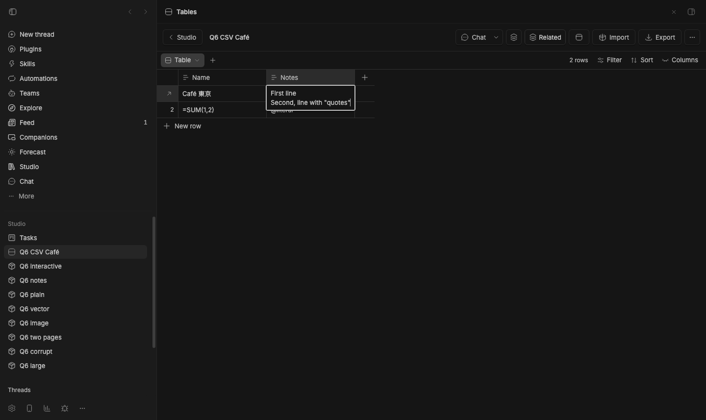
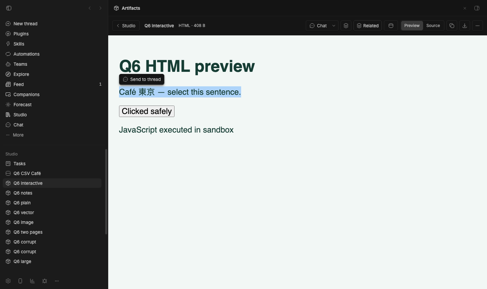
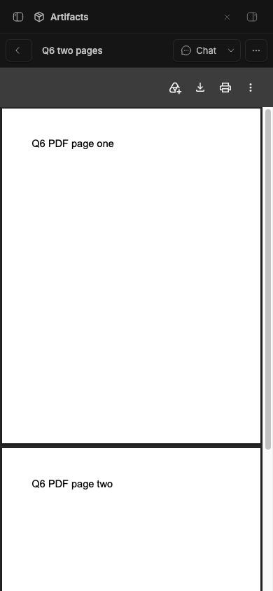
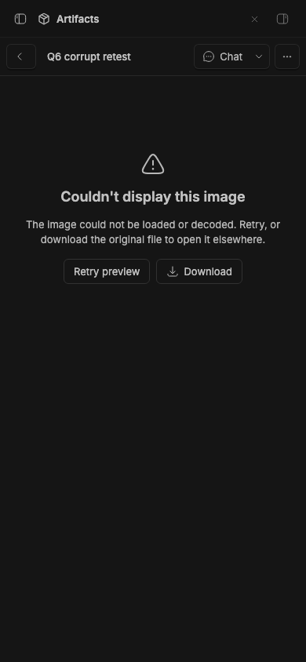
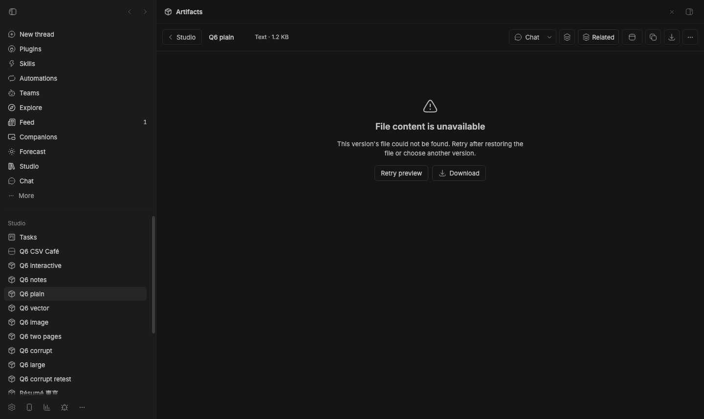

# Live import and preview verification

Normal stable BB, isolated data at `/tmp/bb-studio-goal-staged`, server 49486,
private Chromium on 49529. Tables was installed from published `371d367` after
checking `origin/main`. Initial Artifacts was `7fc47113697e53eeb2af38b47a292a8aec722f07`.
Every item and file used here is a deterministic QA fixture.

## CSV picker and actual download

The native Import button was clicked with browser mouse events. CDP intercepted
the resulting file chooser and supplied the real `fixtures/bom-multiline.csv`
file, exercising `File.text()` and the UI's import handler. This was not a
direct `importCsv` RPC substitute.

The BOM-prefixed quoted header matched the existing Name column. Two rows
imported with no quoted duplicate column. Double-clicking the Notes cell opened
its real textarea with both lines, comma and embedded quotes intact. The
browser normalizes textarea line endings to LF; persisted data and CSV export
retain CRLF. `table-verification.json` and `interaction-verification.json`
record these checks.

The actual Export button downloaded `Q6 CSV Café.csv` to disk. The retained
`exported.csv` is the 99-byte download, including the quoted multiline value,
Unicode, `=SUM(1,2)` and `@literal`. Formula-like values stayed literal in Tables;
this does not test spreadsheet applications' interpretation of the export.

## Live artifact previews

`artifact-verification.json` records the rendered host, image decode dimensions,
iframe attributes and viewport bounds. Desktop and 390×844 captures cover:

- Markdown headings, Unicode, lists, link and code block.
- Plain text with Unicode and a long wrapped line. The source viewer uses a
  shadow root; assertions inspect that rendered root, not an empty outer DOM.
- PNG and SVG decoding at 960×480. PNG fits to 366px on the compact viewport,
  switches to actual size with internal scrolling, then fits again.
- Sandboxed HTML with `allow-scripts`. The screenshot shows its executed script
  and a real button click changing the label to “Clicked safely”. Real mouse
  selection crosses the iframe boundary and opens the quote card with the exact
  selected Unicode text. The quote card was cancelled; delivery to an agent
  thread was not exercised.
- A valid two-page PDF in Chromium's actual PDF viewer. Wheel scrolling reaches
  page two; the compact capture visibly contains both pages. This is browser
  PDF rendering, not native Quick Look or exhaustive PDF compatibility.
- A malformed PDF with a PDF signature shows Chromium's “Failed to load PDF
  document” message and Reload button.

Large text shows the truncation notice on desktop and compact views. Its actual
browser download contains all 2,375,029 bytes and the final `DOWNLOAD END Q6`
marker. A separate artifact downloads as `Résumé 東京.txt` with its exact
45 UTF-8 bytes. JSON records these actual disk reads.

Deleting a fixture and reopening its URL shows “This artifact was deleted” and
returns to the collection. No stale viewer remains.

## Failure regressions discovered

1. A corrupt PNG finished decoding with `naturalWidth: 0` but showed only the
   broken-image icon and filename. It still advertised zoom/area selection and
   provided no visible failure/retry state.
2. Removing the unique blob belonging to the owned text fixture made the real
   text RPC return `{text:null,truncated:false}`. The viewer silently showed an
   empty source area. The exact original blob was restored in `finally`.

`corrupt-image-original.json`, `missing-text-verification.json` and their
screenshots preserve these failures. Root repaired both in Artifacts `1a1981e`;
the final staged retest passed:

- Corrupt images show an honest error, Retry preview and Download at desktop
  and 390px. Retry continues to show the error for corrupt bytes, and the
  downloaded original remains exactly 12 bytes.
- Blocking only the valid PNG's content request in this private browser causes
  the same error. Unblocking it and clicking Retry preview decodes the image
  at 960×480 without navigating away. This is a browser transport failure,
  not a server-storage failure.
- Removing the owned text blob now shows “File content is unavailable” with
  Retry preview. Restoring its original bytes and clicking Retry renders the
  normal preview without a page reload.

`final-image.json`, `final-text-missing.json` and `final-text-retry.json`
record these checks. The original failures remain alongside the fixed captures.

## Boundaries and helper

`scripts/capture/verify-import-preview.mjs` provides real chooser interception,
completed-download disk reads and viewport captures. Callers wait for expected
content after responsive remounts before capturing. These checks do not cover
all file formats, native Quick Look, external spreadsheet execution, browser
printing, PDF editing, or final delivery of the HTML quote to an agent.

`cleanup.json` records removal of all owned tables/artifacts, restored blob
bytes, cleared browser request blocking, and closure/removal of the private
browser profile. The shared isolated stage remains running with Tables
`371d367` and Artifacts `1a1981e` enabled.
