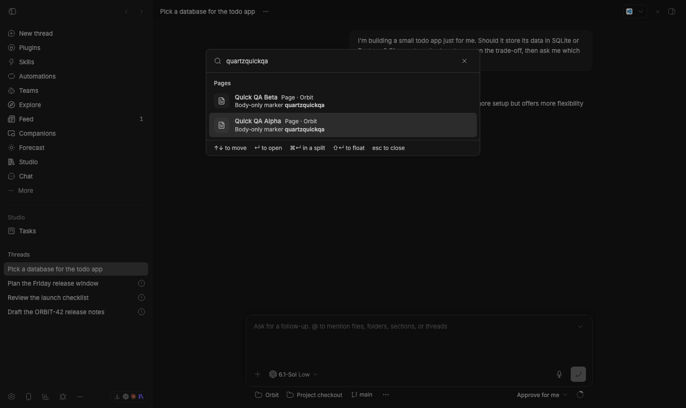
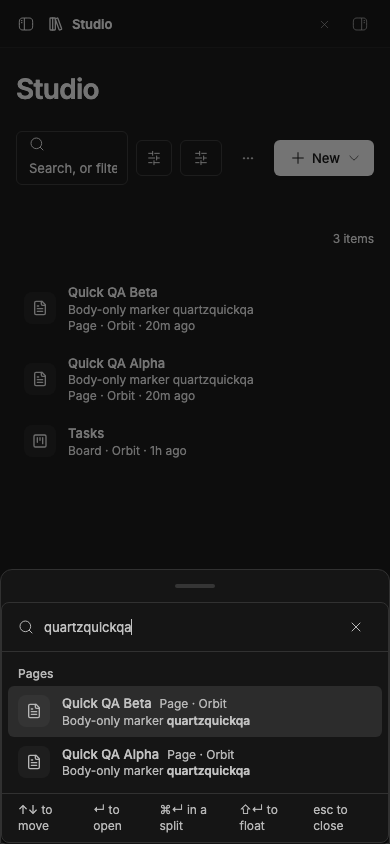
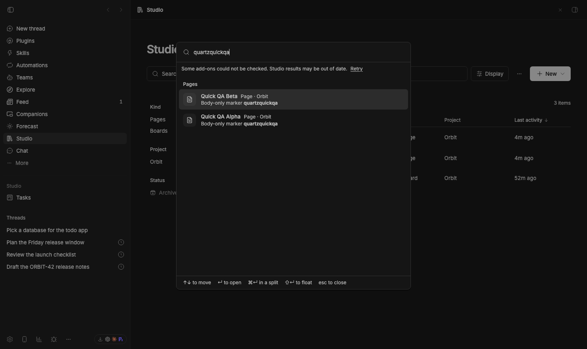
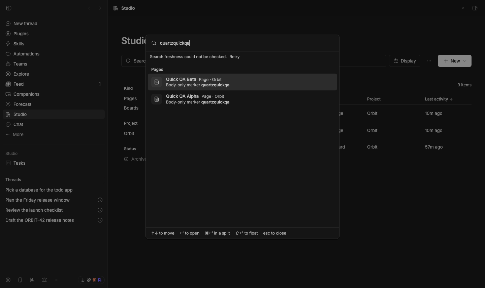

# Search freshness and keyboard verification

Captured in the normal stable BB application at isolated `127.0.0.1:49486`,
using a private Chromium profile on port 49529. No production data was used.
Two temporary Pages contain the body-only marker `quartzquickqa`; neither
title contains that marker. Captures span October 2–3, 2026 local time.

## Final verification at Studio 6c5e012

`final-verification.json`, `final-focus-verification.json` and
`final-mobile-verification.json` repeat the checks below after the focus guard
fix. All pass. Provider re-enable keeps focus in Search Studio, direct
`composer.focus()` is contained, and ArrowDown selects the next arriving result
without manual refocus. Tab/Shift+Tab, Escape focus restoration, automatic
provider removal/return, and the 390px layout pass again.

## Intermediate verification at Studio 653b2cb

`fixed-verification.json` records actual browser keyboard events and staged CLI
provider lifecycle operations. No `studio_changed` calls occurred in this run.

- Cmd+Shift+K opens Quick Open and focuses its input. Tab and Shift+Tab cycle
  between the input and Close search. Escape from Close search closes the
  dialog and restores focus to the original native thread composer.
- Disabling Pages removes both indexed body matches automatically, within the
  15-second observation bound. Search RPC returns an empty list and the dialog
  says “No matches.” Enabling Pages restores both matches automatically.
- ArrowDown and ArrowUp with no results leave no active descendant. When the
  results arrive, option 0 is selected with a valid ID. Refocusing the input
  and ArrowDown selects option 1.
- At a 390×844 viewport the responsive bottom sheet, close control and both
  body matches fit without horizontal document overflow (`mobile-verification.json`).

**Focus regression fixed in 6c5e012:** twice, enabling Pages moved focus from the open
dialog to the native thread composer. The dialog and results remained visible.
The JSON records `reenabled.inside: false` and an explicit input refocus before
the final arrow assertion. This is not presented as uninterrupted focus
containment during plugin lifecycle changes; root was notified.
`focus-diagnosis.json` narrows this further: at a 1440px desktop viewport,
directly focusing the underlying native composer also escapes the Radix
dialog. The only other dialog is a hidden, aria-hidden composer menu.

## Real failure states at Studio 3979fe1

`freshness-verification.json` records staged server failures, not substituted
frontend responses. Faults were injected into installed staged bundles; every
bundle was restored byte-for-byte and reloaded in `finally` cleanup.

- Throwing from Pages `studio_read` for just the two fixtures keeps both cached
  body matches, shows an incomplete-search warning, and provides Retry.
  Restoring the provider and keyboard-activating Retry clears the warning.
- Rejecting the server's `experimental_discoverRpc` call keeps cached matches
  and shows “Some add-ons could not be checked.” Restoration recovers current
  status. This exercises an actual discovery-call failure, not total network
  disconnection.
- Throwing from the `searchStatus` handler leaves cached matches visible and
  shows “Search freshness could not be checked.” Restoring it clears the
  warning. `helper-verification.json` proves the reusable capture helper also
  exercised this real fault and waited for indexed body snippets, not recent
  title-only results.

Old regression evidence is intentionally retained: at 3979fe1, Tab escaped the
modal and Escape then failed; ArrowDown on zero rows produced a NaN active
descendant when results arrived; normal provider disable left stale matches
until explicit reconciliation. The 653b2cb run above verifies the respective
fixes without weakening the old assertions.

## Reactions right-click boundary

At Reactions 38f64b5, the native settings UI applied the selection-menu toggle
off and on through Reload window to apply. A real mouse drag selected assistant
text, then a right-button event reached that paragraph with
`defaultPrevented: false`. No page-DOM menu was created. The normal selection
toolbar showed its reaction icons after the setting was restored on.

`reactions-selected-context.json` and its screenshot preserve this observation.
The browser-native context menu is outside the page DOM in this headless web
surface; these captures do **not** verify reaction entries in the native desktop
shell's right-click menu. That coverage remains open.

## Reproduction helper

`scripts/capture/verify-search-freshness.mjs` exports guarded staged-bundle
fault injection, native keyboard input, and cached-result/warning capture.
Source the owned stage's `capture.env` first. Fault injection requires an
exactly-once source anchor and a managed plugin path inside the staged data
directory. It restores the original bytes and reloads even if verification
throws. The search fixture query must occur in indexed body text, because the
helper deliberately waits for that snippet before accepting the results.

## Cleanup

`cleanup.json` records deletion of the two owned fixture Pages, restored Pages
bundle bytes, enabled Pages, and Studio left at 6c5e012. The private browser and
its temporary profile were removed. Reactions' selection setting was restored
on; the shared isolated stage remains running for the coordinator.
