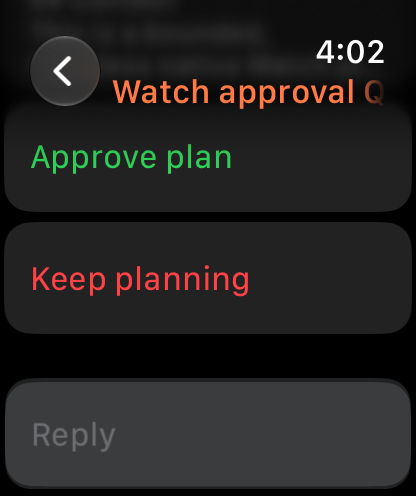
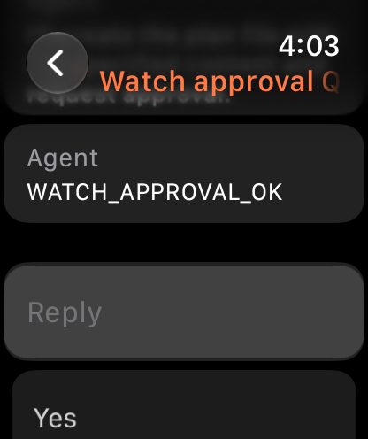
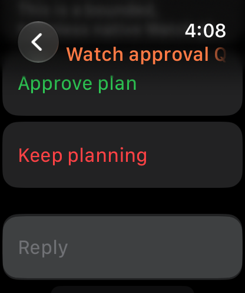
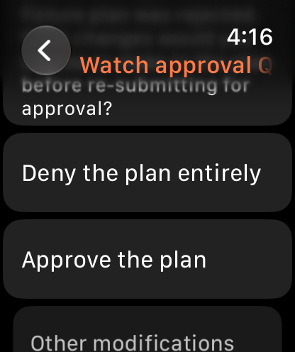

# Watch plan approval through the phone relay

Live verification on 3 October 2026. Production Watch source was unchanged. The private simulator build passed.

## Isolation

Used a dedicated iPhone 18 Pro and Apple Watch Series 12 (46 mm) pair on iOS 27 and watchOS 27. The private app snapshot came from commit `ea82c0fb72a5ce05ae06ce5f00e991f5893d631e`. Both fallback server URLs pointed to `http://127.0.0.1:49486`. A private `BBClient.init` guard rejected every other origin.

The first unsigned install did not register app-group containers. Rebuilt the private snapshot with simulator signing enabled (`CODE_SIGNING_ALLOWED=YES CODE_SIGN_IDENTITY=-`). The build passed. Before either app launched, read back the app and app-group preferences **and their actual container plists** on both devices. All four domains pointed to the staged origin. See [isolation.json](isolation.json).

Only staged fixture `thr_yh9925ram6`, **Watch approval QA 0700**, received test decisions. Its normal Claude Code provider used `claude-haiku-4-5-20251001` with low reasoning. [The fixture prompt](fixture-prompt.txt) allowed only a fixed text response after approval. No fabricated database interaction, permission grant, command approval, network action, or existing user thread was used.

## Actual Watch approval

1. The provider created plan approval `pint_7bjp22w22e`. Its only decisions were `allow_once` and `deny`. The plan permitted only `WATCH_APPROVAL_OK`, with no tools, files, commands, network access, or messages. See [the exact interaction](interaction-before.json) and [the immediate pre-tap readback](interaction-immediately-before-tap.json).
2. Tapped **Approve plan** on the actual Watch UI. The production WatchConnectivity path relayed the decision through the real companion app. The same server interaction resolved to `allow_once`, with `grantedPermissions: null`. See [interaction-resolved.json](interaction-resolved.json).
3. The plan controls disappeared, and [the pending list](interaction-after.json) became empty. The provider returned exactly `WATCH_APPROVAL_OK`. See [the provider timeline](timeline-first.json) and [native UI labels](ui-after.json).

| Pending plan | Approved result |
|---|---|
|  |  |

## Stale settled decision

Created a second real provider plan approval in the same owned thread, `pint_7ffsz5e9wj`. While it was pending, replayed `deny` through the public HTTP resolve endpoint against the **first settled interaction ID**.

The server returned **409**, `Pending interaction pint_7bjp22w22e is already resolved`. The first interaction retained its `allow_once` resolution, and the second pending interaction remained byte-for-byte unchanged. See [stale-decision-replay.json](stale-decision-replay.json).

This replay tested the HTTP boundary directly. It was not a stale Watch tap: the Watch had removed the first plan controls. The second inert fixture was also held for a separate read-only accessibility and navigation check.

## Actual Watch denial

After the accessibility lane released the unchanged second fixture, re-read its full payload and tapped **Keep planning** on the actual Watch. The same interaction resolved to `deny`. See [the pre-tap record](second-interaction-immediately-before-tap.json) and [second-interaction-resolved.json](second-interaction-resolved.json).

The plan approval controls disappeared. The provider then invoked `AskUserQuestion` to ask what plan changes were wanted, rather than returning the requested `WATCH_APPROVAL_DENIED`. [The timeline](timeline-final.json), [pending question](pending-after-denial.json), and [native UI labels](ui-after-denial.json) show that bounded outcome. This verifies the denial relay; it does not establish the requested fixed denial response.

| Second plan | After denial |
|---|---|
|  |  |

No further provider prompt or answer was sent. Stopped the owned fixture; its new question became `interrupted` and the pending list cleared. See [followup-question-after-stop.json](followup-question-after-stop.json) and [pending-after-stop.json](pending-after-stop.json).

## Scope

This verifies a genuine provider plan approval in Simulator. It does not verify command approvals, file-change approvals, permission grants, offline submission, or physical Watch hardware.

The provider created its normal plan file despite the prompt asking for no files. [The original plan](provider-created-plan.md), [the second plan](second-provider-created-plan.md), and [the ownership record](plan-file-ownership.json) document this. Cleanup removed the file only after its exact content and SHA-256 matched the owned fixture.

## Cleanup

Deleted only the dedicated staged thread; its endpoint then returned 404. Shut down, unpaired, and deleted both owned simulators. Their device and pair IDs were confirmed absent. The matching provider-created plan file was also removed. See [cleanup.json](cleanup.json).

No production source edits, package changes, global Xcode changes, or actions on user devices or production threads were made. The evidence commit contains only this directory.
