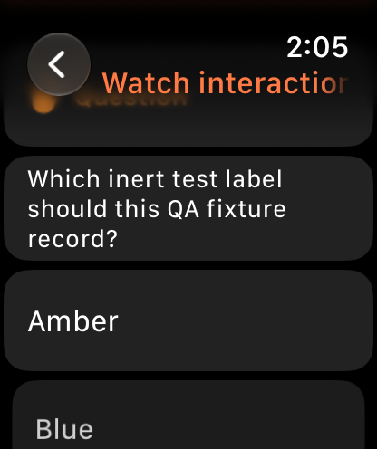
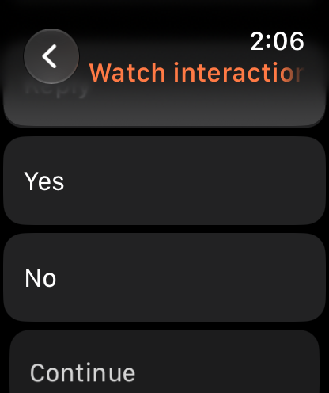
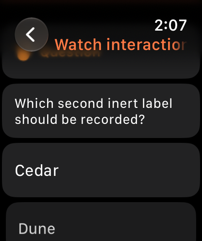
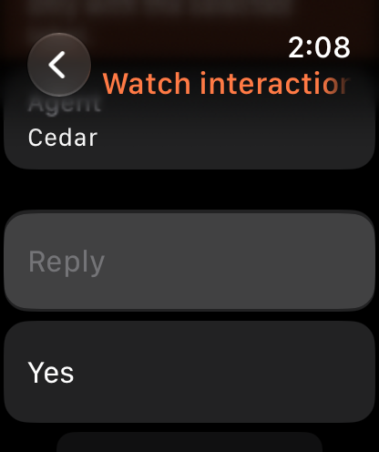

# Watch question resolution through the phone relay

Live verification on 2026-10-03, approximately 06:01–06:10 UTC. Production Watch source was unchanged. The private app build passed.

## Isolation

Created a fresh empty iPhone 18 Pro + Apple Watch Series 12 (46 mm) pair on iOS 27 / watchOS 27. Built a private committed source snapshot with **both** fallback server URLs set to `http://127.0.0.1:49486` and a `BBClient.init` precondition rejecting every other origin. Read back app and app-group server preferences on both devices before launch. [Isolation record](isolation.json) includes source commit, device IDs and the four domains.

Only new staged thread `thr_6m3rpejbdv`, **Watch interaction QA 0601**, was opened or acted on. Its normal Claude Code provider (`claude-haiku-4-5-20251001`, low reasoning) was instructed to invoke only `AskUserQuestion` with two inert label choices, then return the selected label. No database fixtures, custom provider, shell approvals, external actions or existing user threads were involved.

## Actual Watch resolutions

1. The provider created pending question `pint_phkmzii7uz` with **Amber / Blue** choices. Captured its exact question and option IDs in [interaction-before.json](interaction-before.json).
2. Tapped **Amber** on the actual Watch UI. The production WatchConnectivity relay resolved that same interaction. Its server record shows `status: resolved`, `kind: user_answer`, and the exact first option value under the original question ID. See [interaction-resolved.json](interaction-resolved.json).
3. The question controls disappeared and the pending list became empty. The provider returned `Amber`. See [pending list afterward](interaction-after.json) and [timeline-first.json](timeline-first.json).
4. Requested a second normal provider question, **Cedar / Dune**, in the same fixture. After the stale-request check below, tapped **Cedar** on the Watch. Its distinct interaction `pint_evvqb4df99` resolved to the correct question/option IDs. The provider returned `Cedar`; no interactions remained pending. See [final-resolution.json](final-resolution.json) and [final UI labels](final-ui-labels.json).

| Before | After |
|---|---|
|  |  |
|  |  |

## Stale settled choice

While the second interaction was pending, replayed a normal HTTP resolve request against the **first settled interaction ID**, selecting its alternate Blue option. The server returned **409**, `Pending interaction pint_phkmzii7uz is already resolved`. The second pending interaction was byte-for-byte unchanged, and the first retained its Amber resolution.

[stale-choice-replay.json](stale-choice-replay.json) records the exact path, request body, error and before/after objects. This replay exercised the public server boundary directly; it was not a stale Watch tap, since the Watch had already removed the first question's controls. Both successful answers were actual Watch UI actions through the real phone relay.

## Limits and cleanup

This verifies single-choice native provider questions. It does not verify approval decisions, permission grants, plugin-rendered forms, free-text or multi-select questions, cancellation, offline interaction submission, or physical hardware. No harmless SDK approval fixture was introduced in this bounded run; approval-specific payloads remain a separate test case.

Only the dedicated staged fixture was deleted. Its endpoint then returned 404. Both owned devices were shut down, unpaired and deleted; IDs were confirmed absent. See [cleanup.json](cleanup.json). No production source edits, commits, pushes, package changes or global Xcode changes were made.
