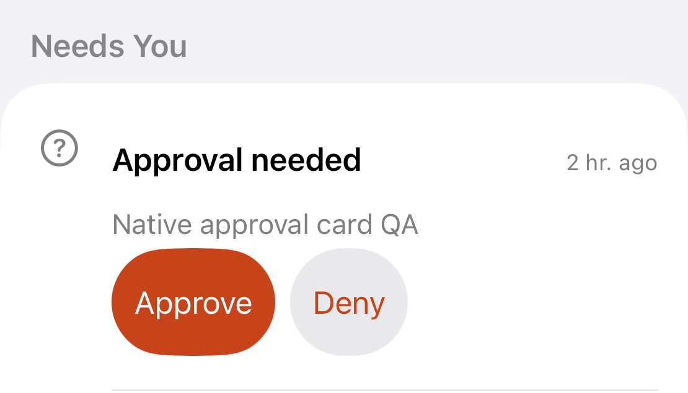
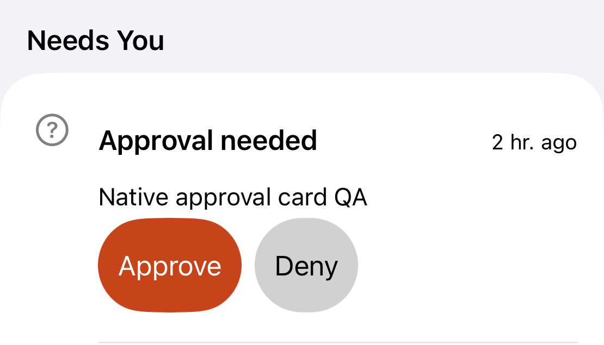

# Native audit policy evidence

This is interim evidence, not a passing full-suite report. The coordinator
approved specific native contrast exclusions. Every other native finding still
fails the test; no exclusion uses a test name as its condition.

| Test / capture | Element | Reason | Evidence |
| --- | --- | --- | --- |
| `testStudioRowContrastNativeDiagnosticAtAccessibilityText` | `studioSelect`, label Select, inside the navigation bar | Policy 3: rendered contrast independently exceeds 4.5:1 | [Element screenshot](select-contrast.png); sampled sRGB foreground 0, background 249, ratio **19.9461:1**; frame `(310.3333, 66, 71.6667, 36)` |
| `testNavigationAtDefaultText`, note screen | `captureNoteSave` | Policy 1: identifier matches and `isEnabled == false` | [Disabled-note screenshot](disabled-note.png); frame `(23.3632, 447.6733, 355.2736, 48.3300)` |

The runtime pixel sampler converts the control screenshot to sRGB and excludes
the outer 10% on each axis to avoid its glass border/shadow. It requires at least
5% opaque dark pixels and 40% opaque light pixels. It compares the median dark
foreground's WCAG luminance with the lower fifth percentile of the light
background. Insufficient samples fail closed. The coordinator extended policy 3
to any resolved element; the RGB implementation also measures tinted toolbar
labels. Regression checks reject low-contrast gray, brown text on gray, and a
lone dark pixel. Every accepted finding retains its crop, RGB values and ratio.

Policy 2 covers only resolved elements whose original queried frame intersects a
queried native bar or lies below the bottom bar's top. The test scrolls the same
element wholly clear of the bars and audits contrast again. The same element
must no longer fail; any frameless retry finding also prevents the exception.
Initial/retry results, original and clear frames, native bar frames, and both
screenshots are retained. Truly nil findings remain failures. No guessed region,
private API, or test-name-only exclusion is used.

The Home labels required a product change, not an exclusion: their icons and
wrapped text now have separate layout space. The strict native text-clipping
test passes. These screenshots are exact crops `(48,453,1158,1400)` from the
before/after native screenshots, with no other pixel changes.

| Before | After |
| --- | --- |
|  |  |

Runs:

- `/tmp/office-audit-policy/results.xcresult`: sampler and strict Home clipping
  tests pass; Studio contrast still fails on a separate, unsuppressed material
  finding after verifying Select.
- `/tmp/office-audit-navigation/results.xcresult`: the disabled-note exclusion
  is exercised; navigation still fails on the remaining audit findings.
- `/tmp/office-contrast-sampler/results.xcresult`: final sampler regression check.

The final report must record the exclusions from the final full run, including
its actual ratios and screenshot paths; these intermediate values do not prove
that run passed.

## Semantic controls and independent OCR

The coordinator approved semantic label colors for Settings section headers,
primary semibold SpaceMark text on tertiarySystemFill, and Large Content Viewer
support for fixed Capture, Studio Select and Space switcher toolbar controls.
Standard and secondary headers still rendered too faint in iOS 27; explicit
`UIColor.label` cleared the header findings away from native material edges.
The fixed controls require a verified Large Content Viewer gesture before any
dynamic-type exception can be applied. The test captures the actual overlay
during a four-second long press and requires exact readable text at confidence
>= 0.95 with glyph height at least 1.25 times the original.

The new OCR evidence test recognizes Capture labels independently at default and
accessibility XXXL sizes. It disables language correction, supplies no expected
words to Vision, requires exact text without ellipses at confidence >= 0.95, and
maps recognized glyph bounds into the containing control's exact screen frame.
It retains label and whole-control crops. The extra AX label-box containment
check allows only 1/1024 point for Float32/CGFloat conversion noise; the glyph
containment proof has no tolerance. An identified Capture clipping finding is resolved only after this proof passes
at both sizes and again for that control in its current viewport.

The [Space mark crop](space-mark-contrast.png) comes from the real screenshot at
queried frame `(132.6667, 74, 20, 20)` in
`/tmp/office-semantic-contrast/results.xcresult`. Its black text against approximately
RGB(228,228,230) measures about 16.5:1. The runtime sampler records its own more
conservative value whenever that exclusion is actually exercised.

Focused validation:

- `/tmp/office-controls-proof/results.xcresult`: Home contrast passes. The request
  body originally intersected the tab bar, then disappeared from the contrast
  audit after scrolling. The only retry finding was SpaceMark, independently
  verified at **17.2969:1** (foreground 0, background 233). See the
  [before](home-material-before.png), [after](home-material-after.png),
  [runtime SpaceMark crop](space-mark-runtime.png), and
  [initial/retry result record](home-material-reaudit.txt).
- The same run keeps Settings contrast failing: Threads/Plugins remain at the
  upper system material edge. No broad exclusion was added for those findings.
- `/tmp/office-verified-controls/results.xcresult`: the sampler's black/white,
  low-contrast gray and sparse-dark-pixel rejection checks pass.
- `/tmp/office-ocr-visible/results.xcresult`: the Capture OCR test passes for all
  four reported labels at both default and accessibility XXXL. Every recognized
  line has confidence **1.0**, exact text, no ellipsis and glyph bounds inside its
  control. [Retained label/control crops and observation records](capture-ocr/)
  include the New thread control scrolled fully into view. The previous helper
  stopped when a partly visible control was hittable; it now requires the whole
  control to be visible before taking evidence.

## Request semantics, toolbar viewers and Settings scaling

The coordinator-approved request changes combine title, body and timestamp into
one opening button. Action buttons remain separate. Semantic label colors and a
primary tint on the bordered secondary action remove real contrast findings.
Titles have no line cap; the intentional body preview remains three lines at
default sizes and uncapped at accessibility sizes. Decorative Face text is
hidden from accessibility, while the outer image retains the bot name/state.
SpaceMark uses tertiarySystemFill; Face keeps its original secondarySystemFill.
Recent item icons scale with text so their fixed width cannot overlap titles.

The following crops use the same rectangle `(48,805,1158,1440)` from native
screenshots, without other pixel changes:

| Before | After |
| --- | --- |
|  |  |

`/tmp/office-grouped-request/results.xcresult` passes all four default/XXXL Inbox
and plan tests, including separate 44-point action targets and opening the
request thread without deciding it. Its navigation audit confirms the body,
timestamp and secondary action findings are gone; unrelated findings still
fail. `/tmp/office-review-proof-2/results.xcresult` supplies the before screenshot.

`/tmp/office-review-proof-2` verifies all four Large Content Viewer gestures:
Capture Back, Capture Close, Studio Select and the Personal Space switcher.
The same run passes the Capture clipping test with exact OCR proof at both sizes.

The coordinator also approved independent evidence for four reported Settings
Dynamic Type findings. `/tmp/office-settings-growth/results.xcresult` verifies
exact OCR text, confidence >= 0.95, glyph bounds inside each row and growth >=
1.25x. [All label/control crops and OCR records](settings-scaling/) are retained.

| Settings label | Default glyph height (pt) | XXXL glyph height (pt) | Growth |
| --- | ---: | ---: | ---: |
| Keep Mac awake | 15.0860 | 49.4527 | 3.28x |
| Threads at once | 13.1183 | 40.4455 | 3.08x |
| Configured limit | 15.5889 | 51.7902 | 3.32x |
| Patrick's MegaMac | 14.7146 | 41.7199 | 2.84x |

These findings are resolved only after the current run reproduces the proof.
The exact host label is discovered from the staged Settings host row.

## Negative body-cap experiment

The title cap was removed permanently, as approved. Native Home clipping still
fails in `/tmp/office-title-uncapped/results.xcresult`. In the experiment build
`/tmp/office-body-uncapped/results.xcresult`, the only further source change was
removing the request body's `.lineLimit(dynamicTypeSize.isAccessibilitySize ? nil : 3)`.
Native Home clipping still fails there. Thus the intentional body preview cap
has **not** been established as the cause. It is restored in product code and
no clipping exclusion is justified by this experiment. Both runs retain native
screenshots and issue attachments; this remains an open failure.

The [body-cap experiment files](body-cap-experiment/) retain both screenshots,
results and the exact source difference. The final localization experiment
removed only Home's top New Thread / Hand Off section and adjusted the diagnostic
wait to the remaining request button. Clipping still failed in
`/tmp/office-home-localization/results.xcresult`. [Screenshot, result and exact
differences](home-localization/) are retained. Both experiment changes were
restored. Per the coordinator's time box, no further localization is planned.

The last navigation run, `/tmp/office-navigation-proof/results.xcresult`, passes
the Settings scaling, material retry, Capture OCR and all toolbar LCV gates.
It still fails on Studio Search clipping, one unidentified Home Dynamic Type
finding, one unidentified Home clipping finding, and Home/Inbox compass contrast.
The coordinator subsequently approved only the decorative emoji finding: a
single emoji glyph's nonempty queried frame must sit inside an `officeFace`
image with a nonempty accessible name. Its frame, name, screenshot and source
finding are kept. Ordinary text, initials, unresolved frames and unlabeled images
never qualify. This final rule awaits the fresh full-suite verification.

The coordinator has changed the final handoff requirement: stop the audit
investigation after the last localization attempt, run the fresh latest-main
full suite, and report unresolved findings honestly. The suite is not yet green.
