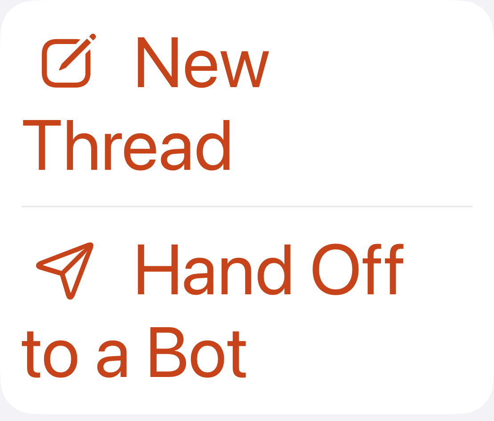
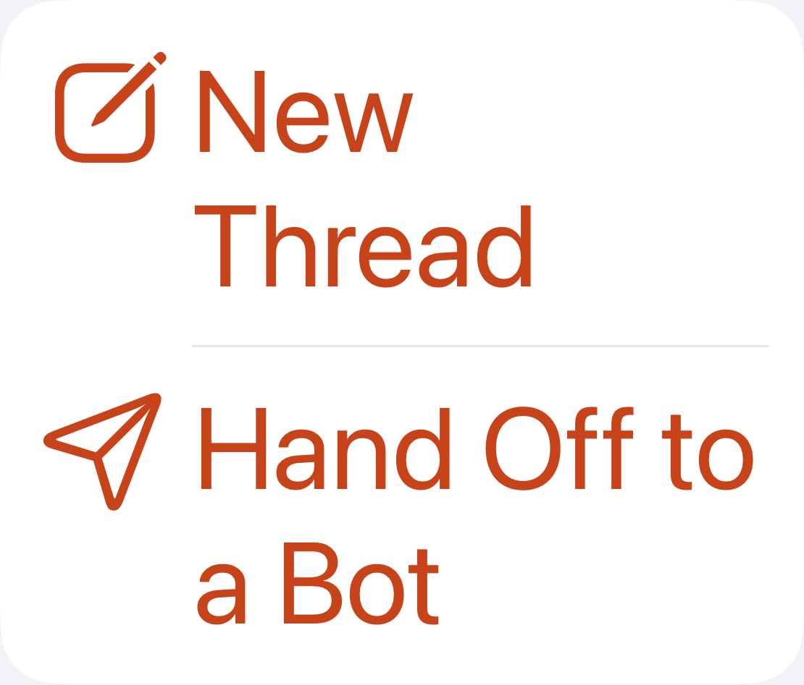

# Native audit policy evidence

This is interim evidence, not a passing full-suite report. The coordinator
approved specific native contrast exclusions. Every other native finding still
fails the test; no exclusion uses a test name as its condition.

| Test / capture | Element | Reason | Evidence |
| --- | --- | --- | --- |
| `testStudioRowContrastNativeDiagnosticAtAccessibilityText` | `studioSelect`, label Select, inside the navigation bar | Policy 3: rendered contrast independently exceeds 4.5:1 | [Element screenshot](select-contrast.png); sampled sRGB foreground 0, background 249, ratio **19.9461:1**; frame `(310.3333, 66, 71.6667, 36)` |
| `testNavigationAtDefaultText`, note screen | `captureNoteSave` | Policy 1: identifier matches and `isEnabled == false` | [Disabled-note screenshot](disabled-note.png); frame `(23.3632, 447.6733, 355.2736, 48.3300)` |

The Select sampler converts the control screenshot to sRGB, excludes the outer
10% on each axis to avoid its glass border/shadow, requires substantial neutral
foreground and light background populations, and measures the median dark
foreground against the lower fifth percentile of the light background. A
non-monochrome or insufficient sample fails closed. Tests verify 21:1 black on
white, gray below 4.5:1, and rejection of a lone dark pixel. This sampler is used
only for the identified Select control; it is not a general contrast audit.

Policy 2 (native material regions) is **not implemented**: the public issue
object has no frame when its element is nil. Runtime diagnostic inspection was
removed. A focused Settings run resolves the previously unidentified region to
the Threads header at `(16, 778, 370, 40.3333)`, under the tab bar. Clarification
was requested before treating resolved elements as material-region exclusions.
A truly nil issue without a queryable frame remains a failure.

The Home labels required a product change, not an exclusion: their icons and
wrapped text now have separate layout space. The strict native text-clipping
test passes. These screenshots are exact crops `(48,453,1158,1400)` from the
before/after native screenshots, with no other pixel changes.

| Before | After |
| --- | --- |
|  |  |

Runs:

- `/tmp/office-audit-policy/results.xcresult`: sampler and strict Home clipping
  tests pass; Studio contrast still fails on a separate, unsuppressed material
  finding after verifying Select.
- `/tmp/office-audit-navigation/results.xcresult`: the disabled-note exclusion
  is exercised; navigation still fails on the remaining audit findings.
- `/tmp/office-contrast-sampler/results.xcresult`: final sampler regression check.

The final report must record the exclusions from the final full run, including
its actual ratios and screenshot paths; these intermediate values do not prove
that run passed.
