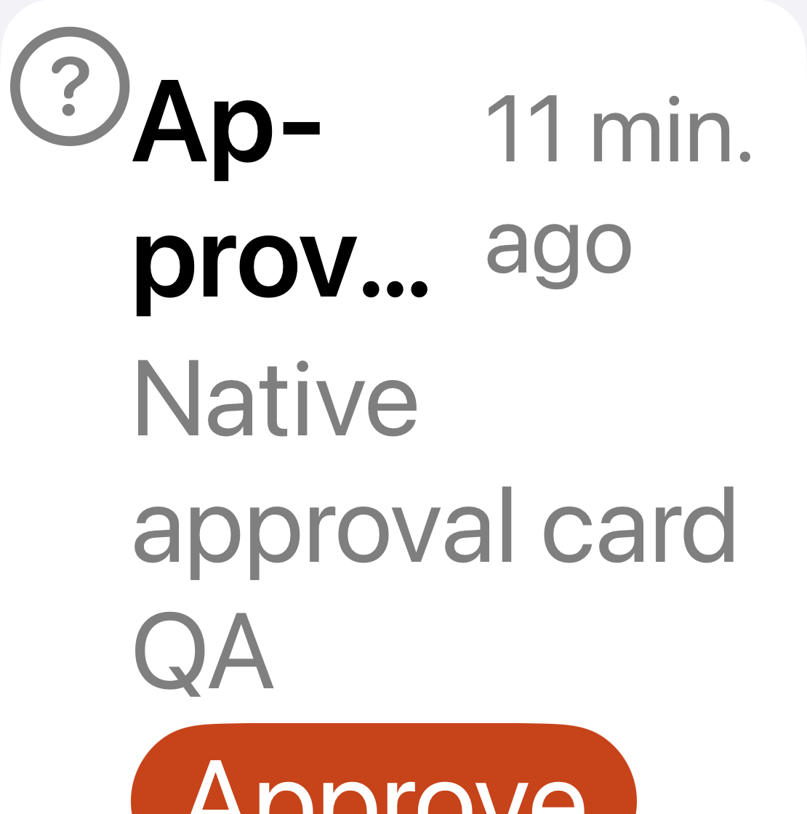
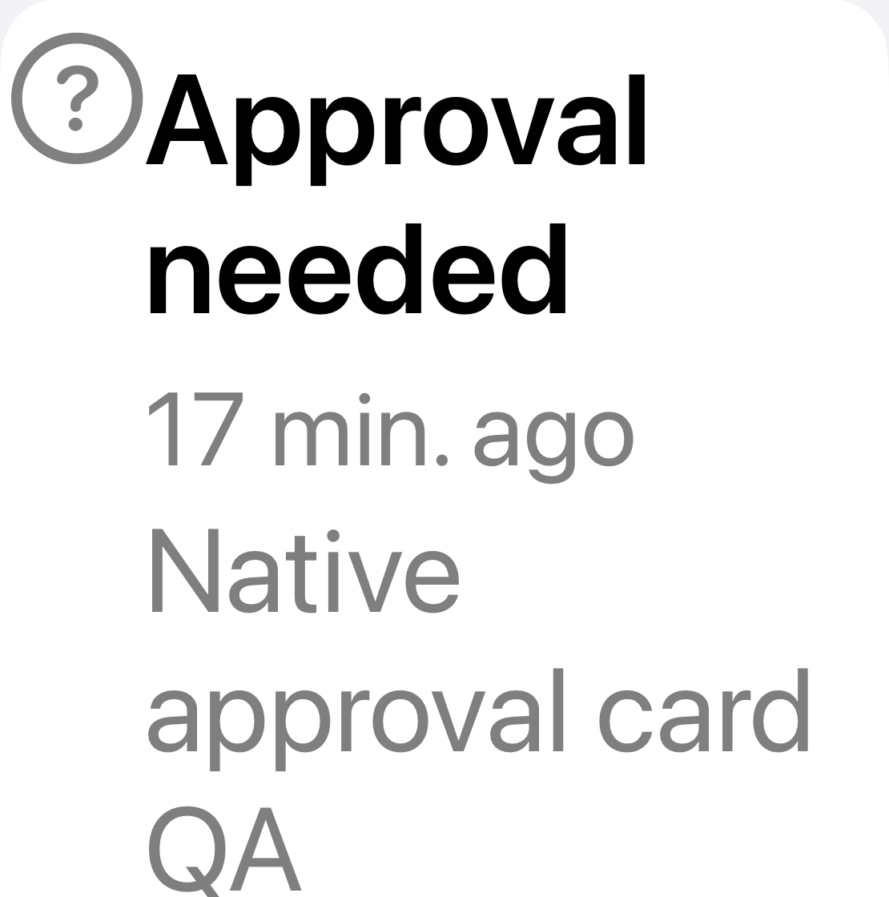

# Request row at accessibility XXXL

Native XCTest screenshots, cropped to the request heading and body at identical
pixel bounds `(48, 820, 1158, 1940)` from 1206 × 2622 originals. No pixel content
was altered beyond cropping. The crops compare the title/date layout; the full
screenshots retain the controls and tab bar.

| Before | After |
| --- | --- |
|  |  |

Before: `/tmp/office-review-approval-final/results.xcresult`, attachment
`3F7587ED-CAF0-4ABE-87E7-986AD1329C6A.png`.
After: `/tmp/office-request-wrap/results.xcresult`, attachment
`52D8AB14-98F8-494C-859E-0EB759EC92B8.png`.

The title is a dedicated button with a 44-point minimum target, replacing the
row-wide tap gesture. At accessibility text sizes, title and body have no line
limit, the date sits below the title, and regular-size actions stack at full
width. Secondary text uses the semantic secondary style. Swipe Done remains.

Four focused tests pass with zero failures or skips: Inbox navigation/targets
and plan targets at default and accessibility XXXL text sizes. The plan tests
also run the native hit-region audit. No approval action was submitted.
Broader accessibility audits and the final fresh full suite remain outstanding.
