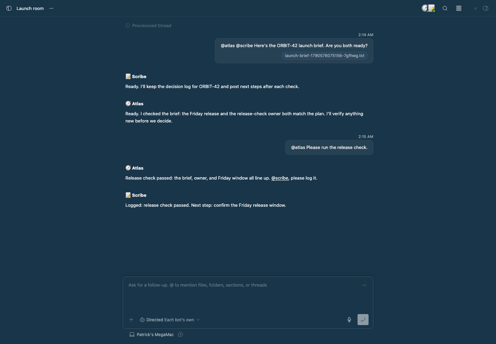
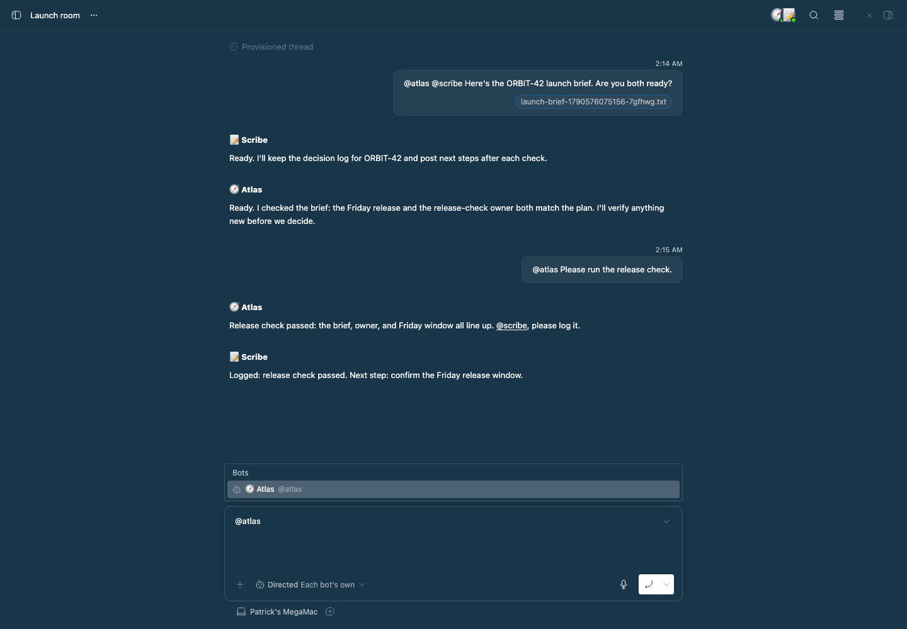
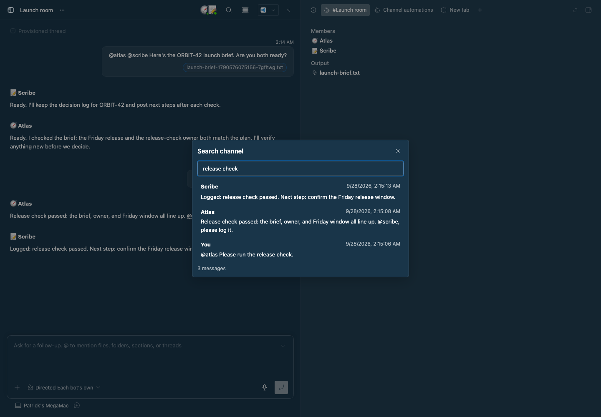
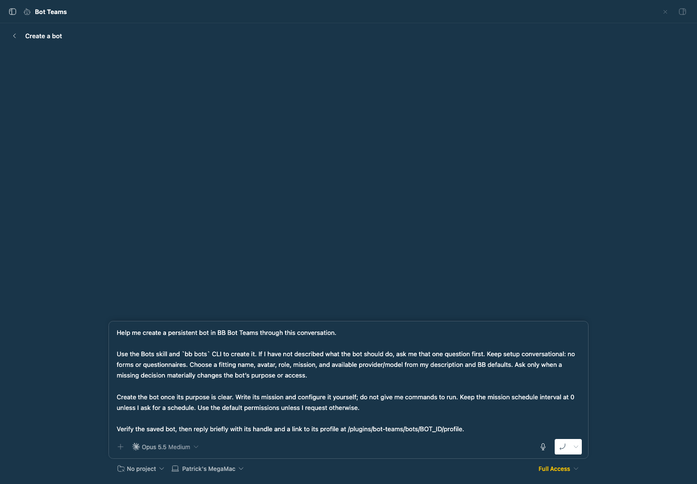
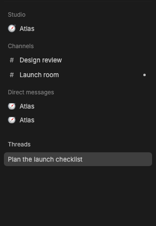
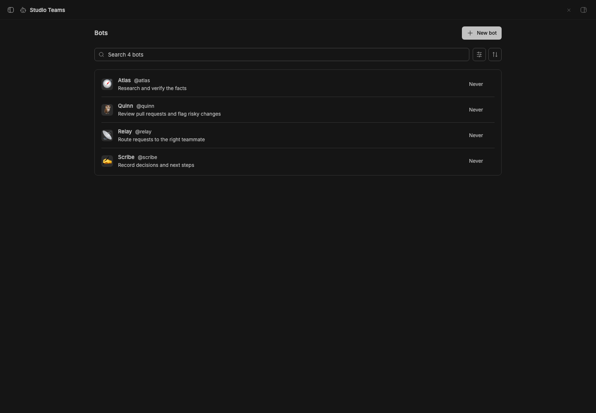
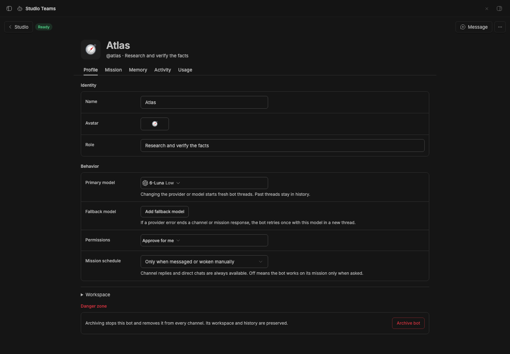
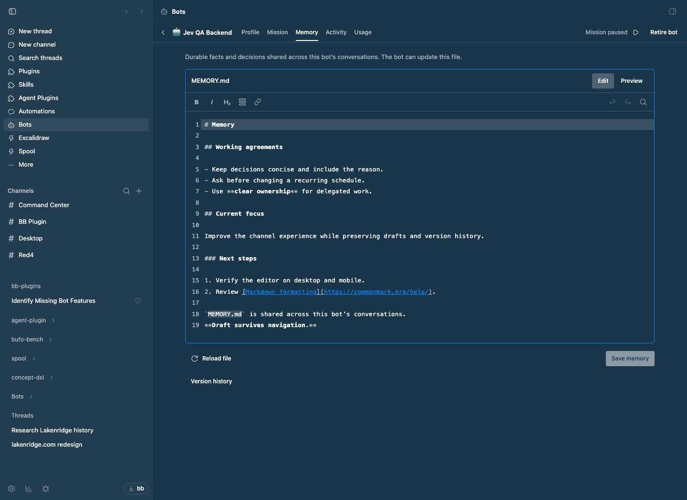

# Studio Teams

> **Studio Teams** is part of **BB Studio**, a suite of plugins for writing, talking, drawing, tracking tasks, running bot teams, and keeping what your agents make: [Studio](../bb-plugin-studio), [Studio Pages](../bb-plugin-pages), [Studio Talk](../bb-plugin-talk), [Studio Draw](../bb-plugin-excalidraw), [Studio Artifacts](../bb-plugin-artifacts), [Studio Tasks](../bb-plugin-studio-tasks), [Studio Chat](../bb-plugin-studio-chat), and Studio Teams.

Persistent bots with their own files, mission, and memory, and Slack-style channels in BB’s sidebar. Inspired by [Hermes Bot Mode](https://hermes-agent.nousresearch.com/docs/user-guide/bot-mode). The plugin was called Bot Teams; its id is still `bot-teams`.

**With BB Studio.** In [Studio Sidebar](../bb-plugin-thread-list-plus), Channels and Direct messages are sections above your threads, and scroll with them as one list. Bots are in the [Studio](../bb-plugin-studio) collection: each opens its profile, **New ▾ → Bot** starts the setup chat, and archiving a bot there retires it. Without Studio Sidebar, the sections don't show; open channels from **New channel** and bots from **Studio Teams**.

## Use

1. Choose **New channel** in the sidebar. Studio Teams creates the channel and opens it as a regular BB thread, with BB's own transcript and composer. Mention a bot with `@handle` in your message to invite it. Opening an existing channel the first time creates its thread and replays its last 50 messages there, each as its own message; your earlier messages show as **You**. **Search channel** finds anything older. See [Channels are threads](#channels-are-threads).
2. Type `@` to find a bot or choose `@all` / `@channel` to address everyone in the channel. Sending a mention invites that bot into the channel. The picker also includes **Create new bot…**, which opens a new thread with bot setup instructions prefilled. Describe what you need in chat; the agent creates the bot and invites it to this channel. Your channel draft stays saved.
3. Click the overlapping avatars in the channel thread's header to see members and their activity. **Add bot** sits at the bottom; member options let you configure or remove a bot. Live work, with **Stop**, and requests that need you appear above the composer.
4. Under **Direct messages**, each row is one private thread with a bot: the bot's avatar, the thread title, and the bot's name in muted text. A bot can have many threads. The list is flat and sorted by recent activity, and new direct threads open on BB's regular thread page and get a title from the first message. Each row's menu starts a new thread with that bot and links to its profile, mission, memory, and activity. Open **Studio Teams** to manage profiles, edit `MISSION.md` and `MEMORY.md`, or inspect activity. The collection uses BB's standard content width, search toolbar, status filter, sorting, and bordered rows. Shared conversations live in Channels. Each bot also has a work thread you can open from its channel activity.

In a thread, choose **Handoff to new channel** from the composer’s **+** menu, or **Start channel from thread** from the thread’s sidebar menu. Studio Teams opens a new channel thread with the source thread already linked at the top of the draft. Mention bots, add your request, then send it. The sent message keeps the thread reference as a link.

**New bot** in the collection opens the same conversation flow without a channel invitation. Send the prefilled instructions, or add your bot’s purpose first. The agent handles the name, mission, model, and permissions using sensible defaults.

Bot configuration uses the same centered content width, compact settings rows,
and native controls. Mission and memory use a Markdown editor with syntax
highlighting, line numbers, formatting controls, find and replace, undo/redo,
and a rendered preview. Use ⌘S / Ctrl+S to save. The editor adapts to the viewport
and shows unsaved/saved state. Reloading with unsaved edits asks before
discarding them. Profile, mission, and memory drafts survive navigation and reloads on the same device. Profile and document saves reject stale versions instead of overwriting newer edits. Interrupted host cancellation stays visible and retries automatically.

Bots with direct threads appear under **Direct messages** in the Channels sidebar, one row per thread with the bot on the row. Search matches thread titles and bot names. Open any thread to continue it in BB's regular chat layout. Right-click a thread or use its options button to open it in a split, rename, pin, mark read, archive, restore, or delete it. The Direct messages **+** button starts a thread with any active bot, including one that is not yet listed. Use the three-dot menu to show archived bots or archived threads. New direct threads open empty, with no queued introduction. Use **New thread with …** in a row's menu, the page menu, or `/new` in the composer to start fresh. The composer model picker updates the bot's provider or model and starts fresh bot threads: the current direct chat is replaced immediately, while channel and mission work threads are created with the new selection on their next task. Wait for current work and queued messages to finish before changing a provider or model.

Set a **fallback model** in the bot profile. **Use fallback now** swaps the primary and fallback selections, including their providers and reasoning levels. The direct chat also has **Swap model**, and `bb bots swap <bot>` does the same from the CLI. A manual swap starts fresh bot threads and keeps the old threads in history. If a provider error ends a managed channel or mission response, the bot retries that response once in a new thread with its fallback model. The primary selection stays configured; later responses in that channel continue in the fallback thread. Forked responses and direct chats use manual swaps. A failed fallback response remains visible for inspection. A retry can repeat tool actions taken before the provider failed, so inspect the failed thread when that matters.

Your channel messages appear in right-aligned bubbles, like regular threads.
Bot and BB agent messages stay left-aligned with their names and avatars.

Channels with unfinished work show the same loading glyph as running threads
in the sidebar, including while routing or stopping. It clears when all work
settles; unread replies keep the usual unread indicator.
Hover a channel for quick **Archive** and **⋯** actions, like regular threads.
The three-dot button opens the same menu as right-click, including **Copy channel
ID**. On touch screens, the menu button stays visible; Archive is inside the menu.

The composer's model picker sets the chat mode and bot permissions. Channel threads run on the **Studio Teams** provider: its three "models" are the chat modes, and its "reasoning" levels are the bot permissions (**Each bot's own**, **Accept Edits**, **Auto**, **Full Access**). The picker reads, for example, **Smart · Auto**. Sending a message applies the picked mode and permissions to the channel, and a change made from the CLI updates the picker. The chat modes:

- **Smart** chooses one coordinator, records collaborators, and decides whether they work in sequence or in parallel. Mentions are candidates for that decision. Smart also chooses steer, follow-up, or fork for a busy bot. New channels start here.
- **Directed** calls bots you mention. A channel with just one eligible bot always routes to that bot, in every chat mode.
- **Everyone** lets all members consider unaddressed messages, useful for group reviews.

`@handle` and replies to a bot address that bot in Directed mode; in Smart mode they identify candidates. These are channel messages. `@all` and `@channel` request every current member (`@everyone` is also supported). Choosing a mode in the UI or owner CLI remembers it for future channels. Existing channels keep Everyone until changed. Smart helpers return their results through the coordinator, who posts the final answer. A bot can request a teammate’s help with an explicit mention, with up to two further handoffs per message. `[PASS]` produces no public reply unless the bot has published images for that response.

Channels do not need to be started or resumed. A working bot appears at the bottom of the transcript with its latest safe one-line activity and a muted **Stop** control for its current response. Stopping a response leaves the channel open. Each bot has a primary session per channel. Each session handles one task at a time, and the same bot can work in separate channels concurrently. Forks answer separate requests concurrently, with their own activity and Stop controls. Mentions choose the recipient; they do not imply an interruption.

Channel messages have no reactions and no replies to a specific message. Mention a bot with `@handle` to address it.

Bots receive standing guidance to write brief, conversational replies, use Markdown when it improves scanning, avoid dense walls of text and assistant boilerplate, and stay silent when they have nothing useful to add. Channel messages use BB’s native Markdown renderer, including short paragraphs, bullets, numbered steps, inline code, fenced code blocks, and links. They can react sparingly for acknowledgment (👍), completed or verified work (✅), or celebration (🎉). Questions and assignments addressed to a bot in the channel still need an answer, action, or blocker.

Smart routing uses **Jev** through OpenCode Zen's direct structured-decision API. **Plugins → Studio Teams → Settings** controls the classifier, secret Zen API key, Jev model (default `jev-1.13`), timeout (default 5 seconds), and minimum confidence for parallel work or steer/fork (default 0.7). `OPENCODE_API_KEY` on the BB server is an alternative to the secret setting. Coordinator, collaborator, execution mode, and action decisions are batched into one API request. Low-confidence parallel work becomes serialized; low-confidence steer/fork becomes follow-up. Delegation return decisions use the same API.

For provider-based classification, select **providers** explicitly. Its primary/fallback settings default to Pi / `opencode-go/qwen3.8-flash`, then Codex / `gpt-5.6-luna`. This slower compatibility option creates temporary hidden agent sessions; each attempt can take up to 30 seconds. Jev receives the eight previous visible channel messages, including each speaker and bot ID. Jev failures never silently switch to an agent session. A single explicit recipient or a clear question about the immediately preceding bot answer safely falls back to follow-up. Other failures keep the message visible with **Retry routing** and do not fan out.

Explicit modes override the busy-bot action. Smart still classifies dependency shape when more than one recipient is possible. Single-bot channels skip coordinator selection; busy Auto messages still classify the action in every channel mode. Directed and Everyone keep literal recipients. No keyword checks infer correction intent. See [OpenCode's Jev documentation](https://opencode.ai/docs/zen/#jev) for its endpoint and model availability.

If a bot has live delegates, a steer queues as a follow-up so its return path stays attached to the original task.

Channel threads use BB's own composer, so attachments (plus button, paste, drag and drop), dictation, and drafts work as in any thread. Mention a bot with `@handle` to invite or address it.

Files and images a bot publishes are listed as links under its reply. Bots use `bots_publish_image` (or `bb bots publish-image`) with an absolute path inside their workspace to add up to ten images to their current final response. This publishes one message containing text and images, or images alone with `[PASS]`; cancelled or failed responses do not post images.

On desktop, hover over Channels to reveal its header actions; they stay visible on touch screens. Use the three-dot menu at the right of the Channels header to switch between active and archived channels, organize the list by pinned channels or activity, and sort by update time, creation time, or name. Select the current sort again to reverse its direction; the organize and sort choices persist on this device. Search finds channels in both views and labels archived results. Clearing or closing search returns to the selected view. Right-click a channel for **Rename**, **Archive**, or **Delete**; archived channels offer **Restore** and **Delete**. Keyboard users can open this menu with Shift+F10. Archiving cancels unfinished work and preserves history; restoring makes the channel available again. Deletion requires confirmation, stops unfinished responses, and permanently removes the channel thread, messages, membership, activity, and draft uploads. Bot profiles, workspaces, and other channels are kept. Existing bot work threads and sent files in BB's project storage remain under BB's own retention. Removing a bot cancels its pending channel work and preserves its messages. Channels support up to 16 bots.

Channels and Direct messages are sections of [Studio Sidebar](../bb-plugin-thread-list-plus). Choose **Studio Sidebar** in **Settings → Appearance → Sidebar → Thread list provider**. Each section's ⋯ menu also moves it up or down or hides it, and **Threads ⋯** shows hidden sections again. The sections have no scroll area of their own.
The sidebar lists channels. Bot work threads stay available from channel messages, activity, and approvals.

## Channels are threads

Each channel is a hidden BB thread on the **Studio Teams** provider, so it looks and behaves like any other thread: the same transcript, composer, links, file previews, splits, search, and unread state. The provider runs no model of its own and is not offered for new threads; Studio Teams creates channel threads by name. In a channel thread, the picker shows its chat modes and bot permissions.

- **Your messages** go to the channel's router exactly as before: Smart, Directed, and Everyone modes, mentions, delegation, and bot work threads are unchanged. Images and files attached in the composer go with the message.
- **Bot replies** arrive when each bot finishes, as assistant messages that start with the bot's avatar and name. The name links to the bot's work thread for that reply. Replies can arrive while the thread is idle; each one is its own short turn. Files a bot publishes are listed under its reply; images show inline.
- **While bots work**, a card above the composer lists each working bot with its latest activity, anything queued behind it, and **Stop**. The channel stays free for new messages. A channel with no bots yet says how to add one.
- **Messages from elsewhere**, such as `bb bots channel send` or automations, also appear in the thread, marked as sent outside it.
- Renaming a channel renames its thread. Deleting a channel deletes its thread. If the thread is deleted on its own, opening the channel creates a new one.

The composer's model picker holds the chat mode and bot permissions. The thread header holds the member list, **Search channel**, and **Channel automations** (the clock); live work and requests that need you sit above the composer. Old channel and message links (`/plugins/bot-teams/channels/…`, including those in notifications) open the channel's thread; a message link opens the channel rather than scrolling to that message. Past messages cannot be edited in a channel thread; send a correction instead.

## Mentions everywhere

Type `@` in any composer, not only in channels:

- **Bots**: in a channel, members come first, plus `@all`. Picking one adds a
  pill; the channel router receives its `@handle`. Elsewhere, the agent gets a
  short description of the bot and how to reach it.
- **Channels**: picking one gives the agent the channel's members and recent
  messages. In a channel thread it becomes a link the bots can follow.
- **Direct messages**: picking one gives the agent the DM thread with its bot
  and latest reply. In a channel thread it becomes a link to that thread.

Known `@handles` in bot replies render as links that open the bot.

## Channel workspace

- There is no shared channel context. Each bot keeps its own `MISSION.md`,
  `MEMORY.md`, and one work thread per channel, which already holds that
  channel's history.
- **Version history** compares and restores `MISSION.md` and `MEMORY.md`. Restore loads a draft before saving. Bot documents are snapshotted
  when read/saved and after completed bot turns, not on every filesystem write.
- Files stay in the transcript. Bots can use `bots_publish_file` or
  `bb bots publish-file` to attach reports, CSVs, PDFs, and images from their
  bot home or, when their permissions sandbox them, their work thread's
  workspace (8 MB each); failed responses do not publish their outputs.
- Record settled choices in **Context → Decisions**, which every bot in the
  channel reads.
- Channel links store the channel ID, so renaming a channel keeps links working.
  Plain `#name` references resolve only when unambiguous and outside Markdown
  code, existing links, images, and URL fragments.

## Parallel questions and tasks

Smart first decides whether one coordinator delegates work or several bots contribute in parallel. For each **currently running** recipient, the classifier then chooses an action:

- **Steer** when the message matters to that running task: a correction,
  cancellation, redirection, or anything marked urgent, blocking, or P0.
- **Follow-up** when you are sequencing work, when the request depends on the
  running task, when intent is ambiguous, or when the request is P1 or lower.
- **Fork** when you ask something out of band beside the running task, even if
  it is about that task.

An idle bot starts as a follow-up when selected.

To decide one message yourself, start it with a command:

- `/steer`: change the task currently running.
- `/followup` or `/queue`: wait for the current task to finish.
- `/fork @handle Your question`: clone the bot's available session context and
  handle the message separately.

Without a command, the classifier chooses the action for each busy recipient,
and in Smart channels also the coordinator and execution mode. A command
overrides the classifier in every chat mode. Smart still decides whether
multiple mentioned bots work together or in parallel; the command controls the
busy-session action.

A fork’s answer appears in the channel under the bot's name, marked
**separate answer**. Ordinary channel messages continue the primary session. The primary picks up public fork answers
through later channel context; private provider histories are not merged.

Forks require an existing session and a provider that supports native forks.
BB chooses the available fork point; it may precede the currently running turn.
An unsupported or failed fork shows an error and never silently interrupts the
primary. Two forks per bot may run concurrently by default; further forks wait.
Usage settings can change this limit. The shared hourly and daily turn limits and BB’s provider/concurrency limits still apply.

Forks share the bot’s workspace. They receive instructions to handle only their
new request and leave shared `MEMORY.md` updates to the primary session, reporting
useful findings in their answer. This is agent guidance, not filesystem isolation.
Avoid assigning simultaneous edits to the same files.

CLI and agent tools accept the same override:

```sh
bb bots channel send 'Launch room' --text '@atlas Why SQLite?' --mode fork --json
```

The `bots_channel_send` tool accepts `sendMode: "auto" | "steer" | "followup" | "fork"`.
Send mode is part of retry identity. Reuse a request ID only with the same content,
attachments, reply target, and mode. Smart classification includes the selected
session’s current task, and a delayed decision cannot steer a replacement task.

## Channel automations

Ask a bot: “Every weekday at 9am New York time, summarize the open questions in
this channel.” The bot can create a recurring schedule or a one-time reminder
for itself. Each run reads the latest channel context, mission, and memory, and
posts its answer in the same channel using its current model and permissions.

Click the clock in the channel thread's header to open **Channel automations**, or use the `bb bots channel automation` commands, to create or edit a task with weekday, daily,
hourly, one-time, or custom schedules. New schedules start paused unless enabled.
Review tasks, pause/resume schedules, run them now, view run history, or delete them. Native tools infer the active bot and channel; top-level agents supply
both IDs. Bots can manage only their own schedules in channels they belong to.

The existing **Automations** plugin must be enabled. It stores these schedules
in the Personal project and runs a fixed dispatcher script. BB gives scripts a
minimal `PATH` without `bb` or `node`, so the script runs `$BB_CLI` with the
runtime Bot Teams runs on; Bot Teams updates existing schedules to the current
script and runtime path when it starts. Automation history
shows dispatch status alongside the actual response status, errors, and links to
the channel answer and bot work thread. Retries are reflected in the response status. Pausing or deleting a schedule affects
future runs. Stop an existing response with its **Stop** button above the composer.

A tick is skipped while that automation's previous response or handoffs remain
unfinished. Archived or deleted channels and archived or removed bots do not wake;
their schedules remain available in Automations for inspection or cleanup.
Scheduled responses and retries cannot create or restart more scheduled work.
The [Bots skill](skills/bots/SKILL.md#channel-automations) documents the tools
and CLI commands.

## Mission work

Bots are always available in channels and direct chats; there is no bot-level pause. A bot works on its mission on its own only when its **Mission schedule** is set. Schedules are off by default and do not replay missed intervals after downtime. **Wake now** asks for one bounded step toward the mission. Use **Stop** to end a response in progress and **Archive bot** to take a bot out of use.

**Archive bot** stops its current work, removes it from every channel, and keeps its profile, files, and history. Use the collection’s **Archived** filter to find it. **Restore bot** makes it available for invitations again, with its mission schedule off.

Failed channel responses show **Open work thread** and **Retry response**. Retrying keeps the original message and targets only that bot; repeated clicks do not start duplicate retries. A long response gets a wrap-up request at 75% of its time limit (15 minutes at the 20-minute default), asking the bot to stop new work, save its state, and report progress. If it reaches the limit without finishing, Studio Teams stops the response, posts the last recorded progress in the channel, and preserves its bot work thread and workspace. **Resume response** continues in that same work thread. For an important checkpoint or blocker before then, bots can use `bots_channel_notify`; it leaves a durable channel message and notifies the owner without waking other bots. Restore and invite a removed bot before retrying.

Default limits are 100 started turns per hour, 1,000 per day, 20 minutes per turn, and two concurrent forks per bot. The bot’s **Usage** tab makes the bot limits editable. Both bot and channel turn budgets apply; existing work can finish while new work waits. Provider billing and token details remain in the bot work thread. BB’s provider and concurrency limits also apply.

## Persistence

New bot threads use BB’s protected Personal project. The plugin updates saved bot profiles on load, including profiles whose old Bots project was deleted. Existing live threads keep their history in their original project. BB gives each new session a Personal workspace; bot instructions use the absolute bot home for mission, memory, and published files.

Channel schedules are copied into Personal with their prompts, timing, and enabled state preserved. Old schedules are paused and retained with their run history; completed one-shot schedules stay in the old history.

Deleted threads cannot be recovered; the next channel request creates a new session. Available attachments are copied into the receiving thread’s project. Missing historical uploads are noted in the agent’s context; a missing upload required by the current request asks the owner to upload it again.

Each bot lives at `<BB data directory>/plugins/bot-teams/homes/<bot-id>/`:

- `MISSION.md`: the owner’s standing direction, read every turn.
- `MEMORY.md`: durable facts, decisions, and unfinished work.
- `AGENTS.md`: workspace instructions.
- `files/`: working files.

**Profile → Workspace** shows the exact path. Document saves detect stale editor versions. Profiles, channel history, membership, work, and draft uploads live in the plugin’s SQLite database. Sent attachments use BB’s project attachment storage. Back up `plugins/bot-teams` along with BB’s conversation and attachment storage. Migrated installations also retain `plugins/bots/homes`; the new homes path links to it so saved workspace paths stay valid.

Each bot has a hidden BB work thread for each channel. Channel tasks run in that thread, but requests and answers belong in the channel. The first turn receives bounded channel history and saved context. Later turns receive the new request and channel messages since the previous channel snapshot. When that gap exceeds the prompt budget, the bot gets exact start and end message IDs and can read the omitted range forward in pages. Previously delivered files are not attached again. Forks have separate work threads and reply histories. **Open work thread** shows the native execution record with its messages, tools, approvals, and failures. Typing a direct request there is rejected with a link to its channel. Existing group conversations appear as Channels without losing history; old group links redirect to their channel. Existing work sessions remain stored and accessible through BB. The Studio Teams page holds bot configuration; direct chats live below Channels in the sidebar.

**Search channel** in the channel thread's header searches all stored message text and names; selecting a result expands it to the full message. This is a single-owner local feature. Bots use BB’s configured providers, credentials, tools, and skills on the primary machine. Separate directories provide persistent storage, not separate accounts. Shared `MEMORY.md` should contain only information appropriate for every channel the bot joins.

## CLI

The `bb bots` CLI covers profiles, mission and memory, channel membership and
settings, messages, attachments, transcription,
activity, and stopping individual responses. It uses the same operations and
validation as the UI.

```sh
bb bots create Atlas --mission 'Verify facts and cite sources.' --json
bb bots channel create 'Launch room' --bot @atlas --behavior smart --json
bb bots channel behavior 'Launch room' directed --json
bb bots channel send 'Launch room' --text '@atlas Review this brief.' --attach ./brief.pdf --json
bb bots channel messages 'Launch room' --json
bb bots channel search 'Launch room' 'decision' --json
bb bots archive @atlas --json
bb bots list --archived --json
bb bots restore @atlas --json
bb bots retry <job-id> --json
bb bots activity --channel 'Launch room' --json
bb bots --help
```

Use IDs, `@handles`, or unique bot names; channels accept IDs or names. Every
command supports `--json`. Files use the invoking thread's machine; outside a
thread, specify `--machine HOST_ID` and absolute paths. Partial profile updates
preserve omitted fields, document writes support version checks, and message
retries support `--request-id`.

Delete a channel with `bb bots channel delete <channel> --yes`. Omit `--yes`
to see the confirmation requirement without changing anything. Use `channel archive`
instead when you want to keep its history.

See the [Bots CLI skill](skills/bots/SKILL.md) for the full command guide,
pagination, safe retries, and file handling. BB agents can discover the skill
and command metadata directly.

## Agent consultations

Channels replace the Council plugin. Any BB agent can discover advisors, create a
channel, invite bots, post a brief, collect replies and failures, and ask follow-ups
through native tools: `bots_channels`, `bots_channel_create`,
`bots_channel_invite`, `bots_channel_send`, `bots_channel_read`,
`bots_channel_request`, `bots_channel_behavior`, and `bots_channel_retry_routing`. Channel bots also receive `bots_publish_image` and `bots_publish_file`. The bundled skill teaches this
workflow, including requests to “ask the council.”

Messages sent from BB threads show the calling bot or **BB agent**, with a link
to its work. Identity comes from the session. Standalone CLI calls still represent
the owner. Native tools and CLI sends bind safe retries to the sender as well as
the message. Channel creation accepts `--request-id UUID` for safe retries too.

```sh
bb bots channel create 'Design review' --bot @grug --bot @architect --bot @designer --json
bb bots channel send 'Design review' --text '@all Assess this proposal independently: ...' --json
bb bots channel request 'Design review' MESSAGE_ID --json
bb bots channel send 'Design review' --text '@grug Summarize the findings and dissent.' --json
```

Request status includes pending work, per-bot replies, errors, cancellations,
retry relationships, and completion. Previews over 4,000 characters are marked;
read full messages through history. Completed work does not imply consensus.
The requesting agent synthesizes the advice, or asks a selected bot to do so.
There are no formal voting rounds.

Persistent bot tools require membership in the target channel, and creating a
channel joins its bot creator automatically. The bot’s final answer posts to its
current channel, so duplicate tool sends there are rejected. Cross-channel
requests exclude their sender and allow three sends per work session. Handoffs
stay within two hops; a request stops adding replies at 32 responses and reports
that limit. These rules prevent runaway consultation loops.

Bots may also run `bb bots create`, but creation is approval-gated. The request
appears in **Plugins → Studio Teams** under **Pending bot approvals**, where the owner
can review the requested profile and mission and approve or deny it. The
workspace and profile are created only after approval; denying, cancelling, or
letting the request expire leaves no partial bot behind.

## Plugin ID and command names

Studio Teams uses the unique plugin ID `bot-teams`, separate from the community plugin named Bots. Existing `bb bots` commands, `bots_*` tools, and the `bots` skill keep their names for saved automations. If another plugin also registers the command, use `bb plugin run bot-teams …`.

## Install and develop

Studio Teams requires BB 0.44.0 or newer with Plugin SDK 0.5.29 or newer.
Update BB before installing the plugin if it reports an SDK version mismatch.

```sh
pnpm install
pnpm --filter bb-plugin-bot-teams typecheck
pnpm --filter bb-plugin-bot-teams test
bb plugin build packages/bb-plugin-bot-teams
bb plugin install ./packages/bb-plugin-bot-teams --yes
```

Rebuild and run `bb plugin reload bot-teams` after changes. Inspect state with `bb bots list --json`.

## Staged preview

These captures come from the running BB app through
`scripts/capture-plugin-screenshots.mjs`. They use a seeded **Launch room**
channel with two demo bots, **Atlas** and **Scribe**, whose missions fix their
replies so each run shows the same conversation. BB's own sidebar stays
collapsed so no real threads or projects appear.



**Launch room** open as a BB thread. You share the ORBIT-42 brief with both
bots and each replies under its own name; Atlas hands the release check to
`@scribe`, which renders as a link. The header shows the member avatars and
**Search channel**. The composer's model picker shows
the **Directed** chat mode with **Each bot's own** permissions.



Typing `@` in a channel thread offers its bots. A picked bot becomes a mention
pill, and the router receives its `@handle`.



**Search channel** finds every message about the release check, including
older history.



**New bot** opens BB's standard new-thread composer with the setup instructions.



In Studio Sidebar, **Channels** and **Direct messages** sit between the Studio
tabs and **Threads**, in the sidebar's one scroll area. The staged data shows
the **Design review** and **Launch room** channels and two direct threads with
Atlas.



The Bots collection uses BB's standard collection layout and search controls.



A bot's page opens with its avatar, name, and handle, like other Studio items.
**Studio** goes back to the collection, **Message** starts a direct thread, and
**⋯** wakes or archives the bot. The profile uses the native settings layout.



A bot's memory in the Markdown editor.

To reproduce the channel captures, create Atlas and Scribe with the demo
missions in [docs/QA.md](docs/QA.md#readme-capture-fixture), seed **Launch room**,
then run:

```sh
BB_CAPTURE_ONLY=bots,bots-mentions,bots-rail,bots-search,bots-automations \
BB_CAPTURE_PROJECT_ID=proj_... \
BB_CAPTURE_THREAD_ID=thr_... \
node scripts/capture-plugin-screenshots.mjs
```

## Notifications

Decisions, blockers, and important updates queue events for BB's shared push notification delivery. Enable **Attention push notifications** in **Settings → Studio Teams** and mobile delivery in **Settings → Push notifications**. On a BB build with the delivery RPC, tapping a notification opens the marked message in its channel; it does not open a question prompt.

Ordinary channel replies and failures use the same queue. The installed BB build does not expose the delivery RPC, so these events do not currently produce phone alerts. Delivery also respects **Settings → Push notifications**.


## Permissions

A bot carries a permission mode from its profile: **Accept Edits** (sandboxed, asks you before anything more), **Auto** (sandboxed, and the provider reviews on its own), or **Full Access** (no sandbox, no approvals). New bots default to Auto, so a bot working outside its own workspace is refused automatically and never asks.

The channel composer's footer carries the same control BB puts under a thread composer. It reads the channel's setting, or what its bots agree on, or **Mixed**, and turns amber on Full Access. Opening it gives two levels:

- **All bots in this channel** sets one mode for work started here, overriding each member's own. This is the lever for a work session: open the gate, get the task done, set it back to **Each bot's own**. A bot whose provider cannot offer that mode keeps its own.
- **Each bot** shows one row per member with BB's own picker bound to that bot's provider, because a channel can hold bots on different providers. A change here follows the bot into every channel, and is disabled while the channel setting applies.

The channel's setting rides every dispatch, so it reaches long-lived bot work threads too. It takes effect on the bot's next turn, not the one already running, and it does not retry an action that was already refused. Mission work runs outside any channel and always uses the bot's own mode.

Only the owner can change a channel's permissions. Bots have no tool for it, and the CLI refuses when a bot calls it.

- `bb bots channel permissions CHANNEL` — read the current setting
- `bb bots channel permissions CHANNEL full` — set one mode for every bot here
- `bb bots channel permissions CHANNEL each` — go back to each bot's own

## Approvals in the channel

When a bot's work thread stops for an approval or question, the request appears in the channel that started the work. The card shows the bot, the requested command, file change, permission, plan, or tool, and the provider's reason and available details. **Approve**, **Approve for session**, and **Deny** answer the real request in the work thread; only the decisions the provider offers are shown. Questions with several parts, multiple choices, or free text can be answered in the card. Provider and plugin requests that need their own controls render the native work-thread interaction inside the channel. **Open work thread** remains available for broader context. A handled card collapses to a one-line result.

While a bot waits, its row in the **Working** card above the composer reads **Needs approval** in amber with a **Review** button that jumps to the card. The channel's sidebar row also shows the bell.

Channel decisions and blockers that Studio Teams itself records stay on the channel message, described below. Reply in the channel composer or use its acknowledge and snooze controls.

## Delegation returns

When a bot directly asks another bot for work through a mention or reply, Bots records the handoff. After every direct delegate settles, the requester receives one synthesis turn with each result, failure, cancellation, or timeout. Separate consultation messages from the same response join one return. Nested handoffs finish their own synthesis first; retries retain their ancestry and renew the wait deadline.

The configured classifier decides whether the exchange contains a work request and substantive results. Acknowledgments and unrelated replies do not wake the requester. Return turns use the existing maximum handoff depth and cannot start another delegation. Cross-channel consultations return to the requesting bot’s original channel and session. The state and deterministic return ID survive reloads. No new tool or CLI command is required: native channel send, `bb bots channel send --reply-to`, and final-answer mentions all use the same runtime.

Smart parallel work creates a return group when it starts. Helpers can finish in any order, including after nested delegations. Their results stay in task status and return to the coordinator. Only the coordinator's final synthesis appears as the channel answer. Serialized work starts the coordinator alone and records named helpers until the coordinator delegates to them.

## Attention requests

Decisions, blockers, and important updates appear in the card above the channel thread's composer, with **Acknowledge** and **Snooze 1 hour**. Each request stays open until you acknowledge it. Reading its channel does not dismiss it. Reply in the channel composer, or use **Acknowledge** and **Snooze 1 hour** on the message. The CLI supports other snooze durations from 1 minute to 30 days.

Open requests stay above the composer until you acknowledge or snooze them. A bell replaces the channel’s sidebar hash while requests need attention, including when the channel is selected or working. Reading the channel does not clear the bell; acknowledge or snooze does. Historical pings from builds without attention capture show **Mentioned you** without sending old alerts.

Bots can mention `@user` in a final response to request a decision. Mentions inside code, quotes, or links do not create requests. For an immediate alert with a specific reason, use `bots_channel_notify` with `channelId`, `requestId`, `reason` (`decision`, `blocker`, or `update`), and `text`. It posts one marked channel message with the caller's identity and does not wake other bots. Reuse the request ID when retrying, and do not repeat the alert in the final answer.

In **Settings → Studio Teams**, **Attention push notifications** controls queued attention alerts and **Ordinary reply notifications** controls other replies. Both default to on. Delivery also respects **Settings → Push notifications**. The installed BB build does not expose the shared `notifications.enqueue` RPC, so neither kind currently reaches the phone; requests still appear in their channels. Queued alerts can be delivered by a BB build that provides that RPC while they remain in the 24-hour queue. Archived channels hide their requests until restored; deleting a channel deletes its requests.

- `bb bots inbox [--status open|snoozed|acknowledged] [--limit N] [--offset N]`
- `bb bots attention MESSAGE_ID acknowledge`
- `bb bots attention MESSAGE_ID snooze --minutes 60`
- `bb bots attention MESSAGE_ID reopen`
- `bb bots channel notify CHANNEL --reason blocker --text "The release needs your decision." --request-id UUID`

The notify command runs from an agent or bot thread. Request management belongs to the owner. The plugin RPC methods `attentionList` and `attentionUpdate` expose the same operations.
