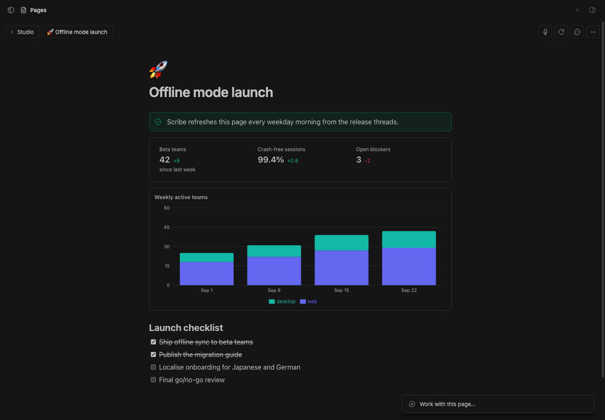
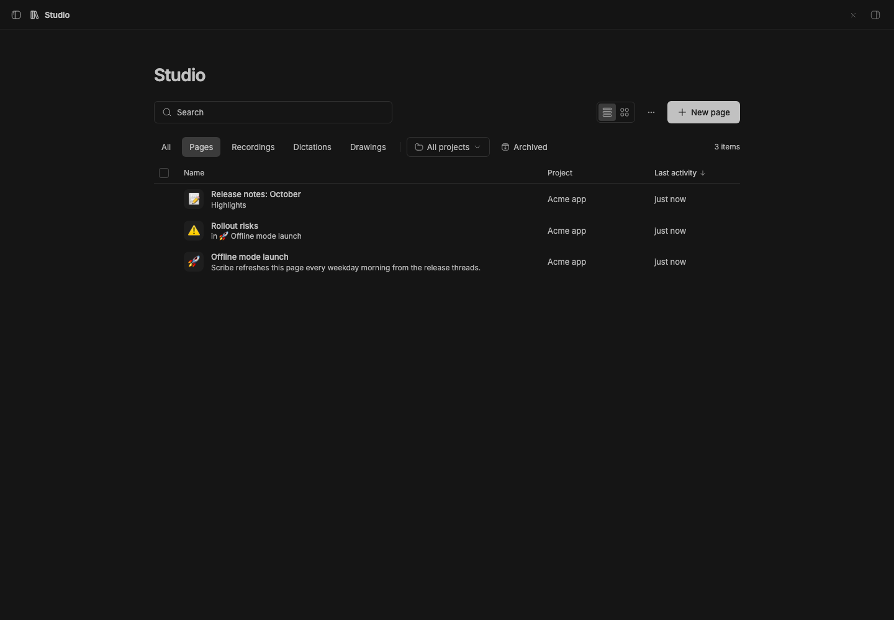

# bb-plugin-pages

> **Studio Pages** is part of **BB Studio**, a suite of plugins for writing, talking, drawing, tracking tasks, running bot teams, and keeping what your agents make: [Studio](../bb-plugin-studio), Studio Pages, [Studio Talk](../bb-plugin-talk), [Studio Draw](../bb-plugin-excalidraw), [Studio Artifacts](../bb-plugin-artifacts), [Studio Tasks](../bb-plugin-studio-tasks), [Studio Chat](../bb-plugin-studio-chat), and [Studio Teams](../bb-plugin-bot-teams).

Collaborative documents for BB that you write together with your agents.
Pages gives you a Notion-style block editor with live multiplayer editing,
comments, charts, and embeds. It also connects to
[Studio Teams](../bb-plugin-bot-teams): @mention a bot in a page to hand it
work, or give a page an owner bot that keeps it up to date on a schedule.
With **Explore**, what an agent noticed along the way while answering
becomes a page that explains it.

## Staged preview



This is the real BB **Pages** panel, opened from the nav panel. The capture
script uses the plugin's own `create` RPC to seed three project pages:
- "Offline mode launch"
- a nested "Rollout risks" sub-page
- "Release notes: October"

The launch page is open. It holds:
- a tip callout
- a stats block with three key numbers and their deltas
- a stacked bar chart of weekly active teams
- a launch checklist with two items done

At the top left are the **Pages** back pill and the breadcrumb. At the top
right are the **Dictate**, **Version history**, **Comments** and page menu
buttons. **Dictate** appears because Talk is installed in the staged app.
The **Work with this page…** composer floats at the bottom right.



The collection is what the **Pages** nav item opens. It shows:
- the search box
- the filter pills and the project pill
- the list/grid toggle and **New page**
- every page in the staged app, with its project and last activity

"Rollout risks" shows the page it sits in. The **Untitled** row is a page
that already existed in the staged app. The script deletes its three pages
afterwards.

## What you get

- **A block editor.** Built on [BlockNote](https://www.blocknotejs.org): type
  `/` for headings, lists, checklists, toggles, quotes, code, tables, images,
  video, audio, files, and the custom blocks below. Blocks can be dragged,
  nested, and turned into other types. Markdown shortcuts work as you type.
- **Live collaboration.** Every page is a Yjs document synced over a
  WebSocket. Agents and bots edit the same document from the server, so their
  changes stream into your editor, with cursors, while you keep typing.
- **Code and diagrams.** Code blocks are syntax-highlighted for about
  twenty languages, in light and dark. A `mermaid` block renders its
  diagram; click it to edit the source.
- **HTML blocks.** An `html` block runs its HTML, CSS, and scripts in a
  sandboxed frame (no access to BB, its cookies, or storage) that grows to
  fit its content. Click its label to edit the source.
- **In a thread's side panel.** The **Page** tab shows a page's live editor
  next to a thread, with a link to the full page. Explore explainers open
  there too.
- **Custom blocks.** Callouts, charts (bar, line, area, pie), stat rows, and
  embed cards for links, BB threads, and other pages. Paste a link on an
  empty line to turn it into a card; web links fetch their title,
  description, and preview image.
- **Studio embeds.** The `/` menu's Studio group embeds a drawing, artifact,
  recording, or task, picked by search. Drawings show their picture and
  artifacts their content (images, HTML, PDFs, code, text); click through to
  open the item. Pasting a link to a Studio item embeds it too.
  Charts and stats are edited as JSON, which makes them easy for agents to
  write.
- **Mentions.** Type `@` to mention a bot, another page, a BB thread, a
  Studio item, or a date. Page and thread mentions open where they point.
- **Comments.** Select text to comment on it. Threads show in a floating
  card where you can reply, react, edit, and resolve. Agents can read, start,
  reply to, and resolve threads.
- **A collection of pages.** The **Pages** nav item lists every page, with
  search over titles and content, filters, a project filter, and a list or
  grid view. **New page** opens a blank full-page document.
- **Projects and nesting.** Pages belong to a project or are global, and
  nest to any depth, with a breadcrumb back up. Give a page an emoji icon,
  move it, archive it, or delete it from its ⋯ menu.
- **Work with this page.** The box at the bottom of every page is BB's
  new-thread composer. Sending starts an agent thread in the page's project
  that gets the page as context. The thread opens in a card on the page,
  and you can minimize it or open it as a full thread. The full thread's
  header shows the page's name, which takes you back to the page with the
  chat open. This works without Studio Teams. With
  [Studio Chat](../bb-plugin-studio-chat) installed, its floating chat takes
  over the box and card: same composer, same page chats, and it follows you
  to other Studio items.
- **Version history.** Pages saves a version before an agent's or bot's first
  edit in a while. You can save one yourself and restore any version, and the
  current page is saved before a restore.

## Explore

Explore turns what an agent noticed while answering into pages you can read
later.

- **"Along the way" at the bottom of a reply.** When an answer involved
  reading code, the agent may end it with 1 to 4 findings, each an emoji and
  a label that says what you'd find: 🐛 suspicious, 🏗️ foundational, 🔗
  connected, 🕐 recently changed. They show as full-width rows, each with its
  state: **Explore**, **Generating · 45%** with a progress bar, **Open ·
  generated 2h ago** with a regenerate button, or **Retry**. Rows reflect
  what's saved, so they survive a reload.
- **An explainer page per finding.** Clicking one starts a hidden copy of
  the thread at that reply, which investigates the finding in the repository
  and writes a page: what it is, why it matters for what you were doing, how
  it works (Mermaid diagrams, callouts, and sandboxed HTML visuals), key
  files as `path:line`, and the interesting thing. Explainers live under an
  **Explore** page in each project's Pages tree, with the finding's emoji as
  their icon, and are tagged **Explore** in [Studio](../bb-plugin-studio)
  when it's installed.
- **In the side panel.** The **Page** tab shows progress while an explainer
  is written (stage, percent, time so far, **Stop**), the error with
  **Retry** if it failed, and then the page's live editor with when it was
  generated, **Regenerate**, **Open in Pages**, and its own follow-up
  findings below it. Clicking a follow-up keeps exploring from the original
  thread.
- **Regenerate** writes the explainer again in place. The old version is
  kept in the page's version history ("Before regenerate …").
- **Setting:** *Explore: suggest things to explore* (on by default) turns
  the agent instructions off; findings already in replies keep working.

The same finding in the same reply is one explainer: a second click opens
it, or follows the job already writing it. A job that runs for 20 minutes
fails, and jobs cut off by a BB restart show as interrupted. Stopping or
failing a job stops and archives its hidden thread.

## Dictation with Talk

With the [Talk](../bb-plugin-talk) plugin installed, you can dictate into a
page:

- The **Dictate** button at the top right, or **Dictate** in the `/` menu, starts Talk. Press
  **Stop dictation** or ✓ in Talk's pill to finish, and the transcript goes in
  at your cursor. Blank lines in the transcript start new paragraphs. If you
  haven't clicked into the page yet, the text goes at the end.
- *Talk: Start or finish dictation* from the command palette works while the
  cursor is in a page.
- If you finish while you're somewhere else, Talk keeps the text. Its **Go
  back** button reopens the page, and the text is added when the page loads.

Talk does the recording, transcription, and durability. Pages only marks the
editor as a Talk dictation field and inserts the text Talk hands it. Without
Talk, the dictation controls are hidden.

## Studio Teams integration

Needs the Studio Teams plugin. Requests run in each bot's DM thread with the
bot's configured model and reasoning level.

- **@mention a bot in the page.** Write what you need and mention the bot in
  the same block, for example *"@Scribe fill this table in from the pricing
  thread"*. The bot reads the page, makes the edit, and leaves a comment on
  that block saying what it did.
- **@mention a bot in a comment.** The bot answers in the thread and makes
  any change you asked for. Once a bot has replied in a thread, your later
  replies there go to it too.
- **@mention a bot in "Work with this page…".** The message goes to that
  bot as a request about the whole page, in its own thread.
- **Keep updated.** Pick an owner bot, a schedule (hourly, every morning,
  weekday mornings, Monday mornings, or a custom cron), and what to keep
  current. The bot revisits the page on that schedule. **Refresh now** runs it
  immediately.

The **Activity** menu at the top right shows each request as queued,
working, done, or failed, and opens its thread in a card on the page. It
also lists the page's chats and its Keep updated schedule. Pages remembers which mentions and comments it
has already sent, so bots are never asked twice.

Without Studio Teams, pages, comments, agent tools, and **Work with this page**
work as usual. **Keep updated…** is disabled and says Studio Teams isn't
installed or enabled. A mention or comment for a
bot made while Studio Teams is unavailable, for example while it reloads, waits
and is sent once Studio Teams is back, as long as the BB server hasn't restarted
in between.

## For agents

Agents get nine tools: `pages_list`, `pages_read`, `pages_create`,
`pages_edit`, `pages_comments`, `pages_comment`, `pages_comment_reply`,
`pages_comment_resolve`, and `pages_explore`, which writes or finds an Explore
explainer (`label`, optional `messageId` and `wait`) and returns its page. `pages_read` returns Markdown with a block id after
each block, and `pages_edit` applies small operations against those ids. An
agent can then change one checklist item or paragraph without overwriting
what you are typing.

The same actions are available from the CLI:

```sh
bb pages list [--all]
bb pages show <page-id|title> [--ids]
bb pages create <title> [--global] [--markdown <text>]
bb pages append <page-id|title> <markdown…>
bb pages explore list [--thread <thread id>]
bb pages explore open <explainer id>
bb pages explore regenerate <explainer id> [--wait]
```

[skills/pages/SKILL.md](skills/pages/SKILL.md) documents the tools, the
Markdown extensions (charts, stats, HTML, embeds, callouts, mentions), and the bot
workflows.

## Storage

Pages, versions, uploads, bot requests, and Explore explainers and their
jobs live in the plugin's SQLite database in the BB data directory. Uploads are limited to 15 MB each and are
served back through the plugin's HTTP route.

## Development

```sh
pnpm install
pnpm typecheck
pnpm test
bb plugin build .
bb plugin install . --yes
```

BlockNote's menus and toolbars are styled with Tailwind classes that live in
`node_modules`, which `bb plugin build` doesn't scan. `blocknote-tailwind.txt`
lists them so the build generates them. After upgrading `@blocknote/shadcn`,
run `pnpm tailwind:blocknote` to regenerate it.
