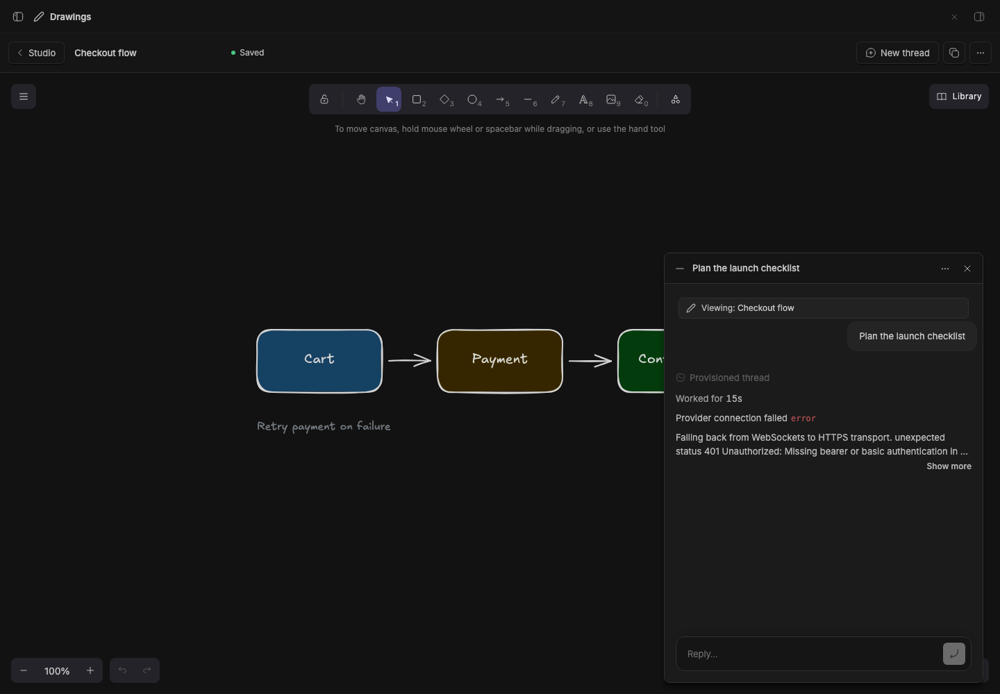

# Studio Chat

> **Studio Chat** is part of **BB Studio**, a suite of plugins for writing, talking, drawing, tracking tasks, running bot teams, and keeping what your agents make: [Studio](../bb-plugin-studio), [Studio Pages](../bb-plugin-pages), [Studio Talk](../bb-plugin-talk), [Studio Draw](../bb-plugin-excalidraw), [Studio Artifacts](../bb-plugin-artifacts), [Studio Tasks](../bb-plugin-studio-tasks), Studio Chat, and [Studio Teams](../bb-plugin-bot-teams).

A chat that floats over your pages, drawings and other Studio items. It
knows which item you're looking at, and it can hold any thread while you move
around.

## Staged preview



Captured from the running BB application: a staged Excalidraw drawing
("Checkout flow") with a seeded thread floated into Studio Chat from its
header's **Float** button. The card's header shows the thread, and the
"Viewing: Checkout flow" chip names the drawing on screen. The staged BB
has no provider credentials, so the thread shows its connection error.

## What you get

- **Work with this…** At the bottom right of every Studio item there's a bar:
  "Work with this page…", "…this drawing…", and so on by kind. It opens BB's
  new-thread composer in the item's project. The message starts with a pill
  for the item, and the agent gets a note saying what it is and which tools
  read and change it.
- **Any thread, anywhere.** A thread header's **Float** button, **Float in
  Studio Chat** in a sidebar thread's menu (with
  [Studio Sidebar](../bb-plugin-thread-list-plus)), or the palette's "Studio
  Chat: float this thread" puts that thread in the card.
  The card shows straight away, even over the thread's own view, and stays
  with you across Studio items.
- **Switch threads** from the card's ⋯ menu, which lists your sidebar threads
  with a filter. It also starts a new chat or opens the current one in full
  or in a split.
- **Resize** the card by dragging its top-left corner. Double-click the
  corner to reset it.
- **Mod+Shift+J** shows or hides the card. You can rebind it in BB's
  keyboard settings.
- **Chats come back.** Each item remembers the last thread used on it, so
  reopening it brings its chat back, minimized.
- **Pages hands over.** With Studio Chat installed, Studio Pages drops its
  own chat card. Page chats still start through Pages, so they keep showing
  in the page's Chats menu. The card moves left of the comments panel.

The card's state is per window and survives a reload.

## How it works

- `viewing` asks Studio's `itemAt` which item a path opens, so any add-on
  that joins Studio works without changes.
- `start` spawns the thread. For pages it calls Pages' `work` RPC instead.
  Other items get a mention pill that this plugin's `item` mention provider
  resolves when BB creates the thread.
- The note comes from the item's kind: its `agentHint` in the Studio contract
  (for example `excalidraw_get_drawing` / `excalidraw_update_drawing`), or a
  pointer to `studio_list_items`. It points at the item and doesn't copy it,
  so the agent reads the latest version.
- Links from items to threads live in the plugin's storage
  (`link:<plugin>:<id>`). For pages, Pages' own chat records count too.

## Limits

- The "Viewing" chip can't add the item to a message in a floated thread.
  A plugin's `ThreadChat` doesn't scope `useComposer()` to its thread on BB's
  SDK 0.5.29, so the button stays hidden. Type `@` in the chat to mention a
  Studio item instead. A new chat always carries the item.
- BB doesn't tell plugins the current route. The card follows the Navigation
  API and polls every 400ms as a fallback.

More in [docs/studio-chat.md](../../docs/studio-chat.md).

## Develop

```sh
pnpm install
pnpm --filter bb-plugin-studio-chat test
pnpm --filter bb-plugin-studio-chat typecheck
bb plugin build packages/bb-plugin-studio-chat
```

Requires [Studio](../bb-plugin-studio). Without it, the bar has no items to
show on.
