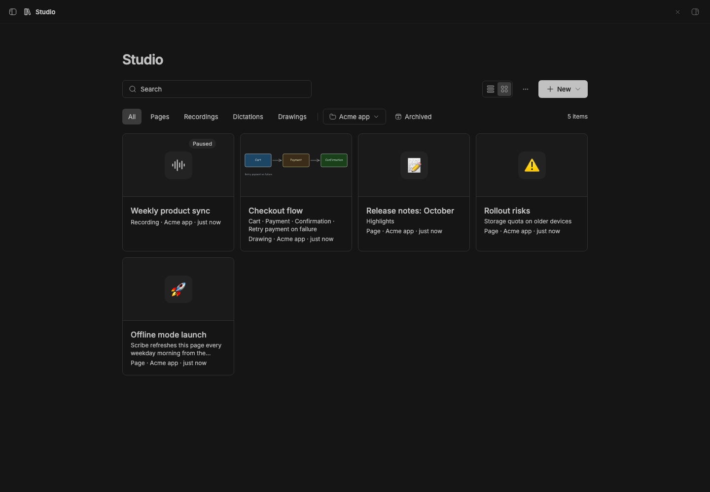
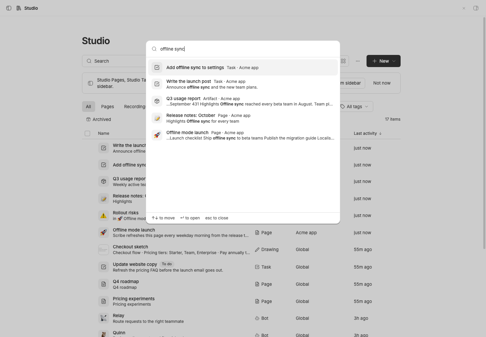

# Studio

> **Studio** is the core of **BB Studio**, a suite of plugins for writing, talking, drawing, tracking tasks, running bot teams, and keeping what your agents make: Studio, [Studio Pages](../bb-plugin-pages), [Studio Talk](../bb-plugin-talk), [Studio Draw](../bb-plugin-excalidraw), [Studio Artifacts](../bb-plugin-artifacts), [Studio Tasks](../bb-plugin-studio-tasks), [Studio Chat](../bb-plugin-studio-chat), and [Studio Teams](../bb-plugin-bot-teams).

One collection for everything the Studio add-ons make: pages, Talk
recordings and dictations, drawings, and saved artifacts. Search across all of them, filter by
kind, project and tag, and hand any of them to an agent.

## Staged preview



Captured from the running BB application: the Studio collection in a staged
project, listing a page, a Talk recording and a drawing side by side, with
the kind filters and New menu in the header.



Studio search (Cmd/Ctrl+Shift+K) over the same staged project, searching
"offline sync": a task matches on its title, and another task, an HTML
artifact and two pages match on their content, each showing the matching
text with the match in bold.

## What you get

- **One collection** (sidebar → Studio): every add-on's items in one list or
  grid, with search over titles and content, kind pills, a project filter,
  and an Archived view. Drawings show thumbnails; recordings show their
  length and word count.
- **Search from anywhere.** Cmd/Ctrl+Shift+K (or **Studio: Search items**
  in the command palette, Cmd/Ctrl+Shift+P) opens a quick-open box over any
  page. Titles match as you type; each add-on also searches its content —
  page text, transcripts, drawing text, artifact files, task notes, bot
  descriptions — and the row shows the text that matched. With nothing typed
  it lists recently changed items. ↑↓ and ↵ open one. (Cmd/Ctrl+K stays
  BB's thread search; plugins can't add results to it.)
- **Tags** group items across add-ons: a page, a drawing and a task can all
  be tagged "Launch". Tag from an item's ⋯ menu or the selection bar, filter
  by tag (or Untagged) from the tag menu, and click a chip to filter by it.
  The tag menu also renames and deletes the active tag.
- **Shared actions**: select items (shift-click for a range) to start a
  **New thread** that mentions them, move them to a project, archive, or
  delete. Actions an add-on defines, like Talk's "Copy transcripts" or Draw's
  "Copy text", appear when the selection is all that kind.
- **Tabs in the sidebar.** With [Studio Sidebar](../bb-plugin-thread-list-plus)
  as the thread list, each Studio item you open gets a tab in a Studio section
  above your threads. × or middle-click closes a tab; closing the one on
  screen opens the next. The section's ⋯ menu groups tabs by app, sorts them,
  and closes other or all tabs. Studio keeps the tabs, so every window shows
  the same ones, and closes tabs of deleted items.
- **New ▾** creates any kind an installed add-on offers, in the current
  project.
- **Takes over from the add-ons.** With Studio installed, each add-on's own
  collection hands over to Studio filtered to its kind, and item pages lead
  back to Studio. Studio's ⋯ menu can hide the add-ons' sidebar rows, so
  Studio is the only entry. Without Studio, each add-on works on its own.
- **For agents**: the `studio_list_items` and `studio_tag_items` tools, the
  `bb studio` CLI, and a `studio` skill.

```sh
bb studio list [--all] [--kind <kind>] [--query <text>] [--tag <tag>] [--json]
bb studio tags
bb studio providers
```

## How it works

- Add-ons implement the Studio provider contract (`studio_describe`,
  `studio_list`, `studio_search`, `studio_create`, `studio_move`,
  `studio_archive`, `studio_delete`, `studio_action`) from
  [`@bb-studio/kit`](../studio-kit), and publish them for RPC discovery.
  Studio finds them with `bb.sdk.plugins.experimental_discoverRpc` and calls
  them with `callRpc`. Any plugin can join the suite this way.
- `studio_search` returns the ids whose content matches and, optionally, a
  snippet of the matching text for each (the kit's `snippets` helper makes
  them). Studio matches titles itself.
- An add-on tells Studio when its items change (`studio_changed`); Studio
  relays that over realtime and the open collection refetches.
- A stopped or failing add-on shows up as unavailable instead of breaking the
  collection.
- Studio stores only tags and open tabs, keyed by `<plugin id>:<item id>`, so add-ons
  don't need to know about them. Tags on items an add-on no longer lists are
  dropped. Each add-on owns its data, editors, tools, CLI and mentions.

See [`docs/studio.md`](../../docs/studio.md) for the design.

## Development

```sh
pnpm typecheck
pnpm test
bb plugin build .
```

`@bb-studio/kit` is a `file:../studio-kit` dependency. Keep
`package-lock.json` current (regenerate it in a clean clone, not the pnpm
workspace), because BB's Git install runs `npm install` from it.
