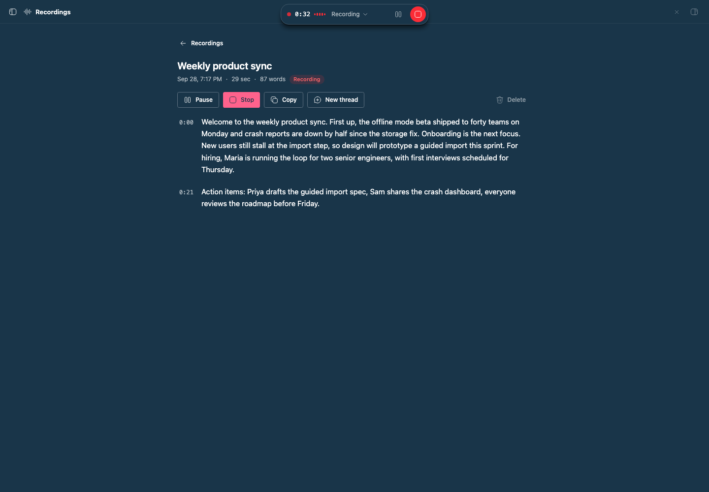

# bb-plugin-talk

> **Studio Talk** is part of **BB Studio**, a suite of plugins for writing, talking, drawing, tracking tasks, running bot teams, and keeping what your agents make: [Studio](../bb-plugin-studio), [Studio Pages](../bb-plugin-pages), Studio Talk, [Studio Draw](../bb-plugin-excalidraw), [Studio Artifacts](../bb-plugin-artifacts), [Studio Tasks](../bb-plugin-studio-tasks), [Studio Chat](../bb-plugin-studio-chat), and [Studio Teams](../bb-plugin-bot-teams).

Long-form, durable dictation and recording for BB. Talk saves audio as you
speak and transcribes it with the voice service configured in **Settings → AI
services**. That service is your ChatGPT subscription through Codex by
default. Every dictation and recording becomes a titled, searchable object you
can link to and @-mention.

## Staged preview



This is the real BB Recordings page, opened from the nav panel. It shows a
seeded recording called "Weekly product sync".

To stage it, the capture script:
- Speaks four meeting notes with macOS `say`.
- Uploads the audio to the live plugin in two sessions.
- Lets BB's voice service transcribe it.

The capture then presses **Record more** with Chrome's synthetic microphone.
The page shows the transcript grouped by session, with timestamps you can
play from. At the top is the app-wide recording pill with its clock, input
level, and pause and stop controls. The script deletes the seeded recording
afterwards.

## What you get

- **Replaces built-in dictation.** The composer's microphone starts a Talk
  dictation. Pressing it again, or ✓ in the pill, stops recording, waits for
  the transcript, and types it into that composer. ✕ stops without inserting.
- **One dictation, one thread.** While Talk is dictating, the mics in other
  threads are dimmed. Pressing one says where the dictation is, with a **Go
  back** button. The thread being dictated into shows a mic in the sidebar.
- **Finish from anywhere.** Press ✓ from another thread and Talk holds the
  text. It types the text into the dictation's thread when you go back. BB
  keeps unsent composer text on the device, so Talk can't safely write into a
  thread that isn't open.
- **Dictation in other plugins.** Plugins can mark a text surface as a
  dictation field, as [Pages](../bb-plugin-pages) does for its editor. Talk
  dictates into it with the same pill, durability, and **Go back** handling
  as a composer. *Talk: Start or finish dictation* works in a focused field.
- **Recordings for meetings.** **New recording** on the Recordings page, or
  the command *Talk: Start or stop a recording*, records for as long as you
  need without inserting anywhere.
- **A table of recordings.** The Recordings page lists everything in a
  table you can search, filter to recordings or dictations, and sort by
  title, date, length, or word count. Tick rows, or shift-click for a range,
  to start one thread that mentions them all, copy their transcripts as one
  document, retry failed pieces, or delete them together.
- **A pill that follows you.** A small overlay at the top of the window stays
  put as you move between threads and pages. Everything else stays clickable.
  Drag it anywhere in the window and it stays there, even after a reload.
  Away from where you started, a back arrow returns you to that thread or
  recording. Expand the pill to read the transcript as it arrives.
- **Streaming transcript.** Audio is cut into pieces of about 25 seconds at
  natural pauses. Each piece is transcribed as soon as it is uploaded, so text
  appears while you are still talking.
- **Linkable and mentionable.** Each recording has its own page at
  `/plugins/talk/recordings/<id>`. It shows up in the composer's @ menu, and
  mentioning it gives the agent its transcript. **New thread** starts a thread
  that links to it.
- **Auto titles.** A short-lived hidden agent thread titles each recording
  from its transcript. It retitles the recording as the transcript grows, and
  never replaces a title you typed.
- **Mobile layout.** The pill, Recordings page, and composer mic all work in
  the BB mobile app, with larger touch targets on small screens.

## Durability

- **Saved on the device.** Every few seconds, audio goes into IndexedDB.
  Audio leaves the device store only after the server confirms it is on disk
  (written to a temp file, fsynced, then renamed). A reload, crash, or network
  drop loses at most the last few seconds.
- **Survives reloads.** After a reload, the page picks the same recording back
  up in a new session. The transcript starts a new paragraph where the reload
  happened.
- **Offline.** While offline, audio keeps saving locally. It uploads with
  backoff when the connection returns.
- **One capture at a time.** A Web Lock makes sure only one window captures.
  Every window shows the pill. Other windows leave the capturing window's
  unsaved audio alone, and upload it only once that window is gone.
- **Refused pieces don't block the rest.** If the server rejects a piece as
  invalid, Talk keeps its audio on the device, says so, and uploads the
  pieces after it. **Unsent audio** (the toast's *Review*, or the notice on
  the recording's page and the Recordings list) lists what the device kept:
  retry each piece or all of them (after a Talk update, say), download one
  as an audio file, or discard it. A laptop that sleeps mid-recording doesn't count the
  sleep as recorded time.
- **Deleting.** A recording that a window is still capturing can't be
  deleted. Stop it first.
- **Interrupted recordings.** If a capture stops reporting for two minutes,
  for example because the laptop closed or the app was killed, the recording
  is marked *Interrupted*. **Resume recording** on its page continues it.
- **Failed transcription.** Failed pieces retry with backoff for about a day.
  If the voice service is off, they retry every 10 minutes. **Retry** requeues
  pieces that gave up. Audio is never discarded because of a failure.
- **Empty recordings aren't kept.** A dictation or recording that finishes
  with no words is deleted along with its audio, and Talk says so. This
  covers a mic tapped by accident, silence, and noise. A recording with a
  failed piece is kept, because a retry may still find speech.

## Settings

| Setting | Default | Effect |
| --- | --- | --- |
| Replace built-in dictation | on | The composer mic starts Talk. Off restores BB's one-shot dictation. |
| Segment length (seconds) | 25 | Target piece length, 8–60. Shorter pieces show text sooner. |
| Auto-title recordings | on | Titles recordings from their transcripts. |
| Title provider | automatic | Provider for titling, such as `codex` or `claude-code`. |
| Title model | provider default | Model for titling. |

## Commands

- *Talk: Start or finish dictation*
- *Talk: Start or stop a recording*
- *Talk: Pause or resume*

From a terminal or an agent:

```sh
bb talk list [--query <text>] [--json]
bb talk show <recording-id> [--json]
bb talk transcript <recording-id> [--offset <chars>] [--limit <chars>]
```

The bundled `talk` skill documents these for agents.

## Dictation fields for other plugins

Other plugins can use Talk without importing its code. The contract is plain
DOM, defined in [src/client/fields.ts](src/client/fields.ts):

- **Mark the field.** Put `data-talk-field="<key>"` on the element that wraps
  the text surface, with a key that stays the same across reloads, for example
  `pages:pg_123`. Add `data-talk-field-label` with a name for toasts, such as
  `“Launch plan”`.
- **Start or finish.** Dispatch a bubbling `bb-talk:toggle` event from inside
  the field. If Talk is already busy elsewhere, it shows where instead.
- **Receive the text.** Talk dispatches a cancelable `bb-talk:insert` event
  on the field, with the detail `{ text }`. Insert the text and call
  `preventDefault()`. If no field takes it, Talk keeps the text and delivers
  it once the field has been back on screen for a moment. Text whose field
  hasn't come back within three days is dropped, with a toast; it's still in
  Talk recordings.
- **Go back.** Talk dispatches a cancelable `bb-talk:open-field` on `window`,
  with the detail `{ field }`. The plugin that owns the key navigates to it
  and calls `preventDefault()`. If no plugin does, for example because the
  owner was disabled, Talk copies the waiting text to the clipboard instead.
- **Show state.** While Talk is loaded, `<html data-bb-talk>` is `idle`,
  `dictating`, or `busy`. `data-bb-talk-field` names the field being dictated
  into, and `data-bb-talk-phase` holds the capture phase. `bb-talk:state`
  fires on `window` when any of them change. If `data-bb-talk` is missing,
  Talk isn't installed, so hide dictation controls.

## Limitations

- **Mic swap can break.** BB has no API for replacing its microphone. A
  content script claims presses on the composer's "Start voice input" button.
  If BB changes that markup, the mic falls back to built-in dictation. Talk
  stays reachable from its commands and the Recordings page.
- **Held text stays on the device.** A dictation finished away from its
  thread waits on the device you dictated on. A new-thread dictation finished
  after you leave that page is copied to the clipboard instead. Either way,
  the dictation is also in Recordings.
- **Mobile backgrounding.** On mobile, the microphone stops when the BB app
  goes to the background. Talk resumes when the app returns, or shows
  **Resume** when the system needs a tap first.
- **Voice service required.** Transcription needs BB's voice service turned
  on. Audio recorded without it is kept and transcribed once it is available.
- **Personal project threads.** Titling runs hidden agent threads in BB's
  Personal project.

## Develop

```sh
npm install
npm test
npm run typecheck
bb plugin build .
bb plugin install . --yes
```
