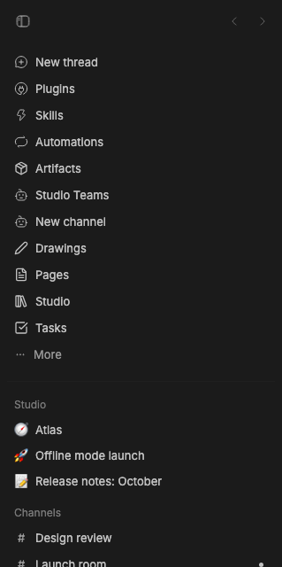

# Studio Sidebar

> **Studio Sidebar** is part of **BB Studio**, a suite of plugins for writing, talking, drawing, tracking tasks, running bot teams, and keeping what your agents make: [Studio](../bb-plugin-studio), [Studio Pages](../bb-plugin-pages), [Studio Talk](../bb-plugin-talk), [Studio Draw](../bb-plugin-excalidraw), [Studio Artifacts](../bb-plugin-artifacts), [Studio Tasks](../bb-plugin-studio-tasks), [Studio Chat](../bb-plugin-studio-chat), and [Studio Teams](../bb-plugin-bot-teams).

Studio Sidebar replaces BB's Thread List sidebar provider. It keeps the thread
list and its organization controls, and adds:

- **Studio apps' sections above your threads.** Each Studio app can add a
  section, like Studio's tabs for the items you've opened. Everything scrolls
  as one list with the threads; no section has its own scroll area.
- **Section controls.** Each section's ⋯ menu moves it up or down or hides
  it. **Threads ⋯** lists hidden sections to show again. The arrangement and
  collapsed sections are kept per browser and follow across windows.
- **New project** in the **Threads ⋯** menu. It opens a folder picker or
  accepts a folder path, creates the project through BB's Plugin SDK, and
  opens it.
- **Float in Studio Chat** in each thread's menu, after **Open in split**,
  while [Studio Chat](../bb-plugin-studio-chat) is installed. It puts the
  thread in Studio Chat's floating card.

The bundled Thread List plugin remains installed; selecting Studio Sidebar as
the thread list provider switches the visible list. Install this package in
BB, then choose **Studio Sidebar** in **Settings → Appearance → Sidebar →
Thread list provider**. The package requires BB 0.44 or newer and Plugin SDK
0.5.29 or newer. Its plugin id stays `thread-list-plus`.

The `source/` directory is a fork of BB's MIT-licensed Thread List plugin at
commit `4354b88ce`, with project creation and Studio sections added. See
[LICENSE](LICENSE) for the upstream license.

## Staged preview



Captured from the running BB sidebar with Studio Sidebar selected as the
thread list provider. Two staged pages, "Offline mode launch" and "Release
notes: October", were opened, so the Studio section lists them as tabs above
the Threads list. The capture asserts that both tabs are present, that the
section sits above Threads, and that it has no scroll area of its own.


The dialog capture opens **New project** from the live **Threads ⋯** menu and
checks for the folder path, Browse, and Create project controls. No project
is created during capture.

## For Studio apps

A Studio app adds a section from any always-mounted component, such as an
`experimental_appOverlay`, with [`@bb-studio/kit`](../studio-kit):

```tsx
<SidebarPortal id="tabs" title="Studio" order={0}>
  <SidebarSection title="Studio" menu={…}>{rows}</SidebarSection>
</SidebarPortal>
```

Studio Sidebar renders an empty anchor for each registered section and the app
portals into it. Without Studio Sidebar, `SidebarPortal` renders nothing.

## Development

```sh
pnpm typecheck
bb plugin build .
```

`@bb-studio/kit` is a `file:../studio-kit` dependency. Keep
`package-lock.json` current (regenerate it in a clean clone, not the pnpm
workspace), because BB's Git install runs `npm install` from it.
