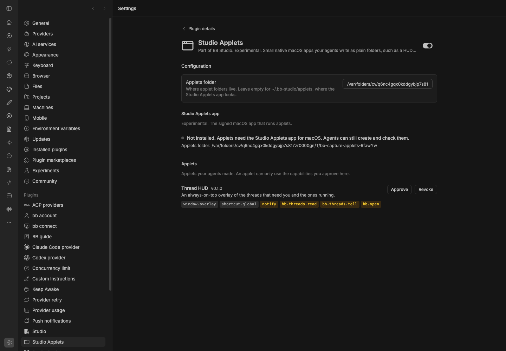

# Studio Applets

Part of BB Studio. **Experimental.**

Applets are small native macOS apps that your agents write as plain folders:
a `manifest.json` plus HTML, JavaScript and CSS. One signed app, Studio
Applets, runs them all, so a new applet needs no build and no code signing.
An applet has no Node or Electron. It reaches the desktop and BB only through
the `window.studio` API, and only for the capabilities you approve.

This plugin is the BB side:

- Agent tools `applets_create`, `applets_update`, `applets_list` and
  `applets_logs`. They write and check applet folders and reject a bad
  manifest before anything is written.
- The applets API (`bb plugin rpc call applets <method>`): `status`,
  `applets.*`, and `threads.list`, `threads.get`, `threads.timeline` (recent
  messages and tool calls), `threads.tell` (queue or steer), `threads.stop`
  and `threads.open`. The app relays an applet's `window.studio.bb.*` calls to it.
- The settings page: whether the app is installed and running, each applet's
  capabilities, and Approve and Revoke.
- `bb applets list | logs <id> | doctor`.

The plugin works without the app. Agents can still create and check applets,
and the settings page says the app isn't installed. The app lives in
[`apps/applets`](../../apps/applets/); it isn't published for download yet.

## Staged preview



The plugin's settings page in a staged BB, with the Studio Applets app not
installed. A seeded Thread HUD applet asks for six capabilities: two are
approved, and four wait for approval, shown in amber with an Approve button.

## Applets

Applets live in `~/.bb-studio/applets/<id>/`. Change the folder in settings
(the app only looks in the default one). A manifest:

```json
{
  "id": "hud",
  "name": "Thread HUD",
  "version": "0.1.0",
  "api": 1,
  "windows": { "main": { "kind": "overlay", "width": 320, "height": 200, "position": "top-right" } },
  "capabilities": ["window.overlay", "shortcut.global", "bb.threads.read", "bb.open"],
  "shortcuts": { "toggle": "Alt+Space" }
}
```

Window kinds are `normal`, `panel`, `overlay` and `popover`, and each needs
its `window.<kind>` capability. `"resizable": true` lets you resize an overlay
or popover; the app remembers where you leave each window. Other capabilities: `shortcut.global`,
`notify`, `clipboard.read`, `clipboard.write`, `fs.applet` (only the applet's
own `data/` folder), `open.url`, `bb.threads.read`, `bb.threads.tell`,
`bb.threads.spawn`, `bb.studio.read`, `bb.open`, and
`bb.rpc:<plugin-id>:<method>` for one plugin RPC method. There is no shell
access, open file access or screen capture.

When an applet's manifest asks for a capability you haven't approved, it waits
in settings until you approve it. Approvals are stored in
`~/.bb-studio/applets/grants.json`.

## Requirements

Requires BB 0.45 or later. Running applets needs macOS and the Studio Applets
app.
