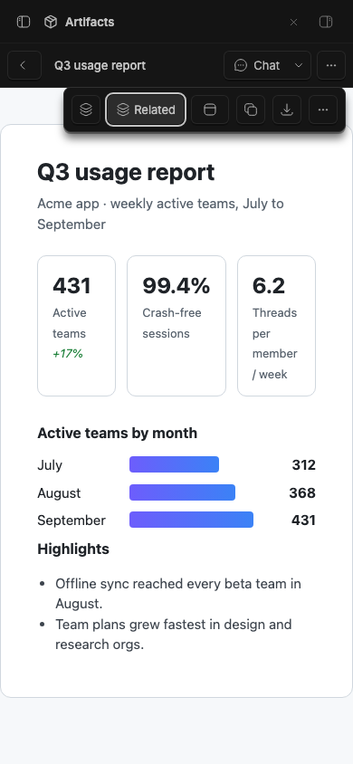
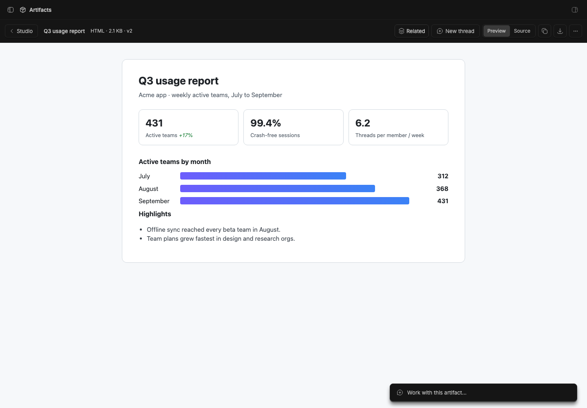

# Studio Artifacts

> **Studio Artifacts** is part of **BB Studio**, a suite of plugins for writing, talking, drawing, and keeping what your agents make. See the [suite overview](../../README.md).

Keep the images, reports, pages and files your agents make. Save a file from
a thread and it becomes an artifact in Studio's collection. You can view it,
download it, mention it in other threads, or start a new thread from it. Saving the same file
from the same thread again adds a new version.

Nothing is saved automatically. You pick what to keep, or you ask the
agent to save it.

## Staged preview



The live 390-pixel viewer shows the seeded Q3 HTML report. **Chat** stays
visible while **Item actions** exposes related items, Open in split, and the
artifact controls.
These compact captures run on stable BB 0.45.0 with the full suite installed
from pushed commit 786fd2f. They check viewport bounds, button hit targets,
and the Related popover before capture.



Captured from a staged BB (`node scripts/staged-bb.mjs start`). It shows an
HTML report, "Q3 usage report", saved twice from a staged thread's workspace.
The viewer shows version 2 in its sandboxed frame, under Studio's shared item
header, with Related, the artifact's thread ("Pick a database for the todo
app", the staged thread that saved it), the Preview/Source toggle, Copy,
Download and the ⋯ menu.

## What you get

- **Artifacts in Studio.** With the [Studio](../bb-studio) plugin
  installed, artifacts join Studio's collection next to pages, recordings
  and drawings. They get type, size and version columns, image thumbnails,
  projects, search over titles and text, archive, move and delete. Saving
  to an archived artifact again brings it back. Studio
  can't create an artifact, because artifacts come from threads. Without
  Studio, the **Artifacts** panel shows the same collection on its own.
- **The viewer** (`/plugins/artifacts/artifacts/<id>`) shows each type in
  the way that suits it:
  - Images fit the window, and a click switches to actual size.
  - HTML runs in a sandboxed frame.
  - PDFs open in the browser's viewer.
  - Markdown renders as a document.
  - Code and text use BB's source viewer.
  - Other files offer a download.

  The header has an editable title, the artifact's thread (with
  [Studio chat](../bb-studio); otherwise **New thread**, which starts a
  thread that mentions the artifact), Copy (text, or the image), Download,
  and a menu.
  The menu has Open source thread, Save as page (for Markdown, text and code),
  Versions, Move to, and Delete.
- **Send to thread.** Select text in a Markdown, HTML, code or text
  artifact, or drag over an image, and **Send to thread** appears. Add a
  note and send: the passage (or the area, cropped, with its pixel
  coordinates) goes to the artifact's thread, which is the thread that made
  it unless you've picked another. Without Studio, BB's composer opens
  with the quote. PDFs aren't supported yet.
- **Save from a thread.** **Artifacts** in the thread panel launcher opens a
  side panel with the files the latest reply created, changed, or generated,
  with the new ones already ticked. The panel also lists the thread's storage
  files and what the thread has already saved.
- **Capture from iPhone.** The Capture sheet accepts a photo or file and saves
  it directly as an artifact in the selected default project.
- **Agents save too.** The `artifacts_save`, `artifacts_list` and
  `artifacts_read` tools, and the `artifacts` skill, cover when to save
  something. When the agent puts `::artifact{id="art_…"}` in a reply, it shows
  a card that opens the viewer. For repository coding tasks, agents keep changes
  in Git and save patches, source copies, logs or implementation summaries only
  when you explicitly request that export.
- **`@artifact` mentions.** The agent receives the artifact's details and,
  for text types, its contents.
- **`bb artifacts` CLI**: `save <path> [--title] [--description]`,
  `list [--thread]`, `show <id>`, `export <id> [path] [--force]` (copies an
  artifact into the thread's workspace, so an agent can edit it and save it
  back; it won't replace an existing file without `--force`), and
  `delete <id>`.

## How it works

- Artifacts and their versions are stored as BLOBs in the plugin's SQLite
  database, up to 25 MB per file. A version is keyed on its source thread
  and path. A save whose bytes haven't changed doesn't add a version.
- Saving reads the file from the thread's workspace or thread storage on
  the thread's machine. Paths outside those two roots are refused.
- Phone capture uses the additive `importFile` RPC. It accepts Base64 file bytes,
  a name, MIME type and project ID, applies the same 25 MB limit, and creates
  an artifact without a source thread.
- The "this reply's files" list comes from the thread's event history:
  generated images and file changes between the reply's turn request and its
  end, with deleted files left out.
- The viewer's HTML preview asks for `content?…&quote=1`, which adds a small
  script before `</body>`. It posts the selected text and its position to
  the viewer, which accepts messages only from its own frame. The page stays
  sandboxed. A page whose own CSP blocks inline scripts just can't be quoted.
- Contents are served from `GET /api/v1/plugins/artifacts/http/content`.
  Every response except a real PDF carries a `sandbox allow-scripts` CSP.
  This gives HTML an opaque origin, so it can't call BB's API with your
  session, even if it's opened directly. Chrome's PDF viewer won't load in a
  sandbox. The route checks that a file's bytes really are a PDF before it
  serves it unsandboxed, and a PDF can't run page scripts.
- The Studio provider (`src/server/studio.ts`) implements the kit's
  `studio_*` methods on top of the store (`src/server/store.ts`).

## Development

```
bb plugin install .     # register (path install; server.ts loads from source)
bb plugin dev           # watch: rebuild frontend + reload on every save
bb plugin build .       # emit dist/ (server.js + app.js/app.css)
pnpm typecheck
pnpm test
```

`@bb-studio/kit` is a `file:../bb-studio-kit` dependency. Keep
`package-lock.json` current (regenerate it in a clean clone, not the pnpm
workspace), because BB's Git install runs `npm install` from it.

## Duplicate and export

Studio can duplicate an artifact as a separate item using its latest file version. The provider exports the original file with its name and MIME type.
