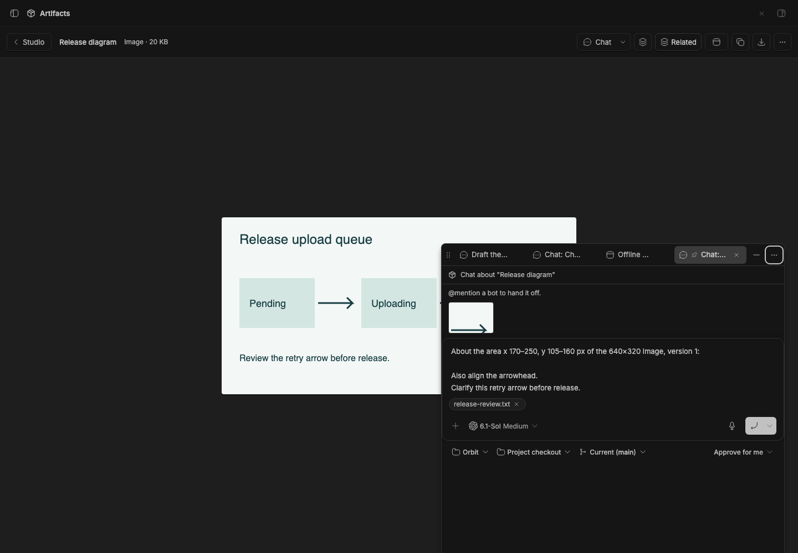

# Studio Chat upgrade bridge

Item chat, conversation selection, and quotes now ship with [Studio](../bb-studio).
This package is absent from the marketplace and retained only for existing installs.
It owns no chat UI or new conversation links.

Update Studio first, then update this installed plugin and run:

```sh
bb plugin update studio --yes
bb plugin update studio-chat --yes
bb studio-chat migrate
```

Wait for **Migration complete** before removing the bridge. The migration copies
chosen conversations and explicit unlinks, keeps the original records, and never
replaces a newer Studio choice. A failed migration can be retried.
The bridge also forwards older native clients and item mentions and redirects old
chat bookmarks. Keep it installed while those clients or bookmarks still need it.
New clients call Studio directly. Composer draft keys and the quote IndexedDB
store keep their original names so unsent text, attachments and quotes survive.

## Staged preview



This historical screenshot shows the former standalone UI. Current chat captures
and behavior tests belong to Studio; this package now serves only upgrades.
