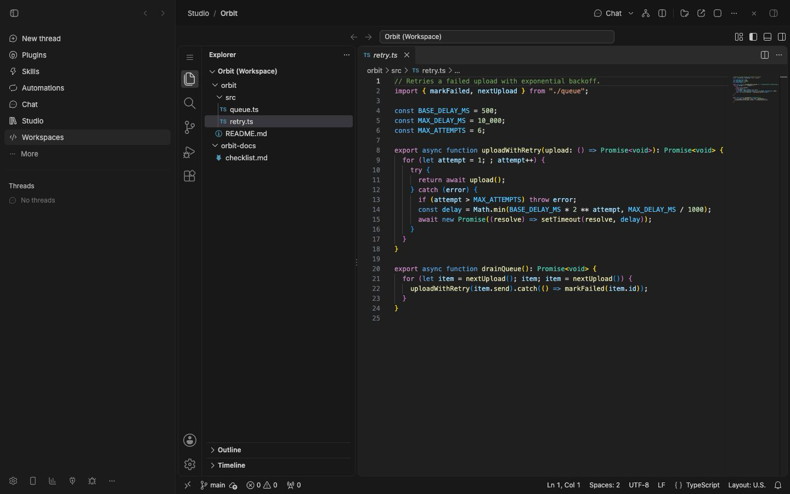
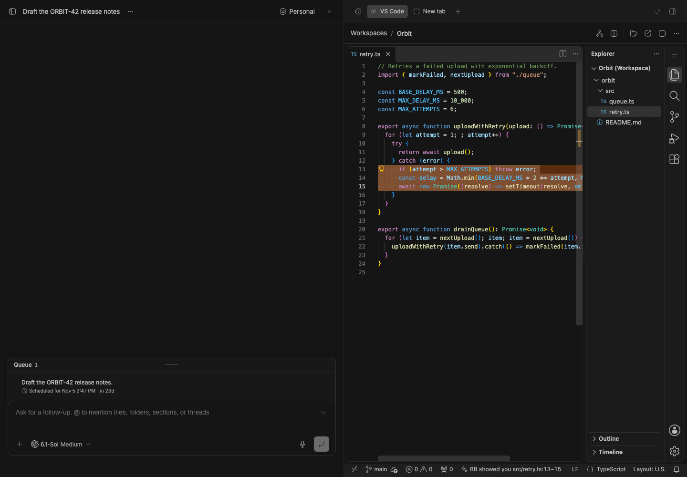

# Studio Code

Part of BB Studio. A **workspace** is a Studio item that opens one or more folders in VS Code, inside BB. Like any Studio item, it belongs to a project and so to a Space. A Space can hold as many workspaces as you like, each open to different folders. The plugin id is `studio-code`.

## Use it

- **In Studio**, choose **New, Workspace**. It starts with its project's folder (the Space's own folder when you create it inside a Space). With no Space chosen, it starts empty and asks for folders.
- **Beside a thread**, open the **VS Code** tab in the right panel. It opens the thread's own worktree, so you see the agent's changes, branch and diff. The workspace is made the first time and reused. **Back** lists the thread's other workspaces. This works only when the thread runs on the computer running BB.
- **From a reply**, a `::workspace{id="cws_…"}` card opens the workspace in that tab.
- **From a file tab**, code files open with VS Code by default. BB's preview always shows. If the thread already has a workspace, the file also jumps to its lines in that workspace's VS Code tab. If not, **Open in VS Code** makes one, so glancing at a file never makes a workspace or starts a server. Markdown stays in BB's preview. **Settings → Files** can make BB's preview the default instead.
- **From the thread header**, a code-icon chip appears once the thread has a workspace (made for it, or holding its folder) or has edited files in its folder. One click opens that workspace beside the chat. A dot pulses while the agent is editing.
- **In a composer**, type `@` and a workspace's name to give the agent its folders.
- **Folders.** The folder button in the header adds or removes folders. **Browse…** walks the folders on the computer running BB (hidden ones on request, secret ones never). You can also type a full path (or `~/…`) or pick a BB project. VS Code shows every folder in one multi-root window and updates live when they change.
- **Share toggle.** The eye in the workspace header turns on or off sharing what you have open with agents. It is on by default.
- **Start and stop.** The first open downloads code-server 4.140.0 (about 200 MB) into the plugin's data folder. Later opens start in a few seconds. **Stop** ends the workspace's server. **Open in browser** opens the same editor in its own window.

## Agent tools

The `studio-code` skill explains when to use them.

- `code_workspace_open` opens the thread's worktree, or makes a workspace for the folders you give, and prints the reply card.
- `code_workspaces_list` lists workspaces.
- `code_workspace_set_folders` replaces a workspace's folders.
- `code_editor_state` reports what you have open right now.
- `code_show` opens a file in your editor, scrolls to the lines, and selects and highlights them ("BB showed you src/retry.ts:13").
- `code_edit` edits live: up to 20 replace-once edits per call. You watch the text typed into your editor behind a "BB" caret. It is one undo step and merges with your unsaved changes, and it leaves saving to you. With no editor open, it edits the file on disk.

There are no CLI commands and no settings.

## Working with the agent

Every workspace runs the **BB Studio bridge**, a small VS Code extension that Studio Code installs. It reports the file you have open, the lines on screen, your selection, errors and warnings, and files with unsaved changes. Each agent turn in a related thread (the workspace's own thread, or one working inside its folders) starts knowing that, so "is this line right?" works without pasting. The agent is told not to edit files you have unsaved changes in.

With the same workspace open in several tabs, the agent talks to the one you used last. If no editor is open, `code_show` jumps there when you open one. **Copy for BB chat** in the editor's right-click menu copies the selection with its path and lines.

**Follow mode.** While a thread works, Studio Code shows what it's doing in any open editor whose folders hold the files: reads, shell reads such as `sed -n` and `cat`, file changes and live edits. The status bar says what it's on ("Fix the retry: editing retry.ts", then "changed 2 files"). Lines it reads get a soft highlight. Lines it changed get a tint and accent bar until its next turn. **Follow** (the eye in the status bar, on by default) moves your editor to where the agent works, but never within a few seconds of your own typing or clicking. Threads working in other folders don't touch your editor.

## BB's shortcuts inside VS Code

While VS Code has the keyboard, BB's page never sees your keys. The bridge passes exactly these through:

| Keys | In BB |
|---|---|
| ⌘K | Search threads |
| ⇧⌘O | New thread |
| ⌘\ | Toggle the sidebar |
| ⌘J | Toggle the right panel |
| ⇧⌘C | Focus the chat composer |
| ⌘1 to ⌘9 | Jump to a thread |

Ctrl replaces ⌘ off macOS. Editing keys, VS Code's palettes (⌘P, ⇧⌘P), ⌘W and tab switching stay with VS Code. VS Code's ⌘K chords (such as ⌘K ⌘S) don't work, because ⌘K belongs to BB. Their commands are in ⇧⌘P.

## Phones and other computers

VS Code answers only on the computer running BB. When BB is opened from anywhere else, such as the iOS app or a browser on another machine, the workspace shows a read-only file browser instead. You can walk its folders and read text files up to 1 MB. Paths resolve through symlinks and must stay inside the workspace's folders. No editor starts.

## How it works

Each open workspace runs its own [code-server](https://github.com/coder/code-server) (MIT) on a loopback port. It gets a `.code-workspace` file listing the folders, plus its own settings and state under `<dataDir>/plugins/studio-code/workspaces/<id>/`. Extensions are shared across workspaces and come from Open VSX. The layout turns off VS Code's tips and command center.

- **Layout.** VS Code is laid out for a pane inside BB: its side bar and activity bar are on the right, with no title bar, menu bar, minimap or breadcrumbs. The menu is the ≡ at the top of the activity bar. Each workspace gets this layout once, so later changes you make stay.
- **Theme.** VS Code takes BB's colors, including custom and plugin themes, over Dark Modern or Light Modern to match BB's mode. Syntax colors stay VS Code's. Open editors reload when BB's colors change.
- **Idle shutdown.** A server stops after 30 minutes with no editor connected and reopens when you return. A view out of sight for 5 minutes lets go of its editor. Each server uses roughly 200 to 400 MB of memory.
- **Servers never outlive BB.** A small watchdog holds a pipe to BB and stops code-server when BB exits, even on a crash or `kill -9`. The plugin also stops leftover code-servers when it next loads.
- **Backup.** Workspaces aren't in `bb studio backup`. A workspace is a list of folders on disk, so back up the folders. See [Backup and restore](../../docs/backup.md).

Tested on macOS (arm64) and Linux (arm64, in Docker). There is no Windows support, because code-server has no Windows build.

## Security

- **Password per server.** code-server runs with password auth on a port the OS picks, with a new random password each start. The password is kept in a file only you can read, never on a command line. The panel signs the editor in with it, and each workspace has its own session cookie. Other programs and web pages on the machine can't use an open editor without it. Any BB client can still get the password through BB's API, like everything else BB serves, so BB's own access controls are what protect the editor.
- **Checked download.** The code-server archive must match the SHA-256 pinned for its platform before it's unpacked. A partial install, or one made without the check, is replaced.
- **Workspace trust.** VS Code skips workspace trust only for folders you picked and for a thread's own worktree. When an agent makes a workspace for folders it names, or changes a workspace's folders, that workspace goes back to Restricted Mode until you trust it in VS Code. Tasks and settings in it then don't run on their own.
- **No secret folders.** A workspace can't open `/`, your home folder, or a folder that holds or sits inside `~/.ssh`, `~/.aws`, `~/.gnupg`, `~/.kube`, `~/.docker`, `~/.azure`, `~/.config/gh`, `~/.config/gcloud`, `~/Library/Keychains` and similar. The folder picker doesn't list them. The read-only file browser skips such folders even if they were added earlier, because it serves a workspace's folders to any BB client.
- **The bridge only talks to its extension.** Every process inside code-server (tasks, terminals, extensions) inherits the bridge socket's path. So each run also has a secret, kept in a mode 0600 file beside the socket, and every request must carry it. Keys passed to BB must be exactly the listed shortcuts. Code that runs as you can still read your files, that secret included. This stops casual and inherited use, not a deliberate attack.
- **What agents see.** Only the workspace's own thread, or a thread working inside its folders, gets what you have open. A thread in a parent folder (your home folder, `/`) gets nothing. The eye in the workspace header turns sharing off. What agents get is marked as untrusted data, not instructions.
- **Edits that can't half-land.** A live edit that fails partway rolls the file back, unless you typed meanwhile (then press ⌘Z). Your typing during an edit gets its own undo step, and the file isn't saved for you. An edit that times out is reported and never repeated on disk. Edits on disk refuse files of 1 MB or more or that aren't plain UTF-8 text, and write the file the path really points at, inside the workspace's folders.
- **Stop ends everything.** code-server runs in its own process group. Stop, or BB exiting, ends the whole group, including extension hosts and terminals. Stopping, archiving or deleting a workspace while it downloads or starts cancels the start.

## Staged preview

A workspace open in Studio, from a staged stable BB. It was made the way
Studio's New makes one, for the seeded Orbit project. VS Code is laid out for
BB, with its side bar and activity bar on the right. The retry loop in
`src/retry.ts` (lines 8–18) is selected and highlighted the way `code_show`
points an agent's user at code, and the status bar reads "BB showed you
src/retry.ts:8–18".

The same editor beside a conversation: the seeded thread on the left, its
VS Code tab on the right. The thread hasn't run yet, so the tab offers the
project's workspaces, and the capture opens Orbit's. Lines 13–15 are
highlighted.

Both are captured by `scripts/capture/captures/bb-studio-code.mjs`. It checks
what VS Code shows through the bridge (the editor's own report of the file
and selection), not just that a frame loaded.
