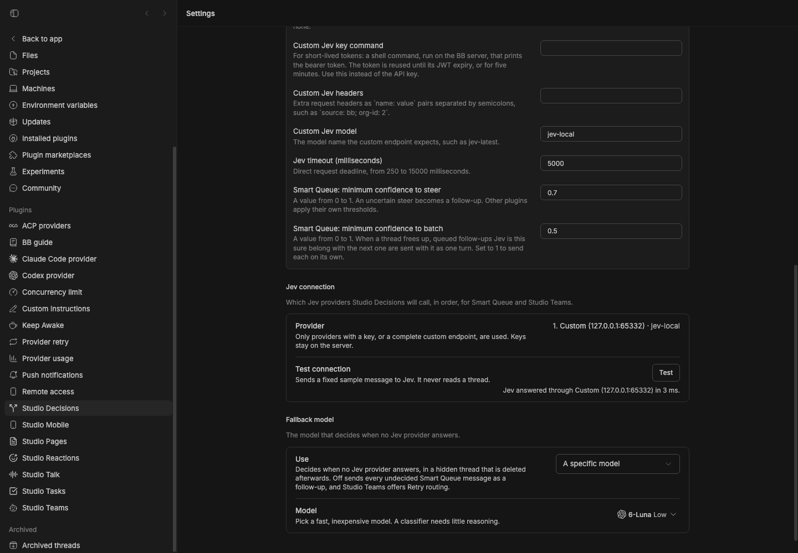

# Studio Decisions

> **Studio Decisions** is part of **[BB Studio](../../README.md)**. It works on its own and doesn't need the Studio collection.

Studio Decisions is the one place BB Studio sets up its fast decision models:
**Jev**, TypeSafe's System One model, and a **fallback model** from a BB
provider you already use. Enter the keys once here. Two things use them:

- **Smart Queue**, built in, decides what happens when you send a message to a
  thread that is still working.
- **Other plugins** ask it for quick decisions through its
  [plugin RPC](#for-other-plugins).

## Smart Queue

Smart Queue decides what happens when you send a message to a thread that is
still working. A correction or urgent change **steers** the running turn now.
A separate or later task waits as a **follow-up** until the turn ends. You no
longer need to pick steer or queue yourself.

If the standalone **Smart Queue** plugin is also enabled, Studio Decisions'
Smart Queue pauses, so each message is decided once. Its Jev and fallback
model setup still serves other plugins.

### How it decides

1. **Jev** answers first. Smart Queue sends Jev the thread title, your last
   three requests, the last 2,000 characters of assistant output, and the new
   message. Jev returns `steer` or `followup` with a confidence. A steer below
   the confidence threshold (default 0.7) becomes a follow-up.
2. **The fallback model** answers when no Jev provider does. It asks the same
   question in a hidden, temporary thread in BB's Personal project, on the
   thread's machine, and deletes the thread afterwards. By default it uses the
   thread's own provider and that provider's default model. Pick a fast,
   inexpensive model with BB's model picker in settings, or turn it off.
3. **Follow-up** is used when neither answers. An unnecessary steer interrupts
   work, so waiting is the safe default.

All conversation text is sent as data, with instructions to treat it as data.

## Jev providers

Every provider serves the same Jev model through TypeSafe's
[System One API](https://docs.typesafe.ai/api). Add a key for any of them.

| Provider | Key setting | Environment fallback | Model |
| --- | --- | --- | --- |
| [TypeSafe](https://typesafe.ai) (canonical) | `typesafeApiKey` | `TYPESAFE_API_KEY` | `typesafeModel`, default `jev-latest` |
| Vercel AI Gateway | `vercelApiKey` | `AI_GATEWAY_API_KEY` | `typesafe-ai/jev` |
| OpenRouter | `openRouterApiKey` | `OPENROUTER_API_KEY` | `typesafe/jev-1.13` |
| OpenCode Zen | `zenApiKey` | `OPENCODE_API_KEY` | `jev-1.13` |
| Custom | `customJevApiKey` (optional) | — | `customJevModel` |

`jevProvider` chooses where to call Jev. `auto`, the default, tries the
providers in the order above, uses each one that has a key, and moves to the
next when one fails. Name one provider to use only that one.

**Bring your own provider.** Set `customJevEndpoint` to the full URL of any
endpoint that accepts System One requests, such as a company gateway or a
self-hosted proxy, and set `customJevModel` to the model name it expects. The
custom key is sent as a bearer token when set. The endpoint must use HTTPS,
except on `localhost`.

Two more settings cover gateways that need more than a static key:

- `customJevApiKeyCommand` is a shell command that prints a short-lived bearer
  token. Studio Decisions runs it on the BB server, reuses the token until its JWT
  expiry (or for five minutes), and runs it again when the endpoint rejects
  the token. Set it instead of `customJevApiKey`.
- `customJevHeaders` adds request headers, written as `name: value` pairs
  separated by semicolons, such as `source: bb; org-id: 2`.

Each provider bills its own usage. TypeSafe charges per input token. A
Smart Queue decision sends at most about 25,000 characters, and usually far
less.

### What it handles

Smart Queue acts only on messages you send yourself to a busy thread. It
ignores messages from agents and other threads, plugin submissions, retries,
scheduled messages, and hidden threads.

Smart Queue holds the message. The queued card shows *Smart Queue is deciding
whether to steer or follow up*. Then either the message joins the turn, or the
card changes to *Smart Queue: follow-up after the current turn (Jev 67% via
TypeSafe)*. A follow-up is released when the thread goes idle.

Both composer settings get this card. When Enter queues, the app adds the
message to BB's queue directly, where no plugin sees it. Smart Queue checks
the queue every second, takes each new row out, and sends its text the way
the composer's steer does. BB's dispatch check then holds it on Smart Queue's
card, in the order you queued.

When the thread goes idle with several follow-ups waiting, Smart Queue asks Jev
which ones belong with the next one. Those move up beside it and go to the
agent as one turn, using BB's queued-message grouping, wherever you queued
them. Say you queue *also print the date*, then *what's the capital of
France?*, then *use ISO format for the date*. The two date messages go
together, and the France question gets its own turn afterward. Messages you
grouped by hand, and messages set to a different model, reasoning level,
permission mode or speed, are never regrouped. If Jev doesn't answer, each
follow-up goes on its own, as before.

When several messages steer, they reach the turn in the order you sent them.
The queued card's own **Send now** and **Steer** buttons still override Smart
Queue, and sending a card by hand cancels its pending decision. Editing a held
card starts a fresh decision for the new text.

## Settings

Open **Settings → Plugins → Studio Decisions**, or use `bb plugin config smart-decisions`.

| Setting | Default | Purpose |
| --- | --- | --- |
| `enabled` | `true` | Turn Smart Queue on or off. Other plugins' calls are unaffected. |
| `jevProvider` | `auto` | `auto`, `typesafe`, `vercel`, `openrouter`, `opencode-zen`, or `custom`. |
| `typesafeApiKey`, `vercelApiKey`, `openRouterApiKey`, `zenApiKey` | — | Provider keys (secret). See [Jev providers](#jev-providers). |
| `typesafeModel` | `jev-latest` | Dropdown: `jev-latest`, `jev-preview`, or `jev-1.13.0` to pin that version. |
| `customJevEndpoint`, `customJevApiKey`, `customJevModel` | — | Your own System One endpoint. |
| `jevTimeoutMs` | `5000` | Deadline for each provider attempt, 250 to 15000 ms, for every caller. |
| `steerConfidence` | `0.7` | Smart Queue's minimum Jev confidence to steer. |
| `batchConfidence` | `0.5` | Smart Queue's minimum Jev confidence to send a follow-up in the same turn as the next one. `1` sends each on its own. |

Below the form, two sections complete the page:

- **Jev connection** lists the providers Studio Decisions will call, in order, and
  any configuration problems. **Test** sends a fixed sample message to Jev and
  reports which provider answered; it never reads a thread.
- **Fallback model** chooses what decides when no Jev provider answers: the
  caller's provider (the busy thread's for Smart Queue), a
  specific model picked with BB's own provider, model, and reasoning picker,
  or off. The same choice is available as `bb smart-decisions fallback`.

## Commands

```sh
bb smart-decisions status              # Jev routes, problems, and the fallback model
bb smart-decisions recent [--limit n]  # Recent decisions, newest first
bb smart-decisions classify <thread-id> <message>  # Dry run; sends nothing
bb smart-decisions check               # Test the Jev connection with a sample message
bb smart-decisions fallback [thread | off | <provider-id> <model> [<reasoning>]]
```

Every command accepts `--json`.

Studio's plugin health check (`bb studio health` and the sidebar footer)
warns when no Jev provider is set up, when Jev failed in the last 30 minutes,
or when the fallback model's provider is unavailable.

## For other plugins

Studio Decisions publishes two plugin RPC methods under the plugin ID
`smart-decisions`. Each takes a `caller`, the calling plugin's ID, for its
logs.

- `systemOne.ask` takes `state` (any JSON, at most 64,000 characters) and
  `questions`, 1 to 64 named System One questions. A `noul` question returns a
  probability; a `choice` question picks one of 2 to 32 options. Every answer
  is checked: a missing answer or an unknown option moves to the next
  provider.
- `model.ask` runs a prompt through the fallback model in a hidden, temporary
  thread in the Personal project and deletes it afterwards. It takes
  `requestId`, `hostId`, `prompt`, and `providerId`, the caller's provider for
  when the fallback follows it.
  An optional `modelSelection` object (`providerId`, `model`, `reasoningLevel`,
  optional `serviceTier`) runs the caller's chosen model instead of the fallback,
  including when the fallback is off. It uses the same temporary-thread cleanup.

Studio Talk can choose models for transcript cleanup, recording titles, and summaries. Callers share the typed
`@bb-studio/kit/decisions` client, including its `askTitle` helper.

Both return `{ ok: true, … , via, ms }`, or `{ ok: false, unavailable, error }`.
`unavailable` means nothing is configured to answer.

## Staged preview



This is the plugin's real settings page in a staged BB, scrolled to the end.
The staged data is a local stand-in for the System One API, set as the custom
Jev endpoint with the model `jev-local`. **Jev connection** lists it as the
only provider, and its live **Test** answered in a few milliseconds. The
**Fallback model** is Codex's GPT-6-Luna (shown by BB's picker as *6-Luna*) at
low reasoning. The capture restores the staged settings afterwards.

## Install

```sh
bb plugin install ./packages/bb-studio-decisions --yes
```

## Development

```sh
pnpm --dir packages/bb-studio-decisions test
pnpm --dir packages/bb-studio-decisions typecheck
pnpm --dir packages/bb-studio-decisions build
```
