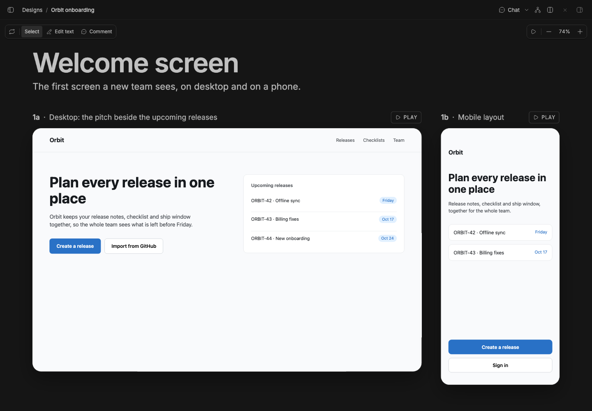
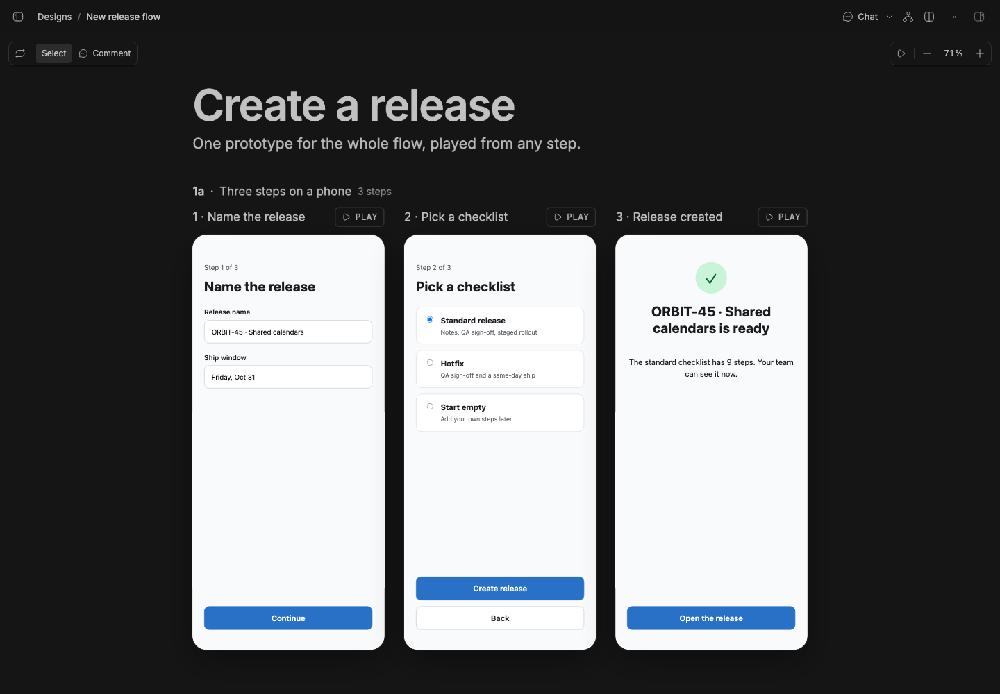

# Studio Design

> **Studio Design** is part of **BB Studio**, a suite of plugins for writing, talking, drawing, and keeping what your agents make. See the [suite overview](../../README.md).

Design UI prototypes with your agents. A design is a set of rounds; each
round holds a few options, and each option is one self-contained HTML screen.
The agent writes the screens, and you see them live on a canvas, play them,
and pin comments to their elements for the agent to act on. The plugin id is
`design`.

## Staged preview



Captured from a staged BB (`node scripts/staged-bb.mjs start`): the seeded
"Orbit onboarding" design open full screen at `/plugins/design/designs/<id>`.
Its one round, "Welcome screen", shows two live options side by side: `1a`, a
desktop welcome page for a release planner, and `1b`, the same screen at
phone size. The floating pill at the top left holds Reload and the
**Select** / **Comment** mode switch; the one at the top right holds Present
and the zoom controls, fitted at 74%. The capture checks the design's name,
the round and both option captions, both pills, and that each frame shows its
screen.



The seeded "New release flow" design: one mobile prototype that declares
three steps (Name the release, Pick a checklist, Release created). The canvas
splays it into one live frame per step, each opened at its step through the
URL hash, with a Play button on each.

## What you get

- **Designs in Studio.** With the [Studio](../bb-studio) plugin installed,
  designs are a Studio kind next to pages, drawings and tables: create, move
  between projects, rename, duplicate, archive, delete and export. Without
  Studio, the **Designs** panel lists them on its own.
- **A card in the agent's reply.** When an agent makes or changes a design,
  its reply shows the design's card (`::design{id="…"}`), with the newest
  round's first screens inline. Clicking the name or the arrow opens
  the design in a **Design** tab in the thread's workbench, beside the chat.
  Opened without a design, the tab lists the thread's designs.
- **The full-screen view** (`/plugins/design/designs/<id>`): the design under
  Studio's shared item header, with an editable name and the design's chat.
- **A pan-and-zoom canvas.** Drag the background or hold Space to pan; pinch
  or hold ⌘ and scroll to zoom. The zoom pill zooms in and out, and its
  percentage fits everything back in view. Rounds stack newest first, each
  with its title and intro. Each option is a live frame at its real size
  (desktop 1280×800, tablet 834×1112, mobile 390×844), labelled with its id
  and caption, so you can click and type in it right on the canvas. Screens
  update as the agent writes them.
- **Splayed prototype steps.** A multi-step flow is one screen that declares
  its steps with a `bb-design-steps` meta tag. The canvas shows one frame per
  step side by side, each opened at that step.
- **The in-app player.** **Play** on a frame, or **Present** for the newest
  option, opens the screen over the canvas, live and interactive, starting
  from the chosen step. It has Fit and Fill and downloads the screen's HTML.
- **Comments pinned to elements.** In **Comment** mode, click an element on a
  screen to pin a note to it. Numbered pins stay on the element. **Send to
  agent** posts the comment, with the element's selector and markup, to the
  design's conversation; it waits for a running turn to finish instead of
  cutting in. Comments can also be resolved or deleted.
- **Questions before designing.** When the look or a key part of the brief
  is open, the agent asks with `design_ask`: a form in the thread's message
  box with picks, toggles, short answers and 1–5 scales, each with "Decide
  for me". The answers come back to the agent as one "Questions answered"
  list.
- **A reviewer for each round.** When the agent calls `design_ready`, a
  separate reviewer agent runs in a hidden thread. It loads each screen and
  step headlessly at its size (desktop screens at a phone's width too),
  measures overflow, small touch targets, clipped text and console errors,
  looks at the screenshots against the design skill, and ends with a
  verdict. Only "needs work" comes back, as findings posted to the design's
  thread; the canvas shows "Reviewing…", "Reviewed" or "Needs work". The
  reviewer thread is archived and stopped after every run. A `design_ready`
  call while a review runs queues one more review of the latest screens.
  After 3 reviews in a row find problems (`MAX_REVIEWS_IN_A_ROW` in
  `src/server/review-queue.ts`), automatic review pauses for that design and
  the agent is told to say so plainly; it resumes when the user edits or
  comments on the design, or asks for another review.
- **Agent tools:** `design_list`, `design_create`, `design_rename`,
  `design_read`, `design_ask`, `design_ready`, `design_write_screen` (a whole screen),
  `design_edit_screen` (replace one exact snippet), `design_comments` and
  `design_resolve_comments`. The `design` skill tells agents how to work:
  ask only what they can't find out, match the project's design system, make
  two or three different options per round, keep small edits small, and
  write flows as one prototype with steps.

## How it works

- Designs, rounds, screens and comments live in the plugin's SQLite database
  (`~/.bb/plugins/design/data.db`); `src/server/store.ts` owns it.
- Each frame loads its screen from the plugin's `/screen` HTTP route. The
  response carries a sandbox CSP, so screens get an opaque origin with no
  access to BB, its cookies or its API. Fonts, images and scripts may load
  over https.
- Every write publishes a realtime signal, so open canvases refetch, and
  tells Studio the collection changed.

## Development

```
bb plugin install .     # register (path install; server.ts loads from source)
bb plugin dev           # watch: rebuild frontend + reload on every save
bb plugin build .       # emit dist/ (server.js + app.js/app.css)
pnpm typecheck
pnpm test
```

The README captures are in `scripts/capture/captures/design.mjs`. They create
each design with Studio's `studio_create` RPC and write its screens with the
plugin's `DesignStore` into the staged data directory.
