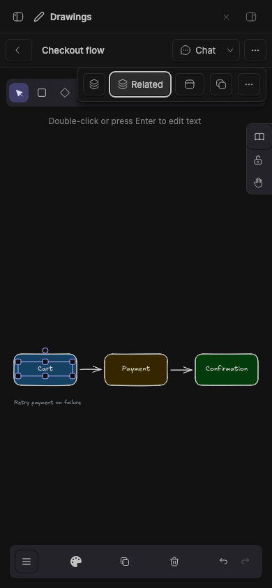
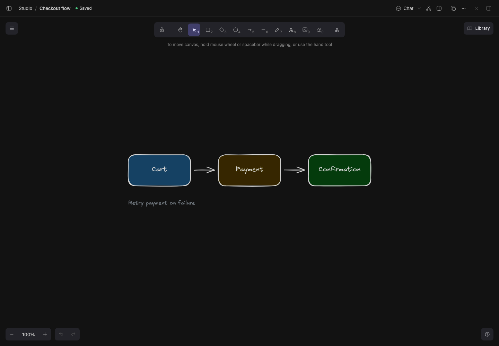

# Studio Draw

> **Studio Draw** is part of **BB Studio**, a suite of plugins for writing, talking, drawing, and keeping what your agents make. See the [suite overview](../../README.md).

Create and edit [Excalidraw](https://excalidraw.com) drawings inside BB,
sketch alongside your agents, and attach drawings to conversations. The
plugin id stays `excalidraw`, so existing installs and drawings carry over.

## Staged preview



The live 390-pixel editor shows the seeded Checkout flow, zoomed to fit Cart,
Payment, and Confirmation. **Chat** stays visible and **Item actions** exposes
the drawing's secondary controls.
These compact captures run on stable BB 0.45.0 with the full suite installed
from pushed commit 786fd2f. They check viewport bounds, button hit targets,
and the Related popover before capture.



Captured from a staged BB (`node scripts/staged-bb.mjs start`): the seeded "Checkout flow" drawing open in the Draw
editor, under Studio's shared item header. Cart, Payment and Confirmation boxes
are joined by arrows, with a "Retry payment on failure" note. The header shows
Studio Chat's **Chat** button, Related, **Open in split**, and the drawing's
own tools.

## What you get

- **Drawings in Studio.** With [Studio](../bb-studio) installed, drawings join its collection next to pages and recordings: thumbnails, projects, search over the words on a drawing, archive, move, delete, duplicate, templates and "Copy text". Without Studio, the **Drawings** panel shows the same collection.
- **Editor** (`/plugins/excalidraw/drawings/<id>`). It autosaves as you work. The header has a back button, an editable name, sync status, the drawing's thread (with [Studio chat](../bb-studio); otherwise **New thread**), copy image, and a menu with **Download PNG** and Delete. The editor follows BB's active theme.
- **Card in the agent's reply.** When an agent makes or changes a drawing, its reply shows a card (`::drawing{id="…"}`) with the picture, name and element count. The chevron hides the picture. The name or arrow opens the drawing in the thread's **Drawings** tab beside the chat, or in the main area without a workbench.
- **Thread tab.** **Drawings** lists the drawings made or changed in that thread, then the project's recent ones. **New** makes one in the thread's project and links it to the thread. In the editor, **Attach** adds the drawing to the conversation as an image. So does the composer's `+` menu, **Drawing**. Neither sends a message.
- **`@drawing` mentions.** The agent receives the drawing's scene as context.
- **Live co-editing.** Keep a drawing open and ask an agent to change it. Your editor shows its edits live, and the agent's next read sees yours.
- **Backup.** `bb studio backup` includes each drawing's scene and images. See [Backup and restore](../../docs/backup.md).

## Agent tools

- `excalidraw_list_drawings`
- `excalidraw_get_drawing` returns the elements, app state, a text summary, and a list of image files (id, type, size) without their data. Scenes over about 400,000 characters come back as element ids only.
- `excalidraw_create_drawing`
- `excalidraw_update_drawing` upserts and deletes elements by id, up to 500 each. Only the elements you send change. Elements already deleted can't be revived; use a new id.

Always read the drawing right before editing it. Tool sets apply when the provider session next starts.

## Commands

The CLI works in every agent session, including providers that don't expose plugin tools.

- `bb excalidraw list`
- `bb excalidraw create <name>`
- `bb excalidraw show <id> [--raw]` prints the scene JSON, with image data.
- `bb excalidraw rename <id> <new-name>`
- `bb excalidraw delete <id>`
- `bb excalidraw merge <id> <scene-file.json>` upserts elements from an array or a full scene. Its image `files` come along, and elements marked `isDeleted` are deleted.
- `bb excalidraw remove-elements <id> <element-id> [<element-id>…]`

The plugin has no settings. The `draw` skill documents the tools and CLI for agents.

Edits merge per element. Deletions travel as tombstones (pruned after 30 days). Two edits to the same element resolve by Excalidraw's `version`, higher wins.

## Export

- **Download PNG** in the editor renders in your browser.
- Studio's item menu exports PNG, SVG or the original `.excalidraw` JSON. PNG and SVG are drawn on the server from the saved scene, with text in Excalidraw's fonts. Embedded PNG, JPEG, GIF and WebP images are drawn if each is under 1.5 MB and all together under 4 MB. Larger images show as placeholders.
- Thumbnails use the same server-side SVG.

## How it works

- Scenes are stored in the plugin's SQLite database (`~/.bb/plugins/excalidraw/data.db`) in Excalidraw's save-file format.
- The editor autosaves after a 1.2 second pause, in order, and retries a failed save up to three times. Then it shows **Retry save** and warns before you close the tab with unsaved changes.
- Unsaved scenes are also kept in this browser's IndexedDB. On reopening, **Recover draft** merges one only if the server copy hasn't changed. Otherwise use **Save as copy**, **Download draft** or **Discard draft**. This storage is local to the browser profile, not a backup. **Retry local storage** appears if it fails.
- Every write (editor, tool, CLI) sends a realtime signal. Open editors reload and reconcile, with your in-progress edits winning, and poll every 5 seconds as a fallback.
- The plugin id stays `excalidraw`, so existing installs and drawings carry over.

## Development

```
bb plugin install .     # register (path install; server.ts loads from source)
bb plugin dev           # watch: rebuild frontend + reload on every save
bb plugin build .       # emit dist/ (server.js + app.js/app.css)
```

- Excalidraw's CSS is vendored in `assets/excalidraw/`, and its theme mapping is `assets/excalidraw-theme.css`.
- The frontend bundle is about 13 MB because it embeds the full editor. It loads only when a Draw surface mounts.
- `@bb-studio/kit` is a `file:../bb-studio-kit.tgz` dependency. Keep `package-lock.json` current (regenerate it in a clean clone, not the pnpm workspace), because BB's Git install runs `npm install` from it.
