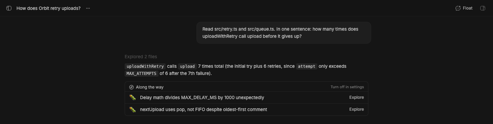

# Studio Explore

> **Studio Explore** is an experimental part of **[BB Studio](../../README.md)**. It needs [Studio Pages](../bb-studio-pages), where it saves explainers.

> [!WARNING]
> Explore is experimental. Its behavior, prompts, and storage may change or
> go away.

Explore turns what an agent noticed while answering into pages you can read
later. It used to be part of Studio Pages.

## Staged preview



This is a real BB thread in a staged BB (`node scripts/staged-bb.mjs start`).
The staged project has a small upload queue with two bugs in it. Claude
Sonnet 5 is asked a narrow question about how many times
`uploadWithRetry` tries, with Explore on. It answers in one sentence and ends
the reply with an `::explore` line. BB renders that line as the **Along the
way** section:
- one row per thing the agent noticed but didn't cover, here the delay cap's
  unit mix-up and a queue that pops newest-first
- **Explore** on each row, which starts an explainer
- **Turn off in settings**, which links to this plugin's setting

The rows' wording is the agent's, so it changes from run to run.

## What you get

- **"Along the way" at the bottom of a reply.** When an answer involved
  reading code, the agent may end it with 1 to 4 findings, each an emoji and
  a label that says what you'd find: 🐛 suspicious, 🏗️ foundational, 🔗
  connected, 🕐 recently changed. They show as full-width rows, each with its
  state: **Explore**, **Generating · 45%** with a progress bar, **Open ·
  generated 2h ago** with a regenerate button, or **Retry**. Rows reflect
  what's saved, so they survive a reload. A muted **Turn off in settings**
  link in the header opens this plugin's settings, where the toggle
  stops agents from adding them in new sessions.
- **An explainer page per finding.** Clicking one starts a hidden copy of
  the thread at that reply, which investigates the finding in the repository
  and writes a page: what it is, why it matters for what you were doing, how
  it works (Mermaid diagrams, callouts, and sandboxed HTML visuals), key
  files as `path:line`, and the interesting thing. Explainers live under an
  **Explore** page in each project's Pages tree, with the finding's emoji as
  their icon, and are tagged **Explore** in [Studio](../bb-studio)
  when it's installed.
- **In the side panel.** The **Explore** tab shows progress while an explainer
  is written (stage, percent, time so far, **Stop**), the error with
  **Retry** if it failed, and then the explainer with when it was
  generated, **Regenerate**, **Open in Pages**, and its own follow-up
  findings below it. Clicking a follow-up keeps exploring from the original
  thread.
- **Regenerate** writes the explainer again in place. The old version is
  kept in the page's version history ("Before regenerate …").
- **Settings:** *Daily digest in Studio Feed* (on by default) is described
  under [With Studio Feed](#with-studio-feed).
- **Setting:** *Suggest things to explore* (on by default) turns
  the agent instructions off; findings already in replies keep working.

The same finding in the same reply is one explainer: a second click opens
it, or follows the job already writing it. A job that runs for 20 minutes
fails, and jobs cut off by a BB restart show as interrupted. Stopping or
failing a job stops and archives its hidden thread.

## With Studio Feed

When [Studio Feed](../bb-studio-feed) is installed, findings don't have to be
explored right away:

- **Save to the feed.** Each finding at the end of a reply has a bookmark
  button. It posts the finding to the Feed under **Follow-ups**, unread, with
  a link to its thread. The post has an **Explore** button that writes the
  explainer. Once the explainer is written, from the Feed or the thread, the
  post links it and shows a preview of the page.
- **Daily digest.** Explore keeps every reply's findings. Each evening after
  6 PM it posts one **Noticed along the way** post per project to the Feed,
  listing the findings from the last week that nobody explored or saved,
  🐛 first. Turn it off with the *Daily digest in Studio Feed* setting.

Without Feed, saving shows an error and there's no digest.

## Deleted pages

Pages doesn't tell other plugins when a page is deleted. Explore checks an
explainer's page when you open it; if it's gone, the explainer goes back to
**Explore** and the next click writes a new page. **Regenerate** checks too.

## For agents

Agents get one tool, `explore_explain`, which writes or finds an explainer
(`label`, optional `messageId` and `wait`) and returns its page. Explore
workers (the hidden threads that write explainers) get neither the tool nor
the instructions.

```sh
bb explore list [--thread <thread id>]
bb explore open <explainer id>
bb explore regenerate <explainer id> [--wait]
```

[skills/explore/SKILL.md](skills/explore/SKILL.md) documents the directive,
the tool, and the CLI.

## Storage

Explainers and their jobs live in this plugin's SQLite database in the BB
data directory. The pages themselves are in Studio Pages. Explainers written
while Explore was part of Pages stay in Pages as ordinary pages, but their
rows under old replies start fresh.

## Development

```sh
pnpm --filter @bb-studio/explore typecheck
pnpm --filter @bb-studio/explore test
```
