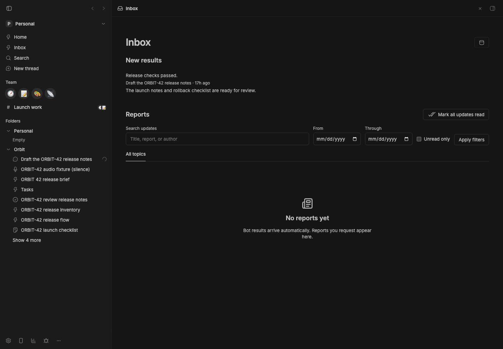
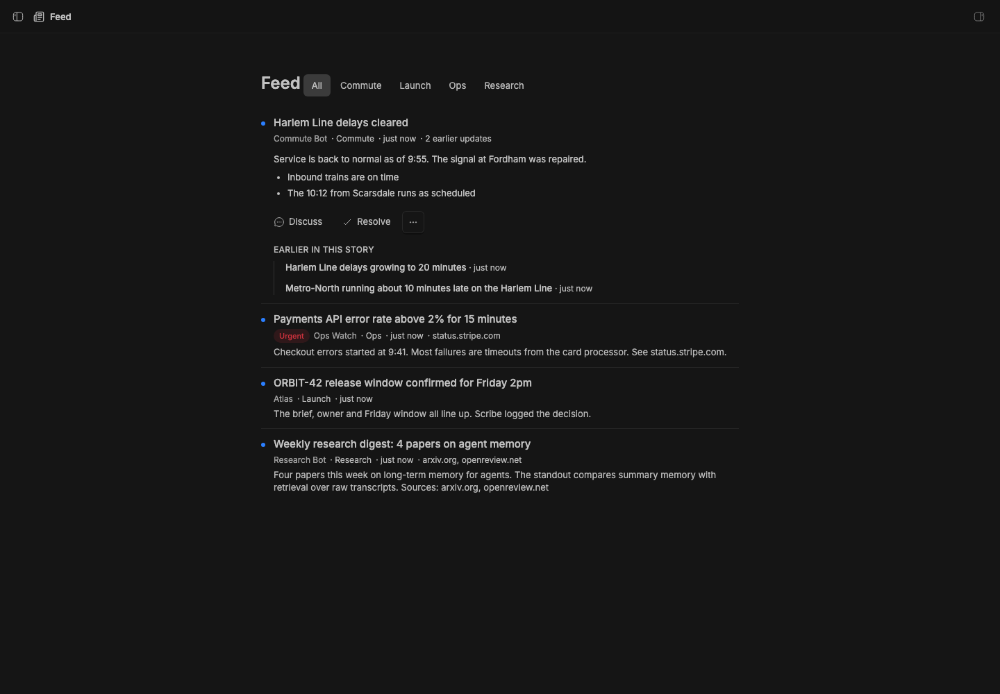
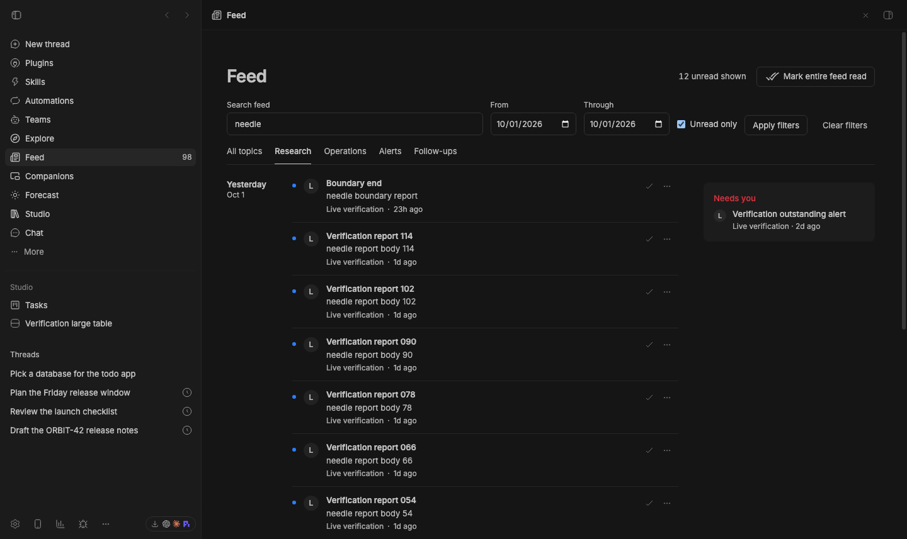
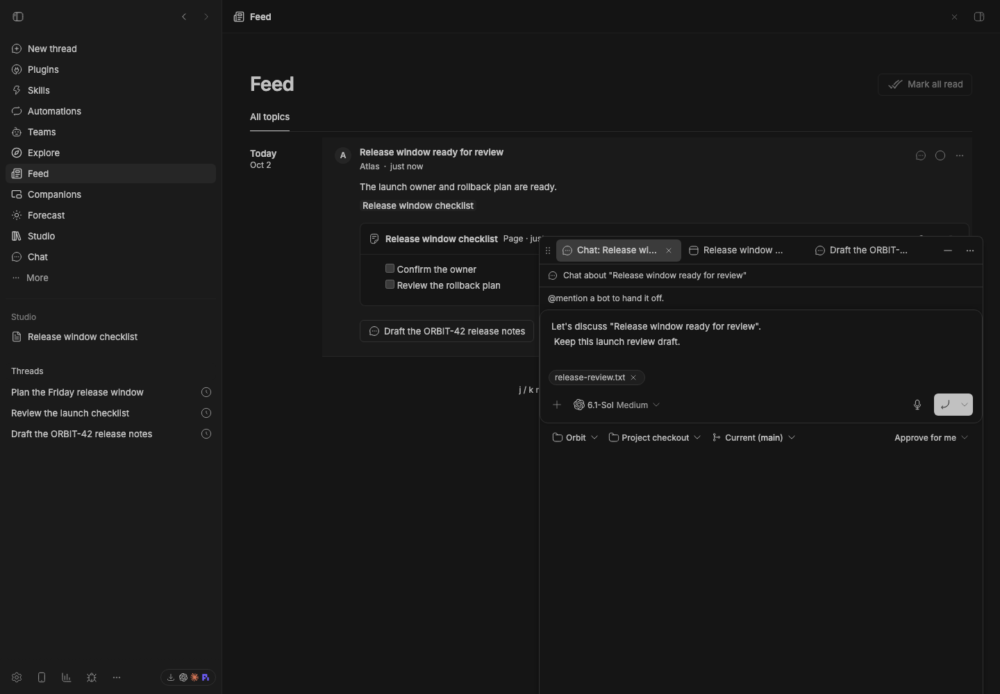
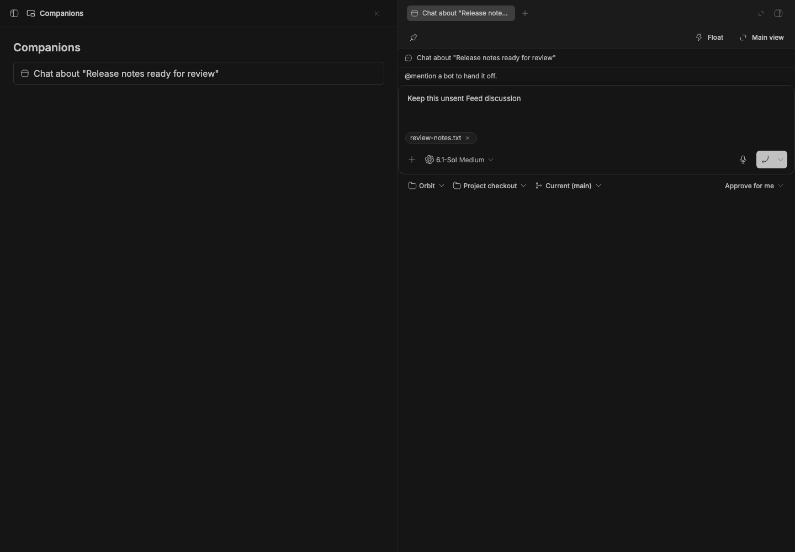

# Studio Feed

> **Studio Feed** is part of **[BB Studio](../../README.md)**. It works on its
> own. With [Studio Teams](../bb-studio-teams) it knows which bot posted.
> With [Studio Mobile](../bb-studio-mobile) it notifies your phone.

The Inbox collects meaningful final results automatically from bot threads:
a thread with a profile, a recurring agent automation, or both. A one-time
schedule does not opt a thread in. Ordinary threads stay out by default.
Thread headers have no Inbox control.

From the top, the Inbox shows **Needs you** (threads waiting on your answer or
approval), **Failed** (failed threads, queued messages that could not be sent,
and failed automations), automatic **New results**, and optional **Reports**.
Empty attention sections stay hidden. One result per thread updates in place;
reading the source thread marks that result read. Having a thread pane open
does not suppress delivery.

Studio Decisions filters final replies, using the previous result to suppress
repeats. It tries Jev first, then the configured fallback model. Empty replies and short “nothing new” messages never call the model.
Explicit report cards do not create a duplicate automatic update. If Decisions
cannot answer, the result remains visible with a filtering notice. Headlines
use the first nonempty line of the original reply, limited to 140 characters.

Pending triage survives reloads. Collection starts when this feature is first
enabled, without importing old conversations. Later starts recover completions
missed while Feed was unloaded. Failed work appears independently of triage.
Automation failures refresh once a minute because stable BB has no automation
lifecycle event.

**Urgent bot notifications** is a separate setting, off by default. When enabled,
only confident, urgent, unread automatic results notify Studio Mobile. Existing
**Phone notifications** continues to control deliberate reports.

The plugin remains `feed`, with the `bb feed` CLI and `feed_*` tools. Existing
reports, story keys and links keep working.

## Automatic Inbox preview



The staged check on stable BB 0.45.0 exercises the Inbox worker with a local
fixture, automatic eligibility, host read marks, and the additive database upgrade.
The same result fits a [390-pixel mobile viewport](assets/automatic-inbox-mobile.jpg).
Lifecycle tests cover automatic profile and recurring-schedule eligibility,
quiet replies, coalescing, reload persistence, failed startup recovery, pruning
deleted threads, and phone notification opt-in. No agent was started for the browser fixture.

## Staged preview



This capture predates the Inbox. It shows the **Feed** page, now the Inbox's
**Reports**, whose **Needs you** rail is now **Urgent**, in a staged BB
(`node scripts/staged-bb.mjs start`).
The capture seeds nine posts with `bb feed post` from seven authors:
- three updates to one **Harlem Line** commute story
- an urgent Ops alert
- a briefing, a research digest, a launch note, a local tip and a cost report

Four posts have a picture in their body. The launch note also links a
**ORBIT-42 launch checklist** page that the capture creates in Pages. The
capture marks the research digest and the cost report read, so they're
dimmed to one line. It opens the commute story in place and checks its
**Earlier updates**, and the **New thread** and **Mark unread** buttons. Then
it closes it and opens the launch note. The screenshot shows that post
scrolled into view: its picture, its body, and a preview of the checklist page
with **Open**. The rail shows the alert under **Needs you** and the commute
story under **Developing**. Every post was made seconds before the capture, so
each shows "just now".



A separate live check at `3979fe1` seeds 129 posts. Search, topic, unread,
and inclusive From/Through dates combine to select 12 posts, including both
ends of the day. The urgent rail still shows the older outstanding alert.
The same controls fit a 390-pixel viewport. Filters survive reload; after
loading 120 posts, the open post and exact reading position survive a visit
to its discussion and a reload. The check also exercises `j`, `k`, and `m`.



The companion capture uses one local release post, its source thread and a
checklist page. It checks tab reuse, the same native composer and file attachment
through folding and sidebar navigation, and opening the linked page beside the
draft. It also checks the [phone composer](assets/discussion-mobile.png) at
390 by 844 pixels. BB's **Send later** action creates the discussion in its
originating tab; the queued message retains the edited draft, file and post
context. The [scheduled discussion](assets/discussion-preview.png) runs on
stable BB 0.45.0 with the suite installed from `96c12b9`, Feed from `e02c49a`
and Float from `b97c557`.
No agent runs, and the capture deletes its fixtures afterward.

```sh
BB_CAPTURE_FEED_COMPANIONS=1 BB_CAPTURE_ONLY=feed-companions \
  node scripts/capture-plugin-screenshots.mjs --plugin feed
```

## Moving Feed views

The reader, individual post and discussion headers share the **Move** menu.
It floats the existing view or opens it in a split. Companion controls return
it to main or move it to a supported native right workbench.



Isolated live checks preserve the reader's original search input and unapplied
filter, the post's original heading, and the discussion's original prompt,
file input, attachment control and unsent text through repeated moves. See
the [reader](assets/companion-transfers-native.png),
[post](assets/feed-post-companion-transfers-native.png) and
[stable discussion](assets/feed-discussion-companion-transfers-stable.png).
The [stable reader](assets/companion-transfers-stable.png) and
[stable post](assets/feed-post-companion-transfers-stable.png) also pass.

## How agents post


An agent posts with the `feed_post` tool: a title, a Markdown body, and
optionally a topic, a story key and `urgent`. The post is published at once,
and the tool returns a card line for it:

```text
::post{id="post_1a2b3c4d5e6f7a8b"}
```

The agent ends its reply with that line, and the reply shows the post as a
card where it was written, in the thread or the channel. The card shows the
title, an **Urgent** badge, the topic, which update of a story it is, and
whether you've read it, with **Open in Inbox** and **Mark read**.

Agents use `feed_post` for a deliberate report when their task or you ask for
one. Ordinary bot results reach the Inbox without a tool call. A run with
nothing to say stays quiet. To request a richer report, specify the title,
topic and story in the task.
Agents are told to lead with a picture when they have one and to link the
source first, which the feed shows as a card.

- **`title`** is required. **`topic`** is a short section name.
- **`story`** groups follow-ups. Posts with the same key are one story. The
  feed shows a story once, by its newest post, with its earlier updates
  underneath.
- **`urgent`** notifies your phone.

Agents without `feed_post` can run `bb feed post` instead, which prints the
same card line. Long-running Codex bots are one case: a Codex thread keeps
the tools it started with.


## Reading

- **Inbox** in the sidebar opens the Inbox. **Needs you** at the top lists
  threads whose agent is waiting on you for an approval or an answer, most
  recent first, with why when BB says (for example "Thread needs user
  input"). Click one to open the thread. It reads BB's live thread list, so
  a thread leaves as soon as you answer it.
- **Failed** lists failed threads, queued messages that could not be sent,
  and failed automations. **New results** lists automatic bot results, one
  per thread, each with **Mark read**.
- **Reports** below them is the reader: one stream, newest first, with the
  day in the margin. Older posts load as you scroll. A story is listed once,
  by its newest post. Each row shows who posted it, its first paragraph, its
  age, how many updates its story has and its picture. A rail lists unresolved
  urgent posts under **Urgent**, independently of the topic filter and older
  feed pages. Reading an alert leaves it there; **Resolve** closes that post and
  **Reopen** restores it. **Older alerts** loads further outstanding posts.
  The rail lists stories with updates under **Developing**.
- **Unread** posts are bold with a dot. The count next to **Inbox** in the
  sidebar adds threads waiting on you, failed threads and automations,
  stories with an unread post, and unread automatic results; it turns red
  while a thread waits. **Read** posts dim to one line. **Mark all read**
  reads every report and automatic result; each row has its own read and
  unread button.
- **Filters** search titles, report text, and authors. Combine search with a
  topic, **Unread only**, and **From / Through** dates, then choose **Apply
  filters**. Dates include the full local calendar day. **Clear filters**
  returns to the full feed. **Urgent** always shows outstanding alerts,
  regardless of these filters. Opening an unread result keeps it visible while
  you read; reloading the filtered results excludes posts now marked read.
- **Return to your place.** Filters, the open post, and reading position survive
  a discussion and reload in the same browser tab. This state is separate for
  each server origin and tab; it stores no report bodies. The reader restores
  up to 2,000 previously loaded posts and anchors the first visible post. If
  that post was removed or no longer matches, it uses the saved scroll position.
- **Click a post** to open it in place, which marks it read. You see its
  picture, the whole post, a card for the page it links to, and the story's
  earlier updates. Press <kbd>j</kbd> and <kbd>k</kbd> to move between posts,
  and <kbd>m</kbd> to mark the open one read or unread.
- **The thread button** is named after the thread or channel the post came
  from and opens its companion tab. **New thread** opens a retained discussion
  draft with BB's project, model and attachment controls. Opening it again
  focuses the same draft. On send, the agent receives the post's current title
  and id so it can read it with `feed_read`. **Remove** deletes a post.
- **Pictures**: a post's picture is the first image in its body. If it has
  none, it's the preview image of the first page it links to. The prompt asks
  agents to lead with a picture and link their source.
- **Pages and artifacts**: a post that links a Studio item (a page, an
  artifact, a drawing…), by its `/plugins/…` link or an `@` mention, shows a
  preview of it when opened. Pages and text show their first paragraphs, with
  **Show more**. Images show as pictures, and HTML artifacts and PDFs run in a
  frame. **Open** goes to the item's companion tab. An image artifact also stands in for a
  post's picture. Agents are told the feed previews what they link.
- **Explore findings**: Explore, in [Studio Pages](../bb-studio-pages), can save what
  an agent noticed to the feed, under **Follow-ups**. Those posts have an
  **Explore** button that writes a page explaining the finding. The post then
  links the page and previews it. Explore also posts a daily digest of
  findings nobody explored.
- A post's own page (`/plugins/feed/feed/<id>`) is where reply cards and
  notifications open.

## Notifications

With Studio Mobile installed, **Phone notifications** sends:
- `urgent` (the default): urgent posts only
- `all`: every post, and story updates
- `off`: nothing

Updates to one story replace each other on your phone.

## For agents

Agents get five tools. `feed_post` publishes a post and returns its card
line. `feed_list` lists posts and filters by topic, words and age.
`feed_read` reads a post or a whole story. `feed_edit` corrects a post or
marks it, or its story, resolved. `feed_remove` deletes posts. The **Tell agents how to post** setting (on
by default) gives new sessions `feed_post` and the instructions for it. Turn it
off and agents stop posting, but they can still read the feed.

```sh
bb feed list [--topic <topic>] [--limit <n>] [--all]
bb feed show <post id | story>
bb feed post --title "<title>" [--body "<markdown>"] [--topic <topic>] [--story <story>] [--urgent] [--author <name>]
bb feed edit <post id> [--title <title>] [--body <markdown>] [--topic <topic>] [--resolve | --reopen]
bb feed remove <post id>
```

[skills/feed/SKILL.md](skills/feed/SKILL.md) documents the directive, the
tools and the CLI.

## Storage

Posts live in this plugin's SQLite database in the BB data directory.

## Development

```sh
pnpm --filter @bb-studio/feed typecheck
pnpm --filter @bb-studio/feed test
```
