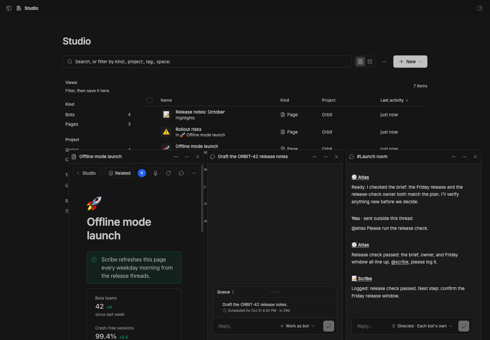
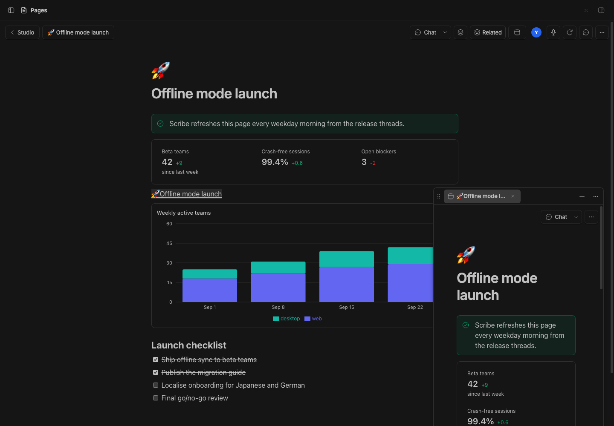
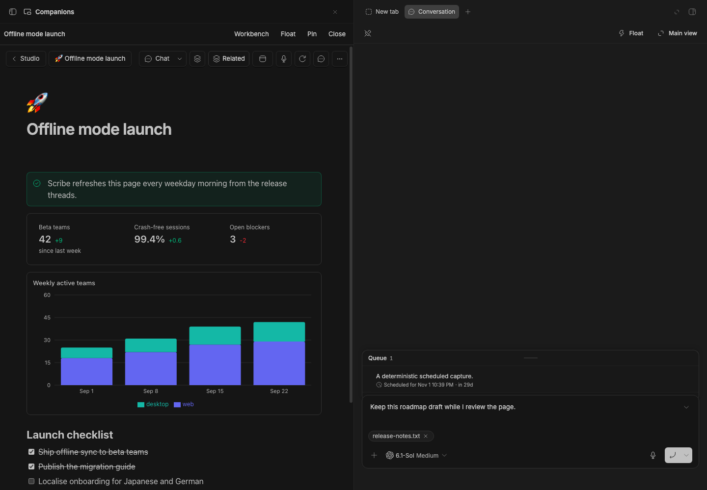

# Float

> **Float** is part of **BB Studio**, a suite of plugins for writing, talking, drawing, tracking tasks, running bot teams, and keeping what your agents make. See the [suite overview](../../README.md).

Float any thread, channel, Studio item or Studio view into a panel of tabs
that stays on screen while you work somewhere else. It docks at the bottom
right, or drag it anywhere.

## Staged preview



Captured from a staged BB (`node scripts/staged-bb.mjs start`): a Studio
page ("Offline mode launch"), the seeded "Draft the ORBIT-42 release notes"
thread and the "Checkout flow" drawing, each floated from its sidebar menu,
as three tabs in one panel. The drawing's tab was dragged to the front,
then the pinned page was selected over the Studio list. The capture also
checks the real Pages editor and an unsent thread draft through tab switches,
folding, hiding, and moving Float, and verifies the pin in saved state.



The drag capture cancels a sidebar drag with Escape, then drops the page into
Float and checks that exactly one tab opens and the drop zone disappears.
Drop cleanup runs after the drop handler, even when a child consumes the
event. Escape, window blur, and resumed pointer input also clear interrupted
drags whose source disappeared before it could send `dragend`.

```sh
BB_CAPTURE_FLOAT_DRAG=1 BB_CAPTURE_ONLY=float-drag-cleanup \
  node scripts/capture-plugin-screenshots.mjs --plugin float
```



The native-host integration capture runs an optimized local BB build based
on current core `32efd2e3f`, in its own data directory with all 17 suite
plugins installed from GitHub `ba0ae10` and Float updated to `f962c2c`. It moves the
real Pages editor and SDK composer through Float, workbench, and main while
asserting DOM identity, the unsent draft, its file attachment, and the shared
pin. Its optional CLI check also verifies saved placement, pin-protected
close, and returning to an existing main companion after another main view
opens. This is implementation evidence for the pending BB host capability;
the [core patch and verification](../../docs/host-support/native-companions/README.md)
are saved with the suite.

```sh
BB_CAPTURE_NATIVE_COMPANION=1 BB_CAPTURE_ONLY=float-native \
  BB_CAPTURE_COMPANION_URL=http://127.0.0.1:<frontend-port> \
  node scripts/capture-plugin-screenshots.mjs --plugin float
```

Source the staged server's `capture.env` first. Omit the frontend URL once
the staged BB release includes the native host. The check fails if that
capability is absent; ordinary stable captures keep using `float`.
Set `BB_CAPTURE_COMPANION_REMOTE=1` when the staged CLI also includes
`bb plugin companion` to verify its controls in the same live workflow.

## What you get

- **Float from the sidebar.** **Float** is in the menu of every thread row (with
  [Studio Sidebar](../bb-studio-sidebar)), every channel row (with
  [Studio Teams](../bb-studio-teams)), and every Studio tab (with
  [Studio](../bb-studio)).
- **Move any item in one gesture.** This works on Studio items and threads
  anywhere: a collection row, a mention or embed on a page, a table's item
  chip, a task's link, a Space's rows, Home, a Feed post's item, and any link
  into a plugin view or a thread.
  - **Shift-click** floats it, and **⌘-click** (Ctrl-click) opens it in a
    split.
  - **Right-click** for Open, Float, Open in split, Copy reference (which
    pastes into a page as a pill; a thread has Copy link) and New thread with
    this. On a collection row, right-click opens the row's whole menu.
  - **Drag** a collection row, Space row or link onto the panel, or onto the
    corner when no panel is open, to float it.
  - Shift+right-click keeps the browser's own menu.
- **From the collection.** The ⋯ row menu has Float and Open in split, and a
  selection has **Float N** to float every picked item.
- **From an open item.** The ⧉ button in an item's header has **Float this**,
  which moves the item into the panel and takes the main view back, and
  **Open in split**.
- **From Quick Open.** ⇧↵ floats the result and ⌘↵ opens it in a split.
- **Float this view.** The palette's "Float: float this view" floats the
  Studio item or view on screen, or else the thread.
- **One panel, many tabs.** Everything you float is a tab in one panel, and
  one shows at a time. Drag a tab to reorder it, middle-click or × to close
  it. When the tabs don't fit, the panel labels only the one showing and
  shows the rest as icons; the ⋯ menu lists every tab.
- **Keep it closed.** Closing the last tab or choosing **Close all** keeps
  the panel closed as you switch threads and Studio items, including after
  a reload. An explicit Float action opens it again.
- **Put it anywhere.** The panel docks at the bottom right. Drag it by its
  header to pull it off the bottom and drop it anywhere on screen. Drop it
  near the bottom edge (an outline shows where) to dock it again, or pick
  "Dock at the bottom" from ⋯.
- **Resize it.** Drag an edge or corner. Docked, the top and left edges move;
  free, every edge does. Double-click an edge to go back to the default size.
- **Fold it** to its tab strip with the − button or a double-click on the
  header.
- **Move a tab.** The ⋯ menu has **Move to main view**, **Move to split**,
  and **Swap with main view**, which trades the tab and the main view.
  The companion-host integration adds **Move to workbench**, placing the
  same live tab beside BB's Browser and Terminal. Its **Float** and **Main
  view** actions move that portal again. The **Companions** page lists open
  tabs and hosts a tab moved to main.
  Focusing a retained main tab returns to its existing main route without
  moving the tab or replacing its history and pin.
- **Pin a companion.** **Pin tab** in ⋯ keeps its conversation or reference
  while you open other items. Links from a pinned tab open another tab.
  Pinned tabs stay through reloads and do not close at the tab limit.
- **Keep work in progress.** Switching tabs, folding the panel, and hiding it
  retain each opened view, including its editor state and unsent chat draft.
- **Links stay in the tab.** A link or item opened from inside a tab opens
  in that tab, as in a browser; ← goes back.
- **Mod+Shift+J** hides the panel and shows it again. You can rebind it in
  BB's keyboard settings.

The tabs, where the panel sits and its size are kept per browser window and
survive a reload.

The native companion host is being implemented in BB as part of the
[full-suite delivery](../../docs/unified-workbench.md). Until that host ships,
stable BB keeps the Float and ordinary main-view flows. Plugin SDK pins remain
compatible with stable; the suite detects native hosting when it is present.

## How it works

Float draws the panel, and a thread tab is BB's `ThreadChat`. Any other
tab shows another plugin's nav panel. BB has no way to put one plugin's
view inside another's, so the plugin that owns the path renders its panel
into the panel through a portal. The shared kit's `FloatPanels` does this
(`packages/bb-studio-kit/src/app/float.tsx`). Pages, Draw, Tables, Tasks,
Talk, Artifacts and Studio render it, so their items and views can float.
Other plugins open tabs with the kit's `openFloat`.

[Studio Chat](../bb-studio-chat) provides the shared item-header Chat action
and adds a "Viewing" chip to conversation tabs. Chat prefers the native
workbench when available and otherwise opens Float.

More in [docs/float.md](../../docs/float.md).

## Limits

- Some buttons inside a floated view still open the main view, where the
  view navigates with BB's own router instead of a link.
- Opened tabs stay mounted until closed. Background tabs can keep audio,
  subscriptions, and editors running; tabs you have never shown stay unloaded.
- A view that can't show in the panel says so, with a button to open it.
- An item open both in the panel and in the main view runs two editors, each
  saving on its own.

## Develop

```sh
pnpm install
pnpm --filter @bb-studio/float test
pnpm --filter @bb-studio/float typecheck
bb plugin build packages/bb-studio-float
```
