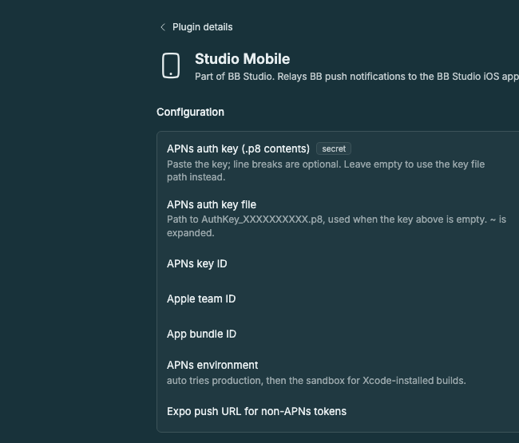

# Studio Mobile

Part of BB Studio. The server side of the [BB Studio iOS app](../../apps/ios/):
it relays BB push notifications to the app over APNs, lets other Studio
plugins notify the same phones through its `notify` RPC, and keeps muted threads in
sync across devices. Completion pushes with no text, or only `[PASS]`, are
suppressed for both APNs and Expo devices. Attachment-only completions use a preview of the attachment. See
[`skills/mobile-push/SKILL.md`](skills/mobile-push/SKILL.md) for settings and
wiring.

Finished turns and errors arrive as plain alerts without a Reply field. Tap an
alert to open the thread. Approval and question notifications keep their actions.
Each push carries this relay's persistent server identity. The iOS app checks
that identity before opening a notification, acting on it, or clearing it.
Update the relay alongside the app: older notifications without an identity
must be reviewed manually in the app. Actions target only the exact pending
request named by the notification.

The relay keeps notification tracking after transient lookup or APNs failures
so the next check can retry. The `notify` response's `sent` count includes only
successful, unmuted deliveries.

Plugin ID: `mobile`.

```sh
npm install
npm test
bb plugin build
bb plugin install .
```

## Staged preview



The plugin's settings page in a staged BB (`node scripts/staged-bb.mjs start`) shows the APNs key, key ID, team,
bundle ID and environment fields and the Expo push URL. No private APNs key or
device token is staged for the capture.
