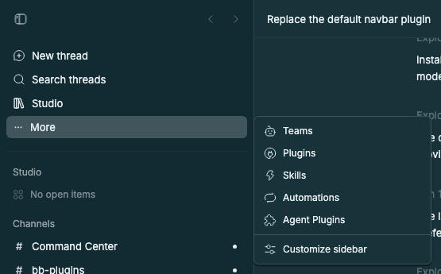

# Studio Navigation

> **Studio Navigation** is part of **BB Studio**, a suite of plugins for writing, talking, drawing, tracking tasks, running bot teams, and keeping what your agents make: [Studio](../bb-studio), [Studio Pages](../bb-studio-pages), [Studio Talk](../bb-studio-talk), [Studio Draw](../bb-studio-draw), [Studio Artifacts](../bb-studio-artifacts), [Studio Tasks](../bb-studio/src/modules/tasks), [Studio Chat](../bb-studio/src/modules/chat), [Studio Teams](../bb-studio-teams), and [Studio Sidebar](../bb-studio-sidebar).

Studio Navigation replaces BB's sidebar navigation, the rows above the thread
list. It draws the same rows as BB's bundled Navigation plugin, and leaves out
the Studio rows that another surface already opens:

| Row | Left out while |
| --- | --- |
| Pages, Drawings, Artifacts, Recordings, Tasks, Tables | Studio's row is there, since the Studio hub lists and opens every add-on. |
| New channel | [Studio Sidebar](../bb-studio-sidebar) shows sections, since the Channels section has its own New channel. |

Everything else stays: BB's own rows (New thread, Search threads, Plugins,
Skills, Automations), Studio, Teams, and every panel from a plugin outside
BB Studio. Hide, reorder, **More**, and **Customize sidebar** work as in BB's
Navigation. A row Studio Navigation leaves out keeps its place in BB's saved
order, so it comes back where it was if you switch back.

Installing it makes it the sidebar navigation, unless you picked a provider
under **Settings → Appearance → Navigation**. Choose **Navigation** there to
go back to BB's. The package requires BB 0.44 or newer and Plugin SDK 0.5.29
or newer.

The `source/` directory vendors BB's MIT-licensed Navigation plugin from BB
0.44.0, with the shared UI it imports under `components/` and `lib/`. Studio's
additions are in `source/app/studio/`, with a small hook in two upstream
files. See [UPSTREAM.md](UPSTREAM.md) for the changed files and sync command,
and [LICENSE](LICENSE) for the upstream license.

## Staged preview



Captured from a staged BB 0.44.0 started by `scripts/staged-bb.mjs`, with
every BB Studio plugin installed from this repository's Git source and a demo
project, Orbit. Studio Navigation draws the rows and Studio Sidebar the thread
list. The rows show BB's New thread, Plugins, Skills, and Automations, Studio
Teams, Studio, and Forecast, a staged plugin outside BB Studio; **More** holds
Search threads. The capture asserts that Studio Navigation draws the region,
that those rows are present, and that none of Pages, Drawings, Artifacts,
Recordings, Tasks, Tables, or New channel appear in the rows or in **More**.

## Development

```sh
pnpm --filter @bb-studio/studio-navigation typecheck
pnpm --filter @bb-studio/studio-navigation test
node upstream/sync.mjs --upstream /path/to/bb --commit desktop-v0.44.0 --check
bb plugin build .
```

`@bb-studio/kit` is the packed `file:../bb-studio-kit.tgz` dependency. Keep
`package-lock.json` current with `scripts/refresh-locks.sh bb-studio-navigation`,
because BB's Git install runs `npm install` from it.
