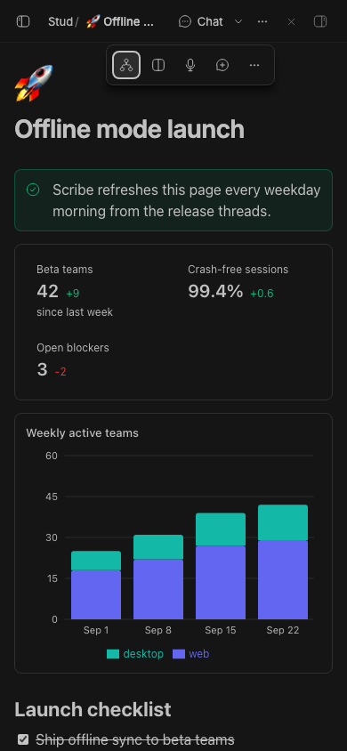
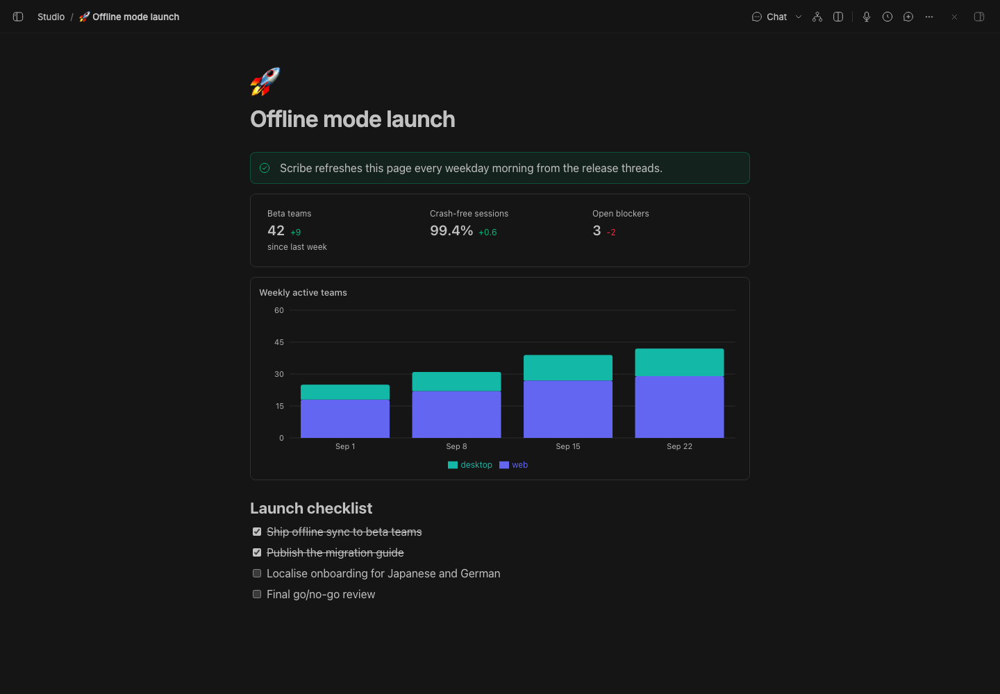
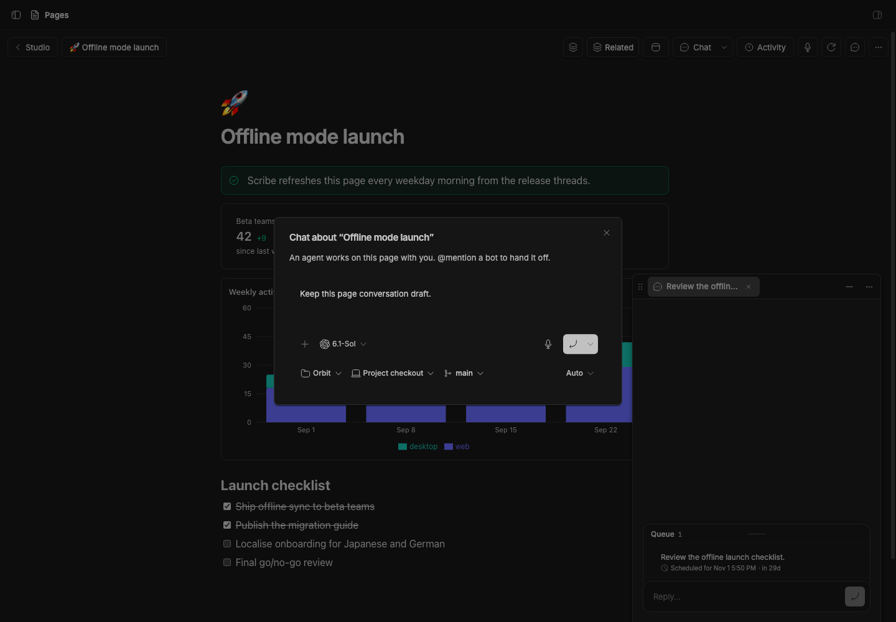
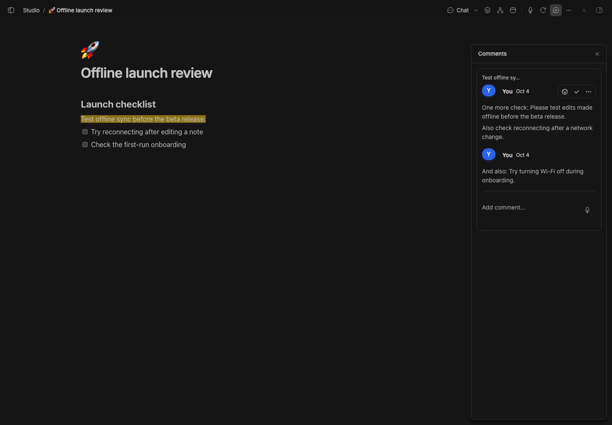
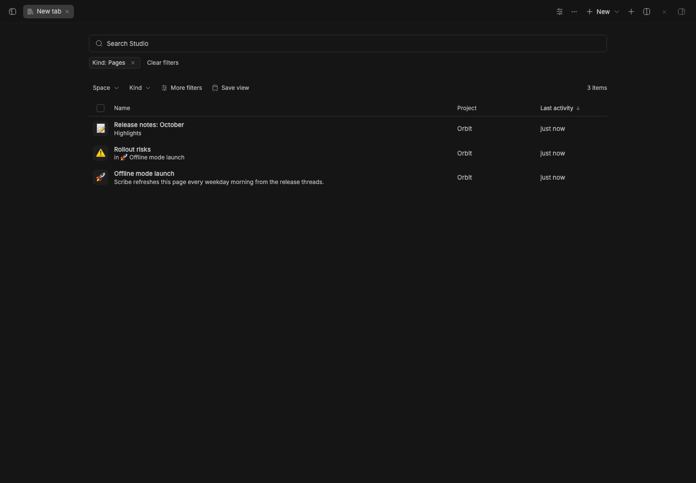

# Studio Pages

> **Studio Pages** is part of **BB Studio**, a suite of plugins for writing, talking, drawing, and keeping what your agents make. See the [suite overview](../../README.md).

Collaborative documents for BB that you write together with your agents.
Pages gives you a Notion-style block editor with live multiplayer editing,
comments, charts, embeds, and ordinary agent chats.

With Studio Talk installed, the microphone in a comment box lets you dictate
new comments, replies, and edits. Stop dictation to insert the transcript at
the cursor, then review it and post when ready. The page body stays separate.

## Staged preview



The live 390-pixel page keeps **Chat** visible while **Item actions** opens the
space, related items, placement, and page controls. The standalone phone capture
also checks that Version history remains reachable through Page actions.
These compact captures run on stable BB 0.45.0 with the full suite installed
from pushed commit 786fd2f. They check viewport bounds, button hit targets,
and the Related popover before capture.



This is the real BB **Pages** panel in a staged BB (`node scripts/staged-bb.mjs start`), opened from the nav panel. The capture
script uses the plugin's own `create` RPC to seed three project pages:
- "Offline mode launch"
- a nested "Rollout risks" sub-page
- "Release notes: October"

The launch page is open. It holds:
- a tip callout
- a stats block with three key numbers and their deltas
- a stacked bar chart of weekly active teams
- a launch checklist with two items done

At the top left are the **Studio** back pill and the breadcrumb. At the top
right are **Chat**, **Dictate**, **Version history**, **Comments** and page menu
buttons. **Dictate** appears because Talk is installed in the staged app.



The standalone Chat check temporarily disables Studio in the isolated
staged app. It resumes a legacy page conversation without creating another
thread, then opens **New conversation** as a companion tab. Its draft and
file survive tab reuse, folding, navigation to another page, and a browser
reload. The desktop check also schedules a second page's conversation and
verifies its page context, edited prompt, attachment, and updated Chat action.
The [phone companion](assets/standalone-chat-mobile.png) keeps every composer
control inside the viewport. All fixture sends are scheduled and their threads
are deleted before any agent runs. The capture restores Studio and
removes its pages and files.

```sh
BB_CAPTURE_STANDALONE_CHAT=1 \
  BB_CAPTURE_ONLY=pages-standalone-chat,pages-standalone-chat-mobile \
  node scripts/capture-plugin-screenshots.mjs --plugin pages
```



This staged page has an anchored comment and a reply. The capture checks real
microphone start/stop, dictation delivery into both drafts, explicit Save,
and an unchanged page body. The reply microphone also fits in the
[phone comment sheet](assets/comments-mobile.png).



The collection is what the **Pages** nav item opens. It shows:
- the query bar, filtered to `Kind: Pages`
- the filter rail, with counts by kind, project and tag
- the list/grid toggle and **New page**
- the three seeded pages, with their project and last activity

"Rollout risks" shows the page it sits in. The script deletes its three pages
afterwards.

## What you get

- **A block editor.** Built on [BlockNote](https://www.blocknotejs.org): type
  `/` for headings, lists, checklists, toggles, quotes, code, tables, images,
  video, audio, files, and the custom blocks below. Blocks can be dragged,
  nested, and turned into other types. Markdown shortcuts work as you type.
- **Live collaboration.** Every page is a Yjs document synced over a
  WebSocket. Agents edit the same document from the server, so their
  changes stream into your editor, with cursors, while you keep typing.
- **Code and diagrams.** Code blocks are syntax-highlighted for about
  twenty languages, in light and dark. A `mermaid` block renders its
  diagram; click it to edit the source.
- **HTML blocks.** An `html` block runs its HTML, CSS, and scripts in a
  sandboxed frame (no access to BB, its cookies, or storage) that grows to
  fit its content. Click its label to edit the source.
- **In a thread's side panel.** The **Pages** tab lists the thread's pages
  (the ones made in it, and the page it was started from), then the project's
  recent ones. **New** makes a page in the thread's project and links it to
  the thread in Studio. A page opens in its live editor, with a link to the
  full page.
- **Custom blocks.** Callouts, charts (bar, line, area, pie), stat rows, and
  embed cards for links, BB threads, and other pages. Paste a link on an
  empty line to turn it into a card; web links fetch their title,
  description, and preview image.
- **Studio embeds.** The `/` menu's Studio group embeds a drawing, artifact,
  recording, or live table, picked by search, or makes a new table or
  drawing in the page's project and embeds it.
  Embeds stay live:
  - a table is the full Studio Tables grid, edited in place, with its views,
    board and calendar; the view shown is kept with the page;
  - a recording plays in the page, with its summary, decisions and
    transcript; click a line to play from there;
  - a drawing is an inline whiteboard: it shows the drawing, and **Sketch**
    (or a double-click) adds a pen, an eraser and five colors. Strokes save
    to the Studio Draw drawing as ordinary Excalidraw elements, merged with
    other edits, so **Open in Draw** shows them in the full editor. `/whiteboard`
    makes a new drawing in the page's project and opens it ready to draw.
    Pages draws the scene as plain SVG and doesn't load Excalidraw;
  - an artifact shows its content (images, HTML, PDFs, code, text).

  Pasting a link to a Studio item embeds it too, and a link to a table view
  embeds that view. A basic table's block menu (⋮⋮) has **Turn into
  database**, which moves its cells into a new Studio table, the first row
  as column names, and embeds it in its place.
  Charts and stats are edited as JSON, which makes them easy for agents to
  write.
- **Mentions.** Type `@` to mention another page, a BB thread, a
  Studio item, or a date. Page and thread mentions open where they point.
- **Comments.** Select text to comment on it. Threads show in a floating
  card where you can reply, react, edit, and resolve. Agents can read, start,
  reply to, and resolve threads. Clients without the editor, like the BB
  Studio phone app, use the `comments`, `commentBlocks`, `commentCreate`,
  `commentReply` and `commentResolve` RPCs, which write as you.
- **A collection of pages.** The **Pages** nav item lists every page, with
  search over titles and content, filters, a project filter, and sorting and
  grouping from **Display**. **New page** opens a blank full-page document.
- **Projects and nesting.** Pages belong to a project or are global, and
  nest to any depth, with a breadcrumb back up. Give a page an emoji icon,
  move it, archive it, or delete it from its ⋯ menu.
- **Chat about a page.** **Chat** continues the page's conversation or opens
  BB's new-thread composer. **New conversation** starts another. Sending
  starts an agent thread in the page's project with the page as context.
  Conversations use the shared companion system: workbench on a capable BB
  host, Float on stable hosts without that capability, or ordinary thread
  navigation without Float. Existing page chats and links still work.
  [Studio chat](../bb-studio) provides the suite-wide item links and
  conversation picker when installed. Standalone Pages uses the same
  retained companion tabs and preserves its existing composer draft keys.
  New conversation focuses `/plugins/pages/pages/<id>/compose`; it keeps
  drafts and attachments while you navigate other pages. The page's Chat
  action updates when that draft becomes a thread.
- **Version history.** Pages saves a version before an agent's first
  edit in a while. You can save one yourself and restore any version, and the
  current page is saved before a restore.

## Dictation with Talk

With the [Talk](../bb-studio-talk) plugin installed, you can dictate into a
page:

- The **Dictate** button at the top right, or **Dictate** in the `/` menu, starts Talk. Press
  **Stop dictation** or ✓ in Talk's pill to finish, and the transcript goes in
  at your cursor. Blank lines in the transcript start new paragraphs. If you
  haven't clicked into the page yet, the text goes at the end.
- *Talk: Start or finish dictation* from the command palette works while the
  cursor is in a page.
- If you finish while you're somewhere else, Talk keeps the text. Its **Go
  back** button reopens the page, and the text is added when the page loads.

Talk does the recording, transcription, and durability. Pages only marks the
editor as a Talk dictation field and inserts the text Talk hands it. Without
Talk, the dictation controls are hidden.

## For agents

Agents get eight tools: `pages_list`, `pages_read`, `pages_create`,
`pages_edit`, `pages_comments`, `pages_comment`, `pages_comment_reply`, and
`pages_comment_resolve`. `pages_read` returns Markdown with a block id on the
line before each block, and `pages_edit` applies small operations against those ids. An
agent can then change one checklist item or paragraph without overwriting
what you are typing.

The same actions are available from the CLI:

```sh
bb pages list [--all]
bb pages show <page-id|title> [--ids]
bb pages create <title> [--global] [--markdown <text>]
bb pages append <page-id|title> <markdown…>
```

[skills/pages/SKILL.md](skills/pages/SKILL.md) documents the tools, the
Markdown extensions (charts, stats, HTML, embeds, callouts, mentions), and the agent
workflows.

## Storage

In **Settings → Studio Pages**, **Saved versions per page** controls history
retention. The default is 50. Set 1 to 1000 to keep that many versions, or 0
to keep all. Lowering the limit removes older versions when that page next
saves a version. Existing pages use the new limit without a restart.

Pages, versions, uploads, and historical requests live in the plugin's SQLite
database in the BB data directory. Uploads are limited to 15 MB each and are
served back through the plugin's HTTP route.

## Development

```sh
pnpm install
pnpm typecheck
pnpm test
bb plugin build .
bb plugin install . --yes
```

BlockNote's menus and toolbars are styled with Tailwind classes that live in
`node_modules`, which `bb plugin build` doesn't scan. `blocknote-tailwind.txt`
lists them so the build generates them. After upgrading `@blocknote/shadcn`,
run `pnpm tailwind:blocknote` to regenerate it.

## Templates and export

Studio can duplicate a page with its subpages, mark a page as a template, and instantiate it with `{{name}}` variables. The provider exports Markdown with uploaded assets, printable HTML with those assets, or a text PDF. Use Studio's New menu to start from a saved template.

## Checklists and agents

A checklist item is a unit of work. **Hand to agent** (in the item's ⋮⋮
menu, or `/hand to agent` on the item) starts a thread in the page's project
with the item as its prompt and a mention of the page. Pages puts a mention
of that thread at the end of the item, labelled with the thread's state:
**Agent · starting**, **working**, **needs input**, **replied**, **failed**,
**archived** or **deleted**. Click it to
open the thread. Check the item off yourself after reviewing; the agent is
told not to.

## Explore

Explore is experimental. Agents end answers that read code with a few things they noticed **Along the way**; clicking one writes an explainer page under the project's **Explore** page, opened in the thread's **Explore** tab. Agents can write an explainer themselves with the `explore_explain` tool. Explore keeps its explainers in its own `explore.db` next to Pages' database. Its settings appear in Pages' settings with an **Explore:** prefix, and the CLI is `bb pages explore list|open|regenerate|stats`.

### Next row

With **Explore: End replies with a Next row** on (the default), agents end a reply with one compact **What next?** card instead of separate lines. Each row has a short label saying what its buttons are for; hover a label for more:

- **Reply**: quick answers to this message, when it asks you something. The agent prefers the reactions saved in Studio Reactions. Clicking a reply or a request drafts it for you to send.
- **Ask for**: things the agent offers to do next, such as "📄 Write this up as a page" or "🧵 Start a thread to fix the retry bug".
- **By the way**: what the agent noticed along the way, told back to you in plain sentences: "I noticed the new endpoint retries without waiting between tries. If the server is down, it will get hammered." Each has **Tell me more**, which writes an explainer page and then opens it. Notes marked 🐛 also have **Fix this**, which drafts a request to fix it.

The agent writes it as one line, and any group can be left out:

```
::next{reply="👍 Ship it|🧪 Add tests first" btw="🐛 I noticed the new endpoint retries without waiting. If the server is down, it will get hammered." do="📄 Write up the plan as a page"}
```

The explainer's writer gets the whole note, not just a short label. Studio Reactions' smart reactions add nothing while the Next row is on. Pages logs each suggestion once when it's shown and counts its clicks. `bb pages explore stats [--days 30]` prints how often each kind (reply, explore for Tell me more, do, fix) is clicked and the most-clicked labels, so the instructions can be tuned from real use. Older replies with `::explore` or `::reactions` lines, or `explore` items in `::next`, still render.
