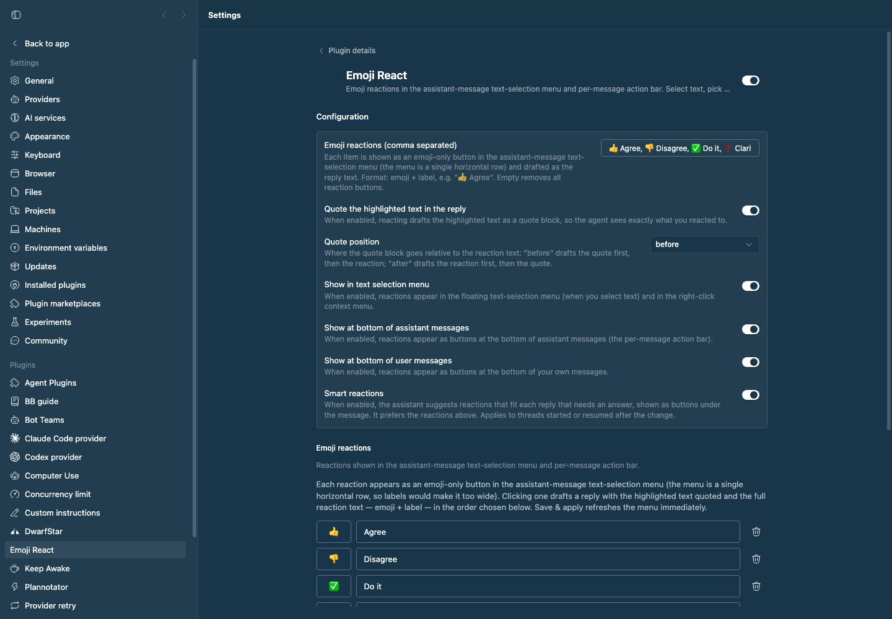
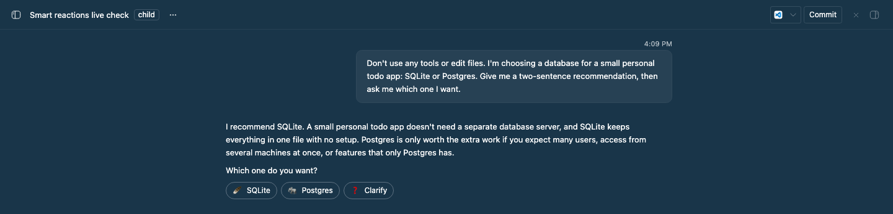

# Emoji React

> Install from the [BB Community marketplace](https://github.com/get-bb/marketplace/blob/main/entries/emoji-react.json).

Emoji reactions in the assistant-message text-selection menu **and the
per-message action bar** — a port of NeonPilot's `system-reply-actions`
extension to bb.

Select any text in an agent response, and the floating selection menu (next
to "Add to chat") shows one emoji button per configured reaction. Clicking
one drafts a reply:

```
> <the highlighted text>

👍 Agree
```

and focuses the composer. Each reaction is a user-configurable emoji + label
pair, editable in **Tools → Extensions → Emoji React → Emoji reactions**.
The reaction buttons show the emoji only (the host renders plugin actions
with the plugin's compact icon — identical for every reaction — so a content
script swaps that icon for the emoji glyph in the per-message action bar and
strips it from the floating selection menu), while the drafted reply uses
the full `emoji label` text.

Optional **smart reactions** (off by default) let the assistant suggest the
reactions that fit each reply, such as `🪶 SQLite` and `🐘 Postgres` when it
asks you to choose. They appear as buttons inside the reply. See
[Smart reactions](#smart-reactions).

## Smart reactions

Smart reactions are off by default. Turn them on with the **Smart reactions**
toggle in settings. When they are on, the assistant suggests reactions that fit
each reply that needs an answer. They appear as buttons under the message.
Clicking one drafts that reaction in the composer, the same way the other
reaction buttons do.

The assistant uses your configured reactions when they fit. When a reply
offers distinct choices, it writes specific ones, such as `🪶 SQLite` and
`🐘 Postgres`. Replies that need no answer get no buttons.

This works through a message directive. The plugin adds instructions that ask
the assistant to end such a reply with one line:

```
::reactions{items="🪶 SQLite|🐘 Postgres|❓ Clarify"}
```

The frontend draws that line as buttons. Items are separated by `|`, so
labels can contain commas. The plugin shows at most 5 items, drops items longer
than 60 characters, and drops items without both an emoji and a label.

- Instructions apply when a thread's agent session starts or resumes, so turn
  the setting on before you start a thread. A running session keeps the
  instructions it started with.
- The buttons still render if you later turn the setting off, so older replies
  never show the raw line. If you disable the plugin, the line shows as plain
  text.

## Staged preview



Captured from the running BB application with configured reaction data. The
settings page shows the default reaction list, the location toggles, and the
**Smart reactions** toggle turned on.



A live thread with smart reactions on. It asked whether to use SQLite or
Postgres for a small todo app. The assistant's reply ends with its suggested
reactions: SQLite, Postgres, and Clarify. The capture script also clicks
SQLite and checks that the reply was drafted in the composer. To seed it, turn
smart reactions on, start a thread with that question, and pass its ID as
`BB_CAPTURE_SMART_REACTIONS_THREAD_ID`.

## Settings

- **Emoji reactions** (`emojiItems`) — comma-separated `emoji label` items.
  Each item appears as one button in the selection menu and is used verbatim
  as the drafted reply text. Empty removes all reaction buttons.
  Default: `👍 Agree, 👎 Disagree, ✅ Do it, ❓ Clarify`
- **Quote the highlighted text** (`quoteSelection`) — when enabled (default),
  reacting drafts the highlighted text as a quote block, so the agent sees
  exactly what you reacted to.
- **Quote position** (`quotePosition`) — where the quote goes relative to the
  reaction text: `before` (default) drafts the quote first, then the reaction;
  `after` drafts the reaction first, then the quote.
- **Show in text selection menu** (`showInSelectionMenu`) — when enabled
  (default), reactions appear in the floating text-selection menu and the
  right-click context menu.
- **Show at bottom of assistant messages** (`showInAssistantBar`) — when
  enabled (default), reactions appear as buttons at the bottom of assistant
  messages (the per-message action bar).
- **Show at bottom of user messages** (`showInUserBar`) — when enabled
  (default), reactions appear as buttons at the bottom of your own messages.

- **Smart reactions** (`smartReactions`) — off by default. When enabled, the
  assistant suggests reactions for each reply that needs an answer. See
  [Smart reactions](#smart-reactions).

Disable any surface you don’t want — at least one must stay enabled for
reactions to be visible. The editor has a **Where reactions appear** group
with those three toggles, so you can keep only the selection menu, only the
bottom bars, or a mix.

Edit them in the plugin's settings page (the "Emoji reactions" editor, or the
raw fields below it) or via the CLI:

```sh
bb plugin config emoji-react set emojiItems "👍 Agree, 👎 Disagree, ✅ Do it"
bb plugin config emoji-react set quoteSelection true
bb plugin config emoji-react set quotePosition before
bb plugin config emoji-react set showInSelectionMenu true
bb plugin config emoji-react set showInAssistantBar true
bb plugin config emoji-react set showInUserBar false
bb plugin config emoji-react set smartReactions true
bb plugin reload emoji-react
```

The settings editor's **Save & apply** updates the selection menu immediately
(the host only re-interprets a plugin frontend when its bundle changes, so the
editor briefly disables and re-enables the plugin to refresh the menu).
Changes made via the CLI apply on the next app reload or frontend
re-interpretation.

## How it works

- `messageAction` slots add one selection-menu entry per configured reaction
  (bb's equivalent of NeonPilot's `selectionActions` + `settingItems`).
  Registrations are static per frontend interpretation, so `app.tsx` reads
  the plugin settings synchronously at setup time (same-origin XHR to the
  plugin settings endpoint) and falls back to the defaults when the server
  is unreachable. If every `showIn*` toggle is off, no actions are registered
  — the plugin is effectively hidden until a location is re-enabled.
- A zero-visibility composer banner captures the bound `useComposer()` API
  into a module ref — `messageAction` runs are plain host-chrome callbacks
  with no hook access, and banners mount in every composer layout.
- The settings section on the plugin detail page is a live editor (rows of
  emoji + label inputs) persisting through the standard plugin settings
  endpoint. It now includes a **Where reactions appear** toggle group for the
  three surfaces; the host-rendered raw settings form below the editor also
  exposes the same three booleans.
- Smart reactions: `server.ts` keeps the settings in memory and, when
  `smartReactions` is on, returns instructions from `bb.agents.configure`.
  `app.tsx` registers a `reactions` message directive that renders the
  suggested items as buttons. `src/smart-reactions.ts` parses the untrusted
  directive attribute and builds the instructions.
- A content script replaces the plugin's compact icon with the reaction
  glyph: the per-message action bar renders plugin actions as icon-only
  buttons (the title lives in `aria-label`), so the script swaps the icon
  span for the emoji text; the floating selection-menu buttons already carry
  the emoji as their label, so there the icon span is simply stripped. It
  relies on the icon span's `data-plugin-icon-asset` URL, so if a future bb
  changes those internals the script degrades to leaving the icon in place.
  When a location is disabled the script hides those buttons instead of
  swapping — selection-menu buttons are detected by text content, action-bar
  buttons by role heuristics (assistant vs user via ancestor attributes).

## Development

```sh
bb plugin install .    # register
bb plugin dev          # watch loop: rebuild + reload on save
pnpm typecheck
pnpm test              # vitest for reaction parsing, drafts, and smart reactions
pnpm build             # self-contained dist/
```
