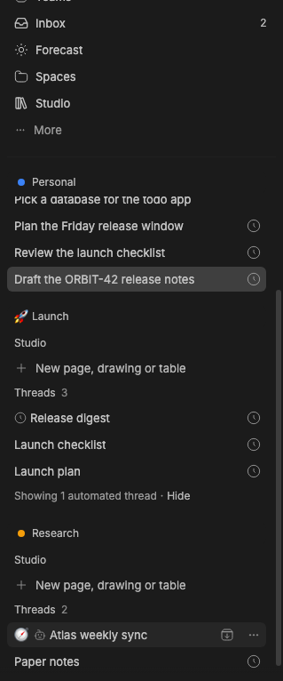

# Studio Sidebar

> **Studio Sidebar** is part of **BB Studio**, a suite of plugins for writing, talking, drawing, tracking tasks, running bot teams, and keeping what your agents make: [Studio](../bb-studio), [Studio Pages](../bb-studio-pages), [Studio Talk](../bb-studio-talk), [Studio Draw](../bb-studio-draw), [Studio Artifacts](../bb-studio-artifacts), [Studio Tasks](../bb-studio-tasks), [Studio Chat](../bb-studio-chat), and [Studio Teams](../bb-studio-teams).

Studio Sidebar replaces BB's Thread List sidebar provider. It keeps the thread
list and its organization controls, and adds:

- **Studio apps' sections above your threads.** Each Studio app can add a
  section, like Studio's tabs for the items you've opened. Everything scrolls
  as one list with the threads; no section has its own scroll area.
- **Section controls.** Each section's ⋯ menu moves it up or down or hides
  it. **Threads ⋯** lists hidden sections to show again. The arrangement and
  collapsed sections are kept per browser and follow across windows.
- **New project** in the **Threads ⋯** menu. It opens a folder picker or
  accepts a folder path, creates the project through BB's Plugin SDK, and
  opens it.
- **Hide empty projects** in **Filter → Projects** removes project groups with no visible threads. Selected, newly created, and renamed projects remain visible.
- **By space** in **Threads ⋯ → Organize**, next to By project, By machine, and Custom. Each [Studio](../bb-studio) Space gets a section, in Studio's order, marked with its emoji or colour, and holding the threads in that Space (a child thread stays with its root). A Space's lead thread comes first. Threads in no Space, or in a Space that no longer exists, go in a final **Threads** section. Click a Space's name, or **Open Space** in its ⋯ menu, to open the Space. **+** starts a thread in the Space's default project; Studio decides whether it joins the Space. Space sections follow Studio's order, so they don't reorder by dragging, but threads still nest when dropped onto each other. While By space is on, Studio's own **Spaces** section steps aside. By space needs a Studio with Spaces: until Studio answers, the option is disabled with a hint, and a list already set to By space shows By project.
- **Automated threads** stay in their usual section with a small mark: a clock for threads attached to an automation, a bot for threads that work as a bot (BB shows a lightning bolt if it doesn't know the icon). Each section's ⋯ menu sets **Automated threads** to **Show all**, **Only with updates** (the default), or **Hide**. Updates are requests for input, unread finished results, failed queued messages, and running work. A section that hides any ends with a row such as "4 automated threads hidden · Show"; **Show** reveals them in that section until the window reloads, and **Hide** puts them away again. Pinned threads and the open thread always show, as do Space leads in By space. BB's **Hide from list** still hides a whole section. Threads attached to bots or automations are detected on load, on window focus, and every 30 seconds.
- **Float** in each thread's menu, after **Open in split**, while
  [Float](../bb-studio-float) is installed. It opens the thread in a window
  along the bottom of the screen.
- **Create channel** when dropping a thread onto another. The dialog names a channel containing both ordinary threads, keeping their projects and history intact. Studio Teams supplies the channel. **Nest threads** preserves parent/child organization, and Cancel leaves both threads alone.

The bundled Thread List plugin remains installed; selecting Studio Sidebar as
the thread list provider switches the visible list. Install this package in
BB, then choose **Studio Sidebar** in **Settings → Appearance → Sidebar →
Thread list provider**. The package requires BB 0.44 or newer and Plugin SDK
0.5.29 or newer. Its plugin id stays `thread-list-plus`.

The `source/` directory vendors BB's MIT-licensed Thread List plugin at
commit `8595b6ea4b8bfa771f84d57e69124e76bacf9eef`. Studio's additions
are isolated under `source/app/studio/` with small hooks in a few upstream
files. See [UPSTREAM.md](UPSTREAM.md) for the changed files, sync command,
and vendored UI policy, and [LICENSE](LICENSE) for the upstream license.

## Staged preview


Captured from the sidebar of a staged BB (`node scripts/staged-bb.mjs start`), with Studio Sidebar selected as the
thread list provider. Two staged pages, "Offline mode launch" and "Release
notes: October", were opened, so the Studio section lists them as tabs above
the Threads list. The capture asserts that both tabs are present, that the
section sits above Threads, and that it has no scroll area of its own.


The By space capture creates two Spaces, Launch (🚀) and Research, and adds
"Launch plan", "Launch checklist", and "Release digest" (attached to a paused
automation) to Launch, and "Paper notes" and "Atlas weekly sync" (working as
the Atlas bot) to Research. The demo project's threads sit in Studio's
Personal Space, which comes first in Studio's order. Research is set to show
all automated threads, so
Atlas weekly sync shows its bot mark; Launch keeps the default, so it ends with
"1 automated thread hidden · Show". The live check verifies the section order,
each Space's threads, the marks, and that Studio's own Spaces section is gone
while By space shows. No automation or agent runs during this capture.



The same fixture after **Show** in Launch: Release digest appears with its
clock mark, and the row reads "Showing 1 automated thread · Hide".


The dialog capture opens **New project** from the live **Threads ⋯** menu and
checks for the folder path, Browse, and Create project controls. No project
is created during capture.

## For Studio apps

A Studio app adds a section from any always-mounted component, such as an
`experimental_appOverlay`, with [`@bb-studio/kit`](../bb-studio-kit):

```tsx
<SidebarPortal id="tabs" title="Studio" order={0}>
  <SidebarSection title="Studio" menu={…}>{rows}</SidebarSection>
</SidebarPortal>
```

Studio Sidebar renders an empty anchor for each registered section and the app
portals into it. Without Studio Sidebar, `SidebarPortal` renders nothing.

An app can also put a mark before a thread's title, as Studio Teams does with
the avatar of the bot a thread works as:

```ts
const unpublish = publishThreadBadges(pluginId, new Map([[threadId, { glyph: "🦉", label: "Working as Atlas" }]]));
```

Only threads with a badge show one; other rows keep their usual inset.

## Preferences shared with Studio

By space is stored like the other organizations, in the synced
`organizationMode` preference (now `project`, `chronological`, `machine`, or
`space`), because this package owns its copy of BB's preference schema.
Automated threads choices are the synced `automatedThreads` preference: a
section key (`threads`, `project:<id>`, `section:<id>`, `machine:<id>`,
`space:<id>`) to `all`, `updates`, or `hidden`, with `*` for every section
without its own choice.

Studio and this package talk without the kit. This package writes the
organization it shows to `localStorage["bb-studio:sidebar-organization"]` and
fires the `bb-studio:sidebar-organization` window event; Studio's Spaces
section reads it and hides while it reads `space` (other windows follow
through the storage event). Studio re-announces its realtime changes as the
`bb-studio:studio-changed` window event, which makes By space refetch; it also
refetches on focus and every 30 seconds.

## Development

```sh
pnpm --filter @bb-studio/thread-list-plus typecheck
pnpm --filter @bb-studio/thread-list-plus test
node upstream/sync.mjs --upstream /path/to/bb --commit <sha> --check
bb plugin build .
```

`@bb-studio/kit` is a `file:../bb-studio-kit` dependency. Keep
`package-lock.json` current (regenerate it in a clean clone, not the pnpm
workspace), because BB's Git install runs `npm install` from it.
