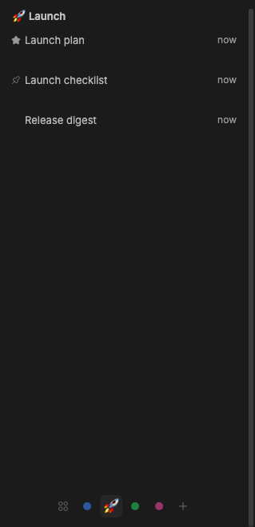
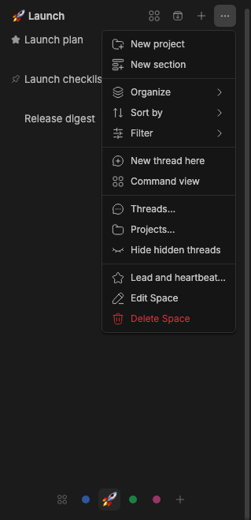
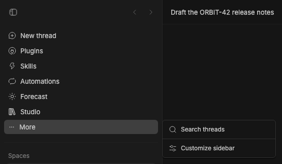

# Studio Sidebar

> **Studio Sidebar** is part of **BB Studio**, a suite of plugins for writing, talking, drawing and keeping what your agents make: [Studio](../bb-studio), [Studio Pages](../bb-studio-pages), [Studio Talk](../bb-studio-talk), [Studio Draw](../bb-studio-draw), [Studio Artifacts](../bb-studio-artifacts), [Studio Tables](../bb-studio-tables) and [Studio chat](../bb-studio).

Studio Sidebar replaces BB's Thread List sidebar provider. It keeps the thread
list and its organization controls, and adds:

- **Studio apps' sections above your threads.** Each Studio app can add a
  section, like Studio's tabs for the items you've opened. Everything scrolls
  as one list with the threads; no section has its own scroll area.
- **Section controls.** Each section's ⋯ menu moves it up or down or hides
  it. **Threads ⋯** lists hidden sections to show again. The arrangement and
  collapsed sections are kept per browser and follow across windows.
- **New project** in the **Threads ⋯** menu. It opens a folder picker or
  accepts a folder path, creates the project through BB's Plugin SDK, and
  opens it.
- **Hide empty projects** in **Filter → Projects** removes project groups with no visible threads. Selected, newly created, and renamed projects remain visible.
- **By space** in **Threads ⋯ → Organize**, next to By project, By machine, and Custom. It shows one [Studio](../bb-studio) Space at a time, like Arc: a row of dots pinned to the bottom of the list switches Spaces. The first dot, a grid, is **All**, which stacks every Space in Studio's order, each with its heading, lead, pins, Studio items and threads, and each collapsible (an amber dot on a heading means a thread there needs you); then comes one dot per Space (its emoji, or a dot in its colour). Hover a dot for its name, and **+** makes a new Space. A dot with a small amber mark has a thread that needs you (a question or approval). **⌃⌥←** and **⌃⌥→** (outside text fields), or a horizontal two-finger swipe over the list, step to the previous or next view, All included. The choice is a synced preference, so it follows across windows. Thread rows are taller here: a status dot (amber needs you, green working, red unread error, blue unread result; a read, idle thread has none) replaces BB's status icon, the title has its age on the right, and a muted second line shows the thread's latest progress from Studio, in red when something failed and amber when it is blocked. Rows with nothing to say stay one line. Threads in no Space, or in a Space that no longer exists, belong to the default Space (Personal). The Space's heading has its mark and name; its ⋯ menu has **New thread here**, **Command view** (it opens the Space's Command view), **Lead and heartbeat…**, **Edit Space**, and **Delete Space**. There are no headings inside a Space. Its open Studio items come first, as small chips (icon and title) in a wrapping row under the heading, like tabs, the one on screen highlighted like the selected thread; then the **lead**, with a star in place of its status dot (coloured by its state, its label naming the heartbeat schedule when one is on); then its pinned threads, in pin order, each with a pin (with Spaces, pins live in their Space instead of a Pinned section); any thread's menu offers **Make Space lead** or **Remove as Space lead**. A lead can't be archived from the sidebar in any organization, from its row, its menu, or an environment's **Archive threads** (which archives the rest): remove it as lead first. BB's own archive shortcut doesn't ask the sidebar, so it still archives a lead. Below them come its other threads (a child thread stays with its root), with threads that need you first and marked with an amber dot. Click a chip to open its item in place of the current pane, or ⌘/Ctrl-click to open it in a split beside it, as with threads; × (on hover) or a middle-click closes it here without touching the item. Right-click a chip, or long-press it on touch, for Open in split, Pin, Rename, Copy link, Copy ID, Close, Archive and Delete; pinned items stay at the top. The Space heading's buttons, on hover, hold the rest: **+** starts a thread in the Space's default project or makes any kind of Studio item in the Space and opens it, and **Browse** (the stack button) searches the Space's Studio items that aren't open and its archived threads together: it lists the items, then the 10 most recently archived threads, with **Load more** for older ones. Threads still nest when dropped onto each other. While By space is on, Studio's own **Spaces** section steps aside. By space needs a Studio with Spaces: until Studio answers, the option is disabled with a hint, and a list already set to By space shows By project. While one Space is shown, BB's **New thread** (with Studio Navigation) starts the thread in that Space's project, like the Space's own **+**.
- **Hidden threads**: right-click a thread (or use its ⋯ menu) and choose **Hide**, and it leaves every section with its sub-threads. A section that hides any offers **Show 2 hidden threads** in its ⋯ menu (a Space's ⋯, or a project or section header's); it reveals them in that section until the window reloads, and **Hide hidden threads** puts them away again. A hidden thread and its sub-threads count as one. A revealed hidden thread's menu offers **Unhide**; its sub-threads offer neither Hide nor Unhide. Pinned threads and the open thread always show, as do Space leads in By space. BB's **Hide from list** still hides a whole section.

The bundled Thread List plugin remains installed; selecting Studio Sidebar as
the thread list provider switches the visible list. Install this package in
BB, then choose **Studio Sidebar** in **Settings → Appearance → Sidebar →
Thread list provider**. The package requires BB 0.44 or newer and Plugin SDK
0.5.29 or newer. Its plugin id stays `thread-list-plus`.

The `source/` directory vendors BB's MIT-licensed Thread List plugin at
commit `8595b6ea4b8bfa771f84d57e69124e76bacf9eef`. Studio's additions
are isolated under `source/app/studio/` with small hooks in a few upstream
files. See [UPSTREAM.md](UPSTREAM.md) for the changed files, sync command,
and vendored UI policy, and [LICENSE](LICENSE) for the upstream license.

## Staged preview


Captured from the sidebar of a staged BB (`node scripts/staged-bb.mjs start`), with Studio Sidebar selected as the
thread list provider. Two staged pages, "Offline mode launch" and "Release
notes: October", were opened, so the Studio section lists them as tabs above
the Threads list. The capture asserts that both tabs are present, that the
section sits above Threads, and that it has no scroll area of its own.



The By space capture creates two Spaces, Launch (🚀) and Research, and adds
"Launch plan", "Launch checklist", and "Release digest" to Launch, and "Paper
notes" and "Atlas weekly sync" to Research. It makes Launch plan the Space's
lead and pins Launch checklist, then shows Launch. The live check verifies
that only Launch shows, with its threads and emoji, that the lead comes first
with a star and the pin next with a pin, under no Lead, Studio or Threads
headings, that the switcher
at the bottom has All first and a dot for each Space with Launch current, that
every Launch row has its status dot, and that Studio's
own Spaces section is gone while By space shows. No agent runs during this
capture.



The same fixture after hiding Release digest from its row's right-click menu:
the capture checks that it leaves Launch with no footer row, then opens
Launch's ⋯ menu and clicks **Show 1 hidden thread**. Release digest is back,
and Launch's ⋯ menu, left open, now offers **Hide hidden threads**.


The dialog capture opens **New project** from the live **Threads ⋯** menu (or,
with no loose threads, the seeded Orbit project's ⋯ menu) and
checks for the folder path, Browse, and Create project controls. No project
is created during capture.

## For Studio apps

A Studio app adds a section from any always-mounted component, such as an
`experimental_appOverlay`, with [`@bb-studio/kit`](../bb-studio-kit):

```tsx
<SidebarPortal id="tabs" title="Studio" order={0}>
  <SidebarSection title="Studio" menu={…}>{rows}</SidebarSection>
</SidebarPortal>
```

Studio Sidebar renders an empty anchor for each registered section and the app
portals into it. Without Studio Sidebar, `SidebarPortal` renders nothing.

An app can also put a mark before a thread's title:

```ts
const unpublish = publishThreadBadges(pluginId, new Map([[threadId, { glyph: "🦉", label: "Working as Atlas" }]]));
```

Only threads with a badge show one; other rows keep their usual inset.

## Preferences shared with Studio

By space is stored like the other organizations, in the synced
`organizationMode` preference (now `project`, `chronological`, `machine`, or
`space`), because this package owns its copy of BB's preference schema.
Hidden threads are the synced `hiddenThreads` preference, a list of thread
ids, so they follow across windows. Set it with
`bb thread-list-plus prefs set hiddenThreads '["thr_…"]'`. The Space By space
shows is the synced `currentSpace` preference (a Space id, `all` for All, or
null for the default Space); `collapsedSpaces` lists the Spaces collapsed in
All. `collapsedSpaceSections` is left from when a Space had Lead, Studio and
Threads sections; nothing reads it now. Each row's second line comes from Studio's `thread_lines` RPC (leads
first, then by recency, at most 60 threads), fetched when the shown threads or
their status change, on focus, and every 30 seconds while the window is
visible.

Studio and this package talk without the kit. This package writes the
organization it shows to `localStorage["bb-studio:sidebar-organization"]` and
fires the `bb-studio:sidebar-organization` window event; Studio's Spaces
section reads it and hides while it reads `space` (other windows follow
through the storage event). Studio re-announces its realtime changes as the
`bb-studio:studio-changed` window event, and fires `studio:space-changed`
after its Space dialogs; either makes By space refetch, as do focus and a
30-second poll. This package opens Studio's dialogs with the `studio:new-space`
and `studio:space-dialog` (`{ spaceId, dialog }`) window events, and sets a
lead through Studio's `space_set_lead` RPC.

## Development

```sh
pnpm --filter @bb-studio/thread-list-plus typecheck
pnpm --filter @bb-studio/thread-list-plus test
node upstream/sync.mjs --upstream /path/to/bb --commit <sha> --check
bb plugin build .
```

`@bb-studio/kit` is a `file:../bb-studio-kit` dependency. Keep
`package-lock.json` current (regenerate it in a clean clone, not the pnpm
workspace), because BB's Git install runs `npm install` from it.

## Navigation

Studio Sidebar also provides **Studio Navigation**, selectable in BB Appearance.
It keeps BB and other plugins' navigation rows, hides duplicate Studio add-on
rows when the Studio hub is available, and starts new threads in the selected
Space. Customize sidebar controls keep their existing visibility and order.
The separate `studio-navigation` package is retired; update Studio Sidebar,
select its navigation provider in Appearance, then remove the old plugin.


