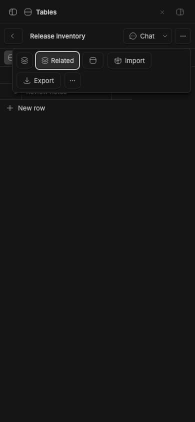
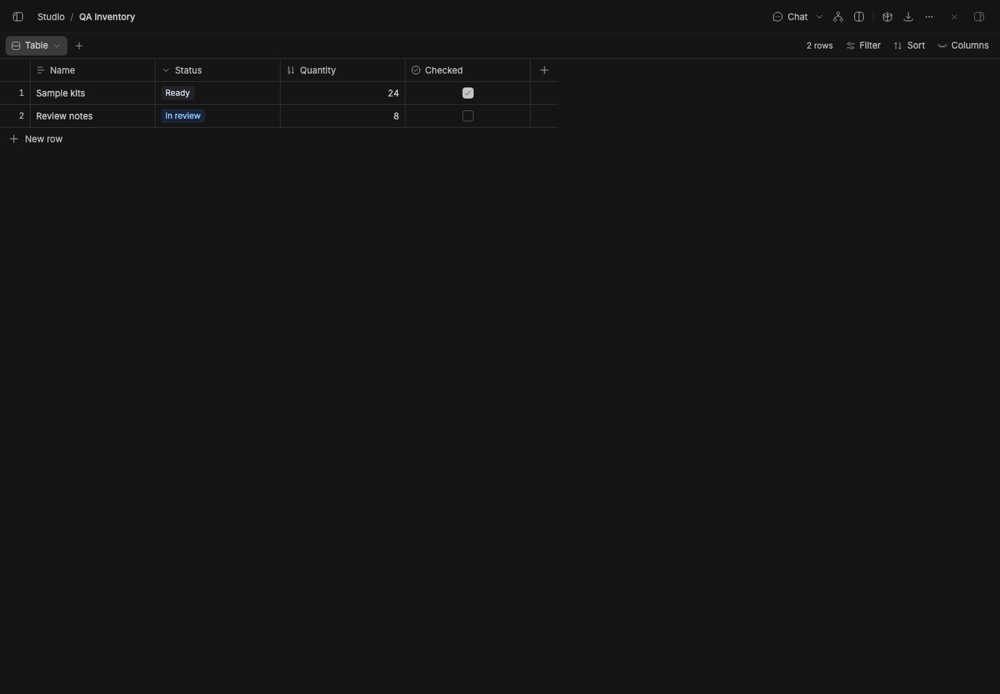

# Studio Tables

Structured tables for BB Studio. Each table has typed columns, rows, and saved table, board, or calendar views, edited in a spreadsheet grid: arrow keys, Enter to edit, typing to replace, copy and paste with Excel or Sheets, fill a range by pasting, undo and redo, and drag to resize columns. Every view and row has a link (`/plugins/studio-tables/tables/<id>/view/<view>/row/<row>`).

Pages embeds tables live, so edits in a page show in Tables and the other way round. Agents can create tables, inspect schemas, query rows, insert rows, and update cells. CSV import matches headers to columns by name.

In a thread's workbench, the **Tables** tab lists the tables made or changed in that thread, then the project's recent ones. **New** makes a table in the thread's project and links it to the thread in Studio.

When an agent creates a table or changes its rows, its reply shows the table's card (`::table{id="…"}`) with its row and column counts. Clicking it opens the table in the **Tables** tab, beside the chat. Where there's no workbench, it opens in the main area.

The grid renders a window of visible rows for large tables, including embedded
Pages tables. Keyboard navigation and clipboard ranges still span every row;
an open cell editor stays mounted when scrolled out of view. The full table
is still loaded for local sorting/filtering. Dense boards show 50 cards per
lane and calendars show 10 entries per day. Each has totals and page controls,
including direct access to the first and last page; every row remains editable.

## Commands

`bb tables list`, `create <title>`, `schema <id>`, `query <id>`, `insert <id> <json>`, `update <id> <row-id> <json>`, `export <id>`, and `import <id> --csv <text>` (headers match columns by name).

Queries return `{ rows, total, offset, nextOffset, revision }`. Agent and RPC
queries accept `limit` (100 by default, up to 500) and `offset`. Continue with
`offset: nextOffset` and `expectedRevision: revision` until `nextOffset` is null.
Keep the same view, filters and sorts. If the table changes, the revision check
asks you to restart the scan. The CLI uses `--limit`, `--offset`, and `--revision`.

## Staged preview

The live 390-pixel Release inventory table contains a seeded Review notes row.
**Chat** stays visible, and **Item actions** keeps Export and More clickable
above the sticky table header.
These compact captures run on stable BB 0.45.0 with the full suite installed
from pushed commit 786fd2f. They check viewport bounds, button hit targets,
and the Related popover before capture.

Captured from a staged BB (`node scripts/staged-bb.mjs start`): a seeded "QA Inventory" table open in the Tables panel.
Its Name, Status, Quantity and Checked columns are typed (text, select, number
and checkbox), with two seeded rows, the row count, Filter, Sort, Columns, and
Import and Export.
