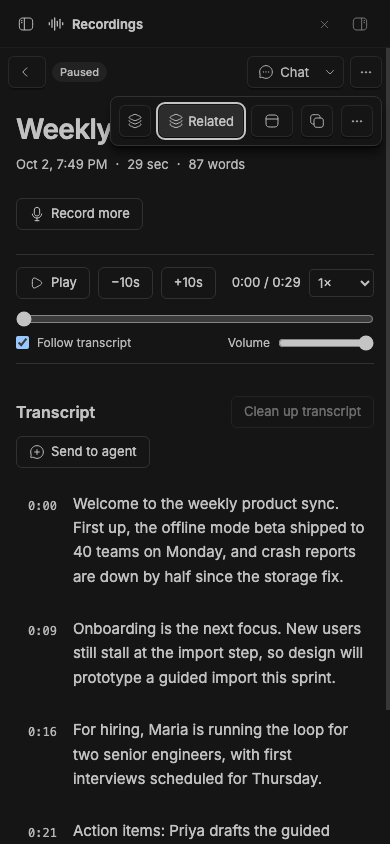
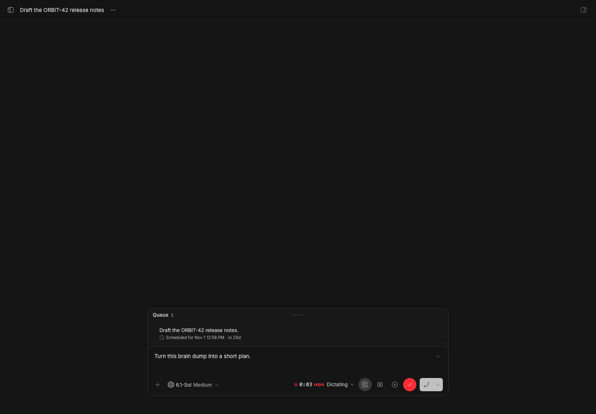
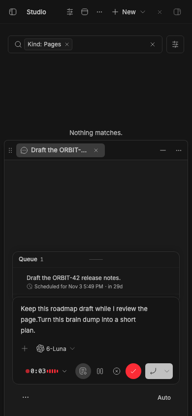
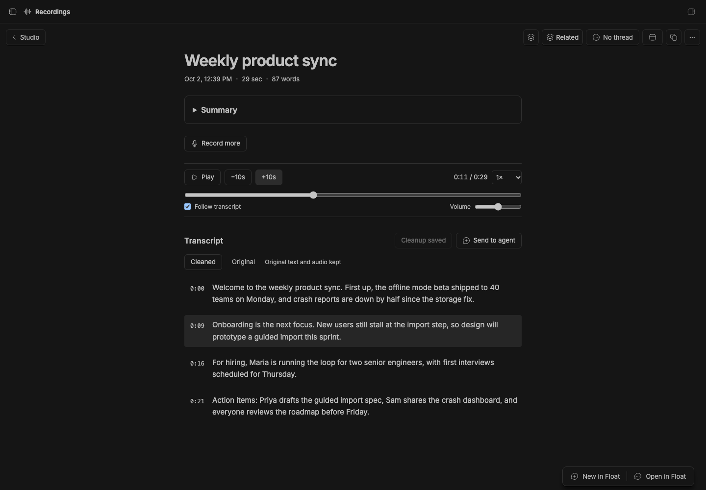
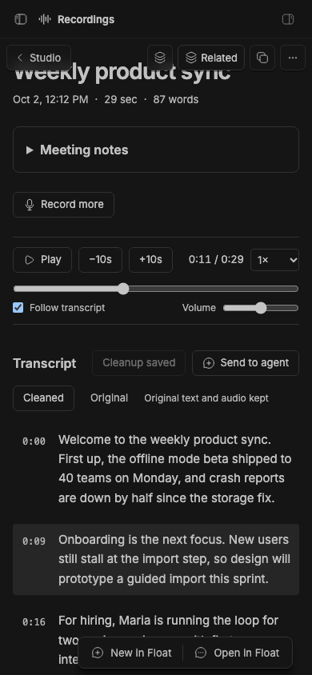
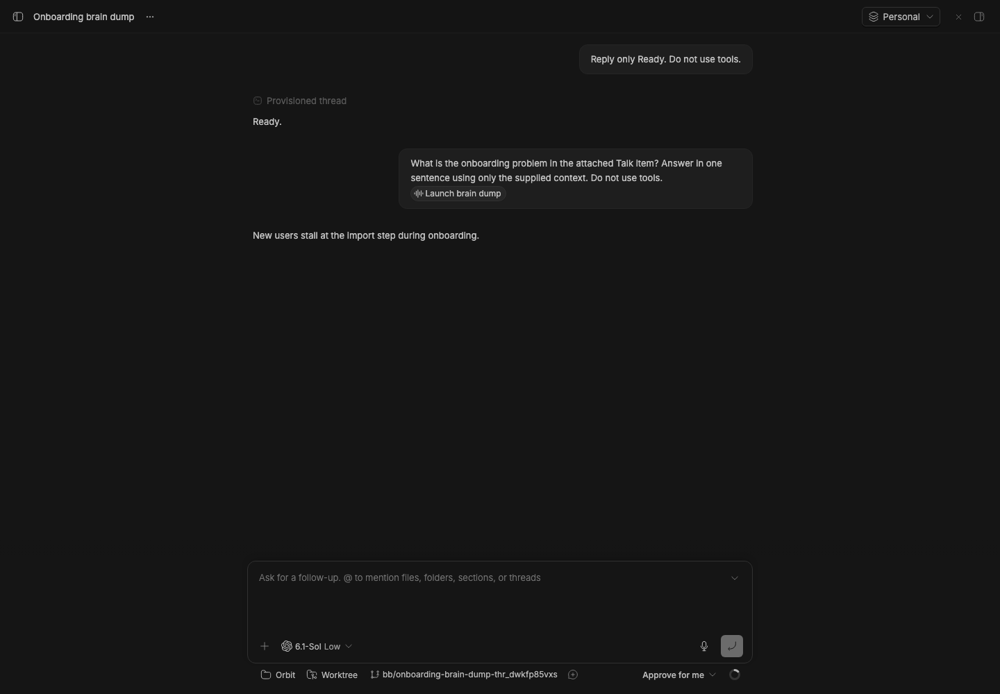
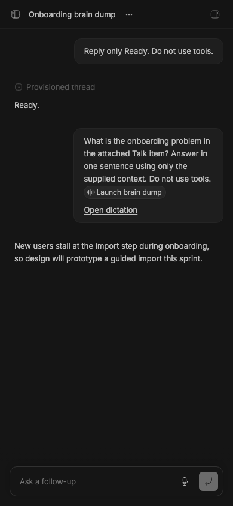

# Studio Talk

> **Studio Talk** is part of **BB Studio**, a suite of plugins for writing, talking, drawing, tracking tasks, running bot teams, and keeping what your agents make: [Studio](../bb-studio), [Studio Pages](../bb-studio-pages), Studio Talk, [Studio Draw](../bb-studio-draw), [Studio Artifacts](../bb-studio-artifacts), [Studio Tasks](../bb-studio-tasks), [Studio Chat](../bb-studio-chat), and [Studio Teams](../bb-studio-teams).

Long-form, durable dictation and recording for BB. Talk saves audio as you
speak and transcribes it with the voice service configured in **Settings → AI
services**. That service is your ChatGPT subscription through Codex by
default. Every dictation and recording becomes a titled, searchable object you
can link to and @-mention.

## Staged preview



The live 390-pixel recording page shows the paused, synthetic Weekly product
sync recording with four transcript sections. **Chat** stays visible and
**Item actions** exposes the recording's secondary controls.
These compact captures run on stable BB 0.45.0 with the full suite installed
from pushed commit 786fd2f. They check viewport bounds, button hit targets,
and the Related popover before capture.



The real staged composer shows the timer, level meter, cleanup toggle, pause,
cancel, and finish controls in place of its microphone. The capture uses a synthetic
microphone and checks pause/resume, expansion, navigation away, and returning to
the same dictation. Expanding and collapsing also retains keyboard focus.



At a 390-pixel viewport, the controls use a second toolbar row and fit inside the
input, including a tappable transcript expansion button.



This is the real BB Recordings page in a staged BB (`node scripts/staged-bb.mjs start`), opened from the nav panel. It shows a
seeded recording called "Weekly product sync".

To stage it, the capture script:
- Speaks four recording sections with macOS `say`.
- Uploads the audio to the live plugin in two sessions.
- Lets BB's voice service transcribe it.

The capture generates an optional summary and a saved cleaned transcript.
It plays the audio, seeks to the second section, adjusts volume, and pauses.
The page shows the scrubber, playback controls, **Original** and **Cleaned**
views, and timestamped sections. The script checks that the original transcript
is unchanged, then deletes the seeded recording afterwards.



The same staged recording at a 390-pixel viewport. The capture checks that
playback controls fit the screen.



The staged chat shows a dictated message with a clickable **Launch brain dump**
mention. The capture checks recovered delivery, the absence of an extra link,
the agent's answer using the saved transcript, and the pill opening the source. It
also checks that keeping the dictation as a recording preserves the reference.



The same message at a 390-pixel viewport, with the source pill in view.

## What you get

- **Replaces built-in dictation.** The composer's microphone starts a Talk
  dictation. Pressing it again, or ✓ in the pill, stops recording, waits for
  the transcript, and types it into that composer. ✕ stops without inserting.
- **The source stays with the message.** Chat dictation adds a native Talk
  mention beside the text, attaching the saved item for the agent. Click the
  pill in the sent message to open the original Studio item. The reference
  survives finishing away from the thread and returning later. **Keep as a
  recording** preserves it. Dictation into document fields inserts the text as usual.
- **One dictation, one thread.** While Talk is dictating, the mics in other
  threads are dimmed. Pressing one says where the dictation is, with a **Go
  back** button. The thread being dictated into shows a mic in the sidebar.
- **Finish from anywhere.** Press ✓ from another thread and Talk holds the
  text. It types the text into the dictation's thread when you go back. BB
  keeps unsent composer text on the device, so Talk can't safely write into a
  thread that isn't open.
- **Hold to talk.** Hold Right Option (or the key set in settings) by itself
  to dictate into the focused composer or field, and let go to insert. A
  quick tap does nothing, and Option+key shortcuts and AltGr characters still
  type as usual.
- **Clean-up before inserting.** Talk asks Studio Decisions to drop filler
  words and false starts, and to fix punctuation, without rewording. The
  dictation keeps the raw transcript. Turn it on or off with the ✦ button on
  the dictation pill; the choice is kept per device. If Decisions is missing,
  slow, or returns something that isn't a clean-up, Talk inserts the text as
  spoken.
- **Dictation in other plugins.** Plugins can mark a text surface as a
  dictation field, as [Pages](../bb-studio-pages) does for its editor. Talk
  dictates into it with the same pill, durability, and **Go back** handling
  as a composer. *Talk: Start or finish dictation* works in a focused field.
- **Recordings as spoken notes.** **New recording** on the Recordings page, or
  the command *Talk: Start or stop a recording*, records for as long as you
  need without inserting anywhere. Use recordings for brain dumps, ideas,
  personal notes, or meetings. **Send to agent** opens a thread with the
  recording attached; mentions include its saved cleaned version when available.
- **Clean up a recording.** **Clean up transcript** on a finished recording
  creates a saved cleaned version while retaining the original transcript and
  audio. Switch between **Cleaned** and **Original**; copy and text downloads
  use the version shown. Cleanup works section by section, so long recordings
  keep their audio alignment. If it stops, press the button again to continue.
- **Audio playback.** Play or pause, scrub across the recording, skip 10 seconds,
  change speed, and adjust volume. Click a timestamp or transcript section to
  play from there. Highlighting follows the audio; **Follow transcript** keeps
  the current section visible. Timing is per audio section, rather than per word.
- **Dictations stay in the background.** Every dictation is saved in case
  something goes wrong, but Studio's All view and Home leave them out. Pick
  the **Dictations** filter, or search, to find one. Recordings you start
  from Studio show up as usual.
- **Keep a long dictation as a recording.** After a dictation of five
  minutes or 800 words, a toast offers **Keep**. **Keep as a recording** on
  the dictation's page does the same. It moves the dictation out of the
  background and gives it a title; you can summarize it from its page. The text is still
  inserted.
- **Dictation audio expires.** After a day, a dictation's audio is
  deleted and its transcript is kept. Recordings keep their audio. A
  dictation with a piece still waiting or failed keeps its audio.
- **A table of recordings.** The Recordings page lists everything in a
  table you can search, filter to recordings or dictations, and sort by
  title, date, length, or word count. Tick rows, or shift-click for a range,
  to start one thread that mentions them all, copy their transcripts as one
  document, retry failed pieces, or delete them together.
- **Dictation at its input.** While its chat input is on screen, a dictation's
  compact controls replace the mic. Expand to read the transcript and it
  becomes a floating pill. Collapse it to dock again. Navigating away also
  floats the controls; returning to the input docks them. Each new dictation
  starts collapsed. Dictation into other plugins' fields uses the floating pill.
- **A pill that follows you.** Recordings and dictations away from their input
  use a small overlay at the top of the window. It stays
  put as you move between threads and pages. Everything else stays clickable.
  Drag it anywhere in the window and it stays there, even after a reload.
  Away from where you started, a back arrow returns you to that thread or
  recording. Expand the pill to read the transcript as it arrives; the pill
  remembers whether you left it expanded or collapsed.
- **Streaming transcript.** Audio is cut into pieces of about 25 seconds at
  natural pauses. Each piece is transcribed as soon as it is uploaded, so text
  appears while you are still talking.
- **Linkable and mentionable.** Each recording has its own page at
  `/plugins/talk/recordings/<id>`. It shows up in the composer's @ menu, and
  mentioning it gives the agent its transcript. Its header names its thread
  with [Studio Chat](../bb-studio-chat), or has **New thread**, which starts
  a thread that links to it, without.
- **Auto titles.** Studio Decisions uses its configured fallback model to
  title each recording from its transcript. If Decisions is missing or reports
  that no model is available, Talk uses the transcript's first words and the
  recording date. Titles update as the transcript grows and never replace a
  title you typed.
- **Optional summary.** Choose **Generate summary** in the recording menu
  for a concise paragraph covering the recording's main ideas. It works for
  brain dumps, personal notes, ideas, conversations, and meetings. Enable
  **Automatically summarize recordings** in settings to summarize when a
  recording finishes. Saved summaries stay collapsed until you open them and
  can be regenerated.
- **Exports.** Download a finished transcript as Markdown or plain text, or
  download its original audio segments together as a tar archive.
- **Agent tools.** `talk_list`, `talk_read`, and `talk_search` let agents find
  and read bounded portions of recordings and summaries.
- **Mobile layout.** The pill, Recordings page, and composer mic all work in
  the BB mobile app, with larger touch targets on small screens.

## Durability

- **Saved on the device.** Every few seconds, audio goes into IndexedDB.
  Audio leaves the device store only after the server confirms it is on disk
  (written to a temp file, fsynced, then renamed). A reload, crash, or network
  drop loses at most the last few seconds.
- **Survives reloads.** After a reload, the page picks the same recording back
  up in a new session. The transcript starts a new paragraph where the reload
  happened.
- **Offline.** While offline, audio keeps saving locally. It uploads with
  backoff when the connection returns.
- **One capture at a time.** A Web Lock makes sure only one window captures.
  Every window shows the pill. Other windows leave the capturing window's
  unsaved audio alone, and upload it only once that window is gone.
- **Refused pieces don't block the rest.** If the server rejects a piece as
  invalid, Talk keeps its audio on the device, says so, and uploads the
  pieces after it. **Unsent audio** (the toast's *Review*, or the notice on
  the recording's page and the Recordings list) lists what the device kept:
  retry each piece or all of them (after a Talk update, say), download one
  as an audio file, or discard it. A laptop that sleeps mid-recording doesn't count the
  sleep as recorded time.
- **Deleting.** A recording that a window is still capturing can't be
  deleted. Stop it first.
- **Interrupted recordings.** If a capture stops reporting for two minutes,
  for example because the laptop closed or the app was killed, the recording
  is marked *Interrupted*. **Resume recording** on its page continues it.
- **Failed transcription.** Failed pieces retry with backoff for about a day.
  If the voice service is off, they retry every 10 minutes. **Retry** requeues
  pieces that gave up and retries waiting ones at once. When a dictation you
  finished hits a failure, the pill says *Transcription failed*, shows the
  service's error, and offers **Retry**. Talk inserts nothing until every
  piece is transcribed, so a failure never leaves a gap in the text. Audio is
  never discarded because of a failure.
- **Empty recordings aren't kept.** A dictation or recording that finishes
  with no words is deleted along with its audio, and Talk says so. This
  covers a mic tapped by accident, silence, and noise. A recording with a
  failed piece is kept, because a retry may still find speech.

## Settings

| Setting | Default | Effect |
| --- | --- | --- |
| Replace built-in dictation | on | The composer mic starts Talk. Off restores BB's one-shot dictation. |
| Segment length (seconds) | 25 | Target piece length, 8–60. Shorter pieces show text sooner. |
| Auto-title recordings | on | Titles recordings from their transcripts. |
| Automatically summarize recordings | off | Summarizes on completion; the recording menu can summarize on demand. |
| Title provider | automatic | Provider for titling, such as `codex` or `claude-code`. |
| Title model | provider default | Model for titling. |
| Hold-to-talk key | Right Option (Alt) | Key to hold for dictation: Right Option, Right Command, Right Control, or Off. |
| Keep dictation audio (days) | 1 | Deletes a finished dictation's audio after this many days. 0 keeps it. |

## Commands

- *Talk: Start or finish dictation*
- *Talk: Start or stop a recording*
- *Talk: Pause or resume*

From a terminal or an agent:

```sh
bb talk list [--query <text>] [--json]
bb talk show <recording-id> [--json]
bb talk transcript <recording-id> [--cleaned] [--offset <chars>] [--limit <chars>]
```

The bundled `talk` skill documents these for agents.

## Dictation fields for other plugins

Other plugins can use Talk without importing its code. The contract is plain
DOM, defined in [src/client/fields.ts](src/client/fields.ts):

- **Mark the field.** Put `data-talk-field="<key>"` on the element that wraps
  the text surface, with a key that stays the same across reloads, for example
  `pages:pg_123`. Add `data-talk-field-label` with a name for toasts, such as
  `“Launch plan”`.
- **Start or finish.** Dispatch a bubbling `bb-talk:toggle` event from inside
  the field. If Talk is already busy elsewhere, it shows where instead.
- **Receive the text.** Talk dispatches a cancelable `bb-talk:insert` event
  on the field, with the detail `{ text }`. Insert the text and call
  `preventDefault()`. If no field takes it, Talk keeps the text and delivers
  it once the field has been back on screen for a moment. Text whose field
  hasn't come back within three days is dropped, with a toast; it's still in
  Talk recordings.
- **Go back.** Talk dispatches a cancelable `bb-talk:open-field` on `window`,
  with the detail `{ field }`. The plugin that owns the key navigates to it
  and calls `preventDefault()`. If no plugin does, for example because the
  owner was disabled, Talk copies the waiting text to the clipboard instead.
- **Show state.** While Talk is loaded, `<html data-bb-talk>` is `idle`,
  `dictating`, or `busy`. `data-bb-talk-field` names the field being dictated
  into, and `data-bb-talk-phase` holds the capture phase. `bb-talk:state`
  fires on `window` when any of them change. If `data-bb-talk` is missing,
  Talk isn't installed, so hide dictation controls.

## Limitations

- **First-message context.** Stable BB expands a Talk mention into its saved
  transcript on follow-up messages. A thread's first message keeps the dictated
  text, native mention, and source link; the agent can read the saved item with
  Talk tools.
- **Mic swap can break.** BB has no API for replacing its microphone. A
  content script claims presses on the composer's "Start voice input" button.
  If BB changes that markup, the mic falls back to built-in dictation. Talk
  stays reachable from its commands and the Recordings page.
- **Held text stays on the device.** A dictation finished away from its
  thread waits on the device you dictated on. A new-thread dictation finished
  after you leave that page is copied to the clipboard instead. Either way,
  the dictation is also in Recordings.
- **Mobile backgrounding.** On mobile, the microphone stops when the BB app
  goes to the background. Talk resumes when the app returns, or shows
  **Resume** when the system needs a tap first.
- **Voice service required.** Transcription needs BB's voice service turned
  on. Audio recorded without it is kept and transcribed once it is available.
- **Speaker labels.** BB's current voice transcription API returns text only.
  Talk does not assign speaker labels without a diarization result.
- **Summaries.** They need Studio Decisions and its configured fallback
  model. If generation fails, use **Generate** or **Regenerate** in the
  recording menu after the model is available.
- **Personal project threads.** Titling runs hidden agent threads in BB's
  Personal project.

## Develop

```sh
npm install
npm test
npm run typecheck
bb plugin build .
bb plugin install . --yes
```

## Studio export

The Studio provider exports a recording's transcript as Markdown, its audio segments, or both. The `studio_export` formats are `markdown`, `audio`, and `bundle`. Recording duplication is unavailable because copying metadata without its audio would create a misleading recording.
