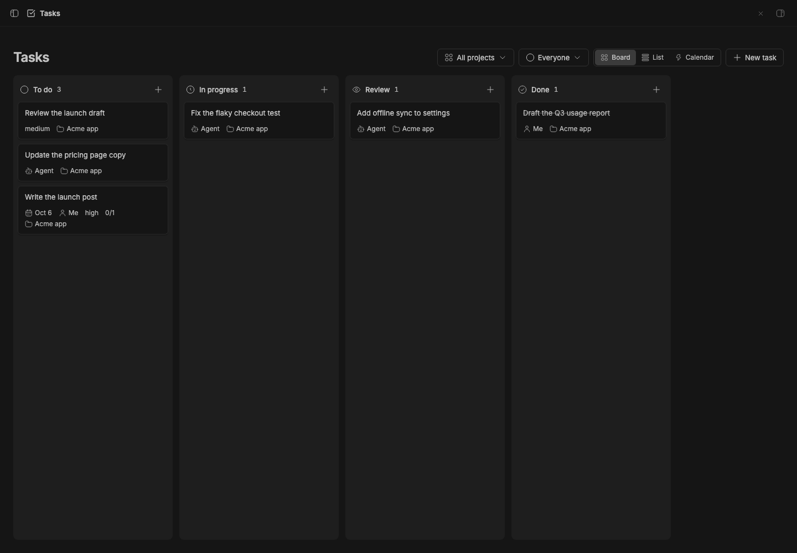

# Studio Tasks

> **Studio Tasks** is part of **BB Studio**, a suite of plugins for writing, talking, drawing, tracking tasks, running bot teams, and keeping what your agents make: [Studio](../bb-studio), [Studio Pages](../bb-studio-pages), [Studio Talk](../bb-studio-talk), [Studio Draw](../bb-studio-draw), [Studio Artifacts](../bb-studio-artifacts), Studio Tasks, [Studio Chat](../bb-studio-chat), and [Studio Teams](../bb-studio-teams).

A board, list and calendar of tasks you can do yourself or hand to an agent. A handed-off task
follows its thread: it moves to In progress while the agent works and to
Review when the agent replies or says it's ready. Its card says who acts
next, such as "Needs your input" or "Ready for review". You mark it done.

## Staged preview



The Tasks board in an isolated staged BB application shows six seeded tasks in
the "Acme app" project, including a high-priority recurring task and its
subtask. The header shows the Board, List and Calendar views.

## What you get

- **The board** (`/plugins/studio-tasks/tasks`): To do, In progress, Review and
  Done. Drag cards between and within columns, add a task with **+** at the
  top of a column, and filter by project and assignee (both remembered).
  Cards show the handoff's state, the agent's last note, the due day (red
  when overdue), the assignee, links and project. Done shows 20 at a time.
  **List** sorts by due date, title, priority or recent activity and groups by
  status, priority or project. **Calendar** places tasks on their due dates.
- **A task** (`/plugins/studio-tasks/tasks/<id>`): editable title, status,
  assignee, due day, priority, labels, recurrence, reminder and project; a Markdown description; links to threads,
  pages, artifacts, drawings and recordings; and the agent section. The
  header has **Hand off**, **Mark done** / **Reopen**, and a menu with Mark
  done and archive threads, New thread about this, Archive threads, Move to
  project, Archive task and Delete.
- **Hand off to an agent.** Pick the project, the agent and model (the
  project's default is preselected), a new worktree or the project folder,
  and an optional note. BB starts a thread with the task, its description and
  its links as mentions. The agent section shows the handoff's state in
  words ("Agent replied, check its answer", "Agent says it's ready for
  review"), its last note, **Open thread**, and **Send back** to reply with
  feedback, which moves the task back to In progress. Earlier handoffs are
  listed below it.
- **Studio Teams bots.** Assign a task to a bot and use **Send to bot** to
  create a dedicated channel and post the task there.
- **Subtasks and recurrence.** A task includes its parent and flat subtask
  counts. Daily, weekly, monthly and weekday tasks create their next instance
  when completed. Project boards can have ordered custom columns; removing a
  column moves its tasks to the first remaining active column.
- **Pages checkboxes.** In a Pages checkbox, use the **Task from checkbox**
  slash action. It creates a linked task and keeps Done and the checkbox in
  step in both directions.
- **Archive on done**, an option in the plugin's settings, off by
  default. When it's off, marking a task done offers **Archive threads** in
  the toast.
- **Agents use it too.** `tasks_list`, `tasks_get`, `tasks_create` and
  `tasks_update`, and the `studio-tasks` skill. A handed-off agent calls
  `tasks_update` with status "review" and a note when it's done, and links
  what it made. `::task{id="tsk_…"}` in a reply shows a task card.
- **`@task` mentions** give the agent the task's details, links and handoff
  state.
- **`bb studio-tasks` CLI**: `list`, `add`, `show`, `move`, `hand`, `done`.
- **In Studio.** With the [Studio](../bb-studio) plugin installed,
  tasks join Studio's collection with Status, Due and Assignee columns and
  Mark done / Move to To do actions.

## How it works

- Tasks, links, custom statuses and handoffs live in the plugin's SQLite database
  (`src/server/store.ts`). Board order is a fractional rank per column.
- BB's thread events (`thread.active`, `thread.idle`, `thread.failed`,
  archive and delete, and `interaction.pending`) become signals that
  `src/server/handoff.ts` turns into the handoff's next state and the task's
  column. The rules are pure and tested. Only a task's newest handoff moves
  it, and only between In progress and Review. On startup the plugin
  reconciles open handoffs with their threads, since events aren't replayed
  while it's off.
- The handoff's first message (`src/server/prompt.ts`) mentions each linked
  item through its add-on's mention provider, so the agent gets the item's
  contents.
- The Studio provider (`src/server/studio.ts`) implements the kit's
  `studio_*` methods on top of the store.

## Development

```
bb plugin install .     # register (path install; server.ts loads from source)
bb plugin dev           # watch: rebuild frontend + reload on every save
bb plugin build .       # emit dist/ (server.js + app.js/app.css)
pnpm typecheck
pnpm test
```

`@bb-studio/kit` is a `file:../bb-studio-kit` dependency. Keep
`package-lock.json` current (regenerate it in a clean clone, not the pnpm
workspace), because BB's Git install runs `npm install` from it.

## Templates and export

Studio can duplicate a task or save it as a template. Instantiation replaces `{{name}}` variables in its title and description. The provider exports one task as Markdown or CSV.
