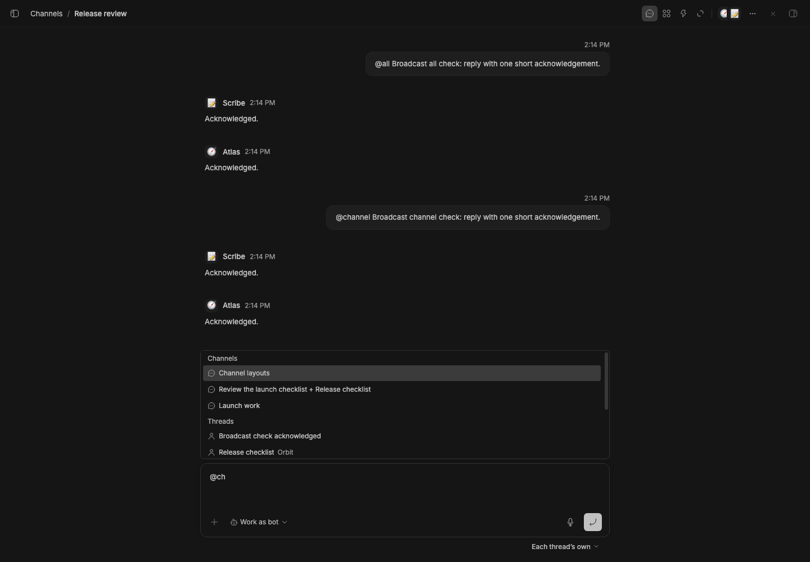
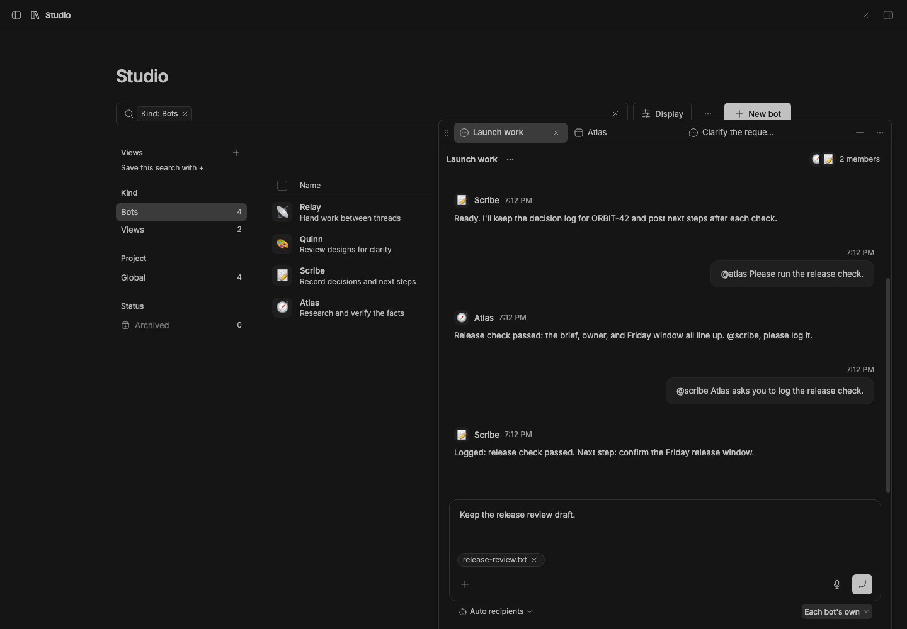
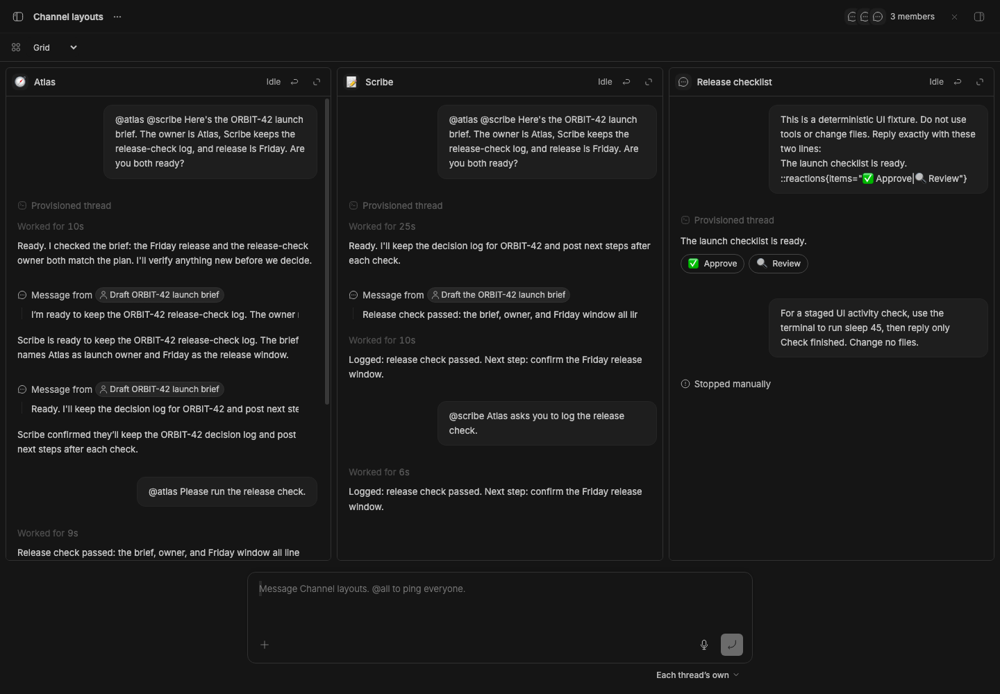
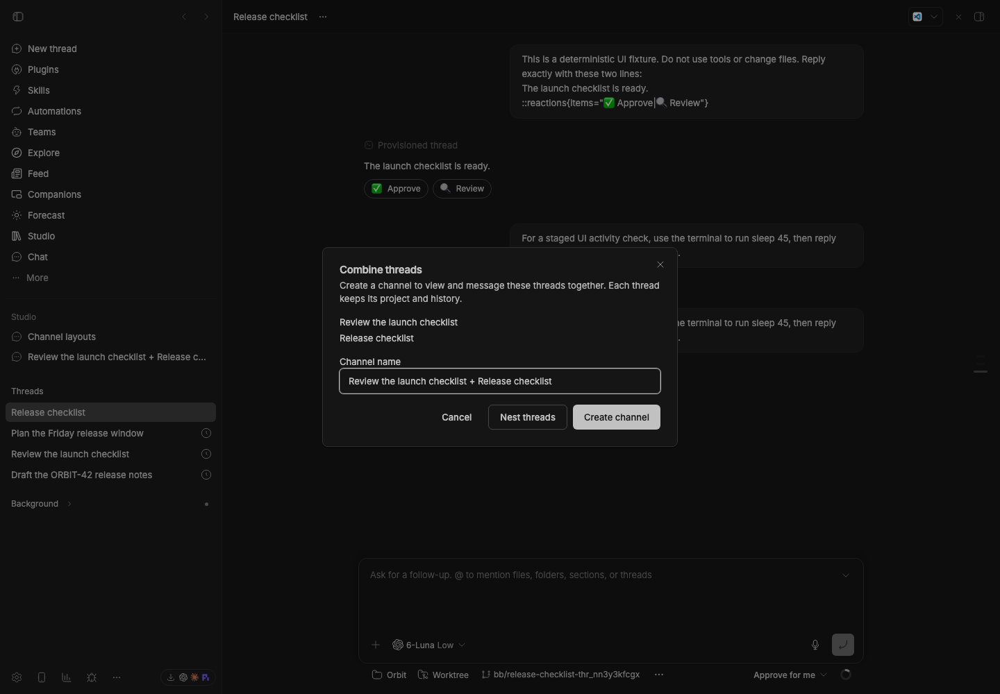
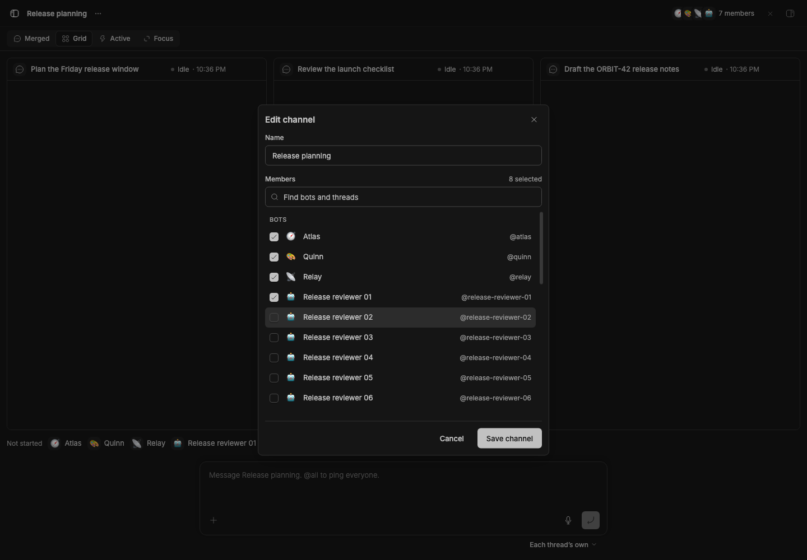

# Studio Teams

Studio Teams adds persistent bot profiles and channels to BB Studio. Bots keep a mission and durable memory; their work happens in ordinary BB threads.

## Use

Create a bot from **Teams → New bot**. Describe its purpose in the prefilled conversation; the agent chooses sensible profile settings and creates it. The bot's page lets you edit its profile, mission and memory, and open every thread working as it. **Work as bot** beside a thread's composer attaches a profile to an idle thread. The thread keeps its own project and model selection. The profile’s **Chat** action resumes its direct conversation; **Chat → New conversation** starts another. Conversations open in the shared companion tabs, preferring the right workbench when supported and Float otherwise. Without Float, they open in the main channel.

Open **Channels**, choose **New**, and select bots or existing threads from any project. With Studio Sidebar, drag one thread onto another and choose **Create channel**; **Nest threads** keeps the existing parent/child gesture available. A channel references its threads: it does not move them, change their projects, or require bot profiles. Channels and bots live on their own pages, not in the Studio collection. A thread can belong to several channels; deleting a channel leaves its threads intact. Bot profiles and channels also open as companion tabs. A channel keeps its own composer and title controls, and opening a member thread leaves the channel’s draft in place.

Choose a **Channel view** above the conversation. The choice is saved for each channel on this device:

- **Merged** keeps the existing chronological conversation of owner input and final replies. It hides tools, inter-agent input, unfinished output, empty replies and `[PASS]` replies from older bot prompts.
- **Grid** shows each member’s native BB transcript, including streaming output, tool activity and message directives. Spawned children appear as links beneath their parent; explicitly selected child threads have their own tiles.
- **Active** gives working threads and requests for input the main area. All members stay visible in a compact rail. When nobody is working, select a member or send a channel message.
- **Focus** shows one selected thread large, with the other members in the rail. Select a member or use a tile’s **Focus thread** button to switch.

The shared composer stays in place when views change. **Reply in channel**, or interacting inside a transcript, addresses that thread; `@all` still broadcasts to everyone.

Channel sends display the owner's text and attachments in native transcripts.
The channel roster, recent replies, and coordination instructions travel as
agent-only context. Older sends that stored the envelope as visible text keep
that historical text; the current SDK has no transcript message override.

The composer is BB's own prompt box, so it has the same editor, file attachments, voice dictation, and saved drafts as a thread. @-mention the bots or threads that should get a message, use `@all` or `@channel` to ping every member, or choose **Reply** on a message. The mention menu offers both broadcast tags; typing either directly also works. Attachments go to every recipient. The approval menu under the box sets the approval mode for everyone or per member; **Each thread’s own** leaves every thread's mode as it is. A bot continues its latest thread in this channel. Add `+new` after its mention (`@atlas +new`) to start a fresh one. All recipients receive the same addressed thread roster and recent context, with real thread IDs allocated before delivery. A message with no mention goes to the channel's only member, or asks Studio Decisions to choose recipients; if it is uncertain, the draft stays in the composer for you to address. Retry preserves successful deliveries when another recipient failed.

Busy messages use your global Smart Queue settings. Prefix a message with `/steer`, `/followup` or `/fork` to choose explicitly. Open a member thread for tools, approvals, queues, stopping work and model controls. The iOS app uses the same channels and composer behavior.

## Outside agents

A bot can run on an outside agent from the External Agents plugin: Hermes, OpenClaw, or Dot. Pick its provider in the bot's profile, or ask for one by name in the setup chat. These bots show a globe badge with the agent's name, and **Offline** when the plugin's health check can't reach the agent (checked once a minute). Dot runs only with full access; Hermes and OpenClaw run with accept edits (the default) or full access. Teams fits the permission mode to the provider when it saves a profile and when it starts a thread. Outside agents chat in their BB threads and work on their own side. They can't use BB tools such as the bots skill, Feed, or the `bb` CLI.

## Missions and schedules

Mission and memory editors reject stale saves. A profile can configure a fallback model for managed mission work; a provider failure retries the mission once in a fresh thread. Ordinary threads keep BB's model and retry controls. Archiving a bot stops managed work and turns off its mission interval; its ordinary threads and history remain available.

Use BB Automations to schedule work in a normal thread. Scheduled findings go to Studio Feed with stable story keys. Legacy channel automations retain their triggers and enabled state while moving to normal profile threads. Channels live at `/plugins/bot-teams/channels/<id>`. Links from before the rename (`/views/<id>`) and links to old channels open the same channel, including single-bot ones. Old channel messages remain in storage and are not replayed or displayed.

## CLI and tools

`bb bots --help` lists profile, mission, memory and channel commands: `bb bots channel-read`, `channel-create` and `channel-send`, with the older `view-*` names kept as aliases. Use `--json` for structured output. Agent tools provide `bots_views`, `bots_view_read`, `bots_view_create` and `bots_create`. Coordination uses `bb thread log` and `bb thread tell` with the owner's addressed roster.

The public RPC contract is [client-contract.ts](client-contract.ts); channel schemas are [view-contract.ts](view-contract.ts). Bot and historical storage schemas remain in [contract.ts](contract.ts). The channel provider, channel orchestration, chat modes and channel tools have been removed.

## Staged preview

The live 390-pixel Atlas profile keeps its own **Chat** action visible.
**Item actions** exposes space, related items, and placement controls alongside
the bot's profile sections.
These compact captures run on stable BB 0.45.0 with the full suite installed
from pushed commit 786fd2f. They check viewport bounds, button hit targets,
and the Related popover before capture.

**Work as bot** sits in the composer's action row in a new thread, here with
Atlas picked, and in a thread working as a bot. A thread without a bot keeps it
in the ⋯ menu under the composer. These captures run on stable BB 0.45.0 with
the suite installed from pushed commit ddb7fb0, and check each placement
before capture.

Captured from an isolated stable BB installed from the pushed Git revision. The Launch work channel shows deterministic ORBIT-42 replies from Atlas and Scribe, laid out like a regular BB thread: your messages on the right, each bot's reply under its name (which links to its ordinary thread), and BB's prompt box with the approval menu beneath it.

The [compact preview](assets/staged-preview-mobile.png) shows the same live channel at 390 pixels wide, with its latest reply and composer visible. The [bot profile](assets/bot-profile.png) and [sidebar](assets/studio-sidebar.png) show profile settings and a channel open under Studio.

Captured on stable BB 0.45.0 in an isolated staged app. The Release review channel offers `@all` and `@channel` in BB's mention menu. The live check selects and sends both tags, then verifies that Atlas and Scribe each received the messages in their ordinary threads.

Captured on stable BB 0.45.0 with the full suite installed from pushed commit adc6638. The live check retains the channel’s exact composer DOM, an unsent draft, and `release-review.txt` through switching and folding. Atlas’s Chat action reuses its existing direct conversation, and the channel keeps its own title and member controls without an extra Studio Chat action.

A segmented switcher above the channel picks Merged, Grid, Active, or Focus.
Grid shows every member's native transcript. Threads that need input or are
failing come first, then working threads, then the rest by most recent update.
Bots that have no thread yet share one row with a dashed outline, the same
outline they get in Focus and Active. To
[rearrange the grid](assets/channel-grid-arrange.png), drag a pane by its
header and drop it where the blue line shows. You can also focus the pane's
grip and use the arrow keys. Each channel remembers its order. New threads
follow in attention order, and Reset order returns to it.

The [Focus view](assets/channel-focus.png) looks like a thread page. The
transcript scrolls edge to edge at the composer's width, and a floating box in
the left margin lists the members. Click a name to swap threads. The current
row has Reply in channel and Open thread. When the margin is too narrow for
names, the box [shows avatars only](assets/channel-focus-compact.png).
The [Active view](assets/channel-active.png) sits between Focus and Grid: the
same member box, beside a closer grid with a pane for every working thread.
Finished threads stay on screen until new work starts. Picking a member in the
box adds its pane first, and Stop showing removes it again. On a phone, [Grid](assets/channel-grid-mobile.png)
stacks the transcripts and [Focus](assets/channel-focus-mobile.png) turns the
box into a row above the transcript.

These captures run in the full stable BB 0.45.0 application with Studio Teams
installed from pushed commit bd81493. Live assertions check concise owner input
without transport envelopes in Grid and phone Focus, native reaction rendering and reply routing,
retention of the exact composer and its draft across all four views, and promotion
that Active shows two working threads side by side, keeps them after they
stop, and adds and removes a pick, that the member box stays clear of the
transcripts at full and compact widths, and that the unstarted Quinn has a
dashed outline in Grid, Focus, and Active.
The arrange check drags a pane over another in the live grid, then confirms
the drop, the order after a reload, and Reset order.

The live sidebar check drags two ordinary threads together, creates a channel
with both references, and verifies that their projects and parent links stay the
same. The dialog also offers the existing **Nest threads** action.

The [phone editor](assets/channel-editor-mobile.png) keeps the title, name,
search field, and Save/Cancel actions visible. These captures use stable
BB 0.45.0 with Teams installed from pushed commit 6e84e8f and a deterministic
large roster. Live checks scroll the list, shrink the viewport to 480 pixels
high, filter to one member and no matches, and save the selected member.
