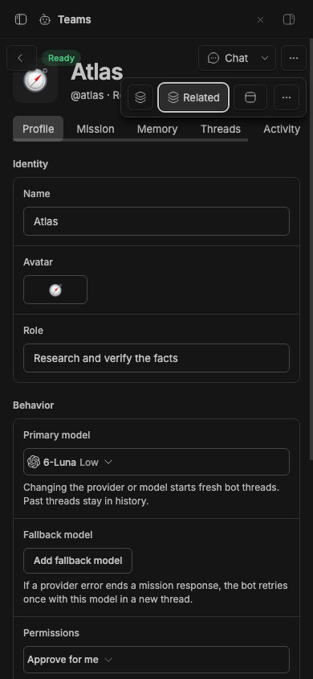
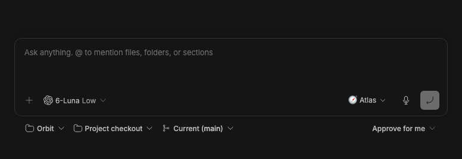
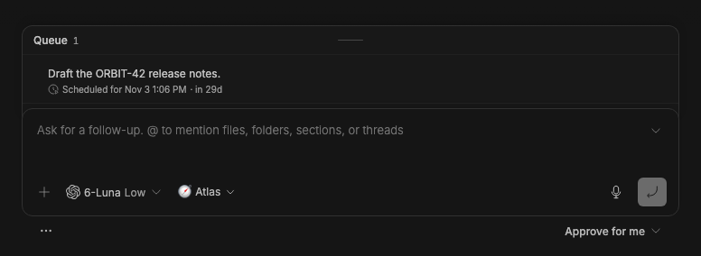
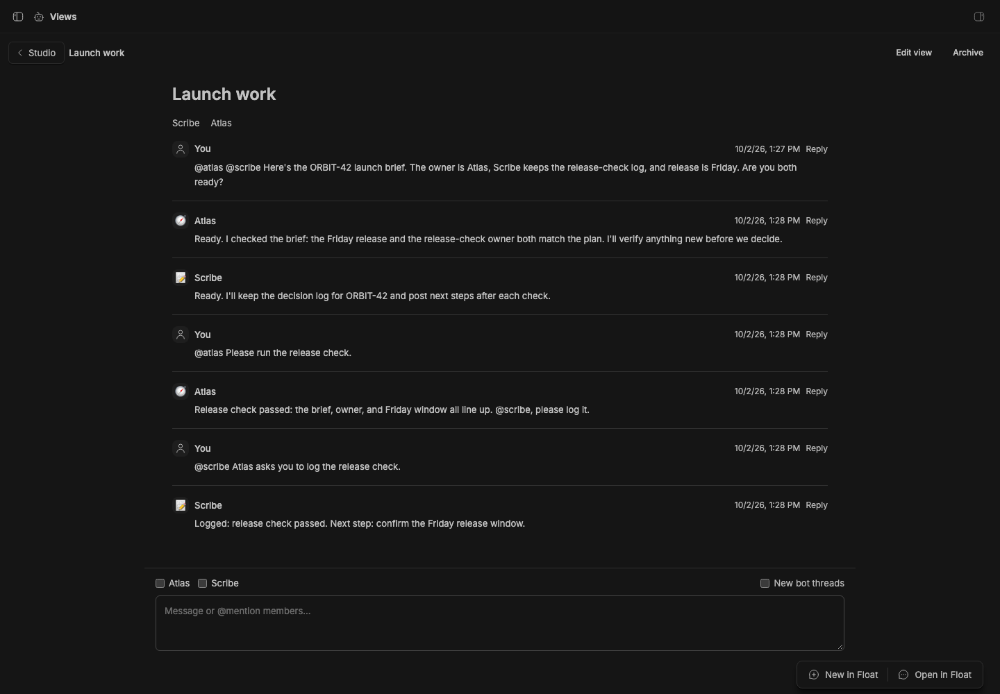

# Studio Teams

Studio Teams adds persistent bot profiles to BB Studio, and a Command view to talk to a Space's threads at once. A bot is a profile a thread wears: it keeps a mission and durable memory, and its work happens in ordinary BB threads.

## Use

Create a bot from **Teams → New bot**. Describe its purpose in the prefilled conversation; the agent chooses sensible profile settings and creates it. The bot's page lets you edit its profile, mission and memory, and open every thread working as it. **Work as bot** beside a thread's composer attaches a profile to an idle thread. The thread keeps its own project and model selection and shows the bot's avatar and name. The profile's **Chat** action resumes its direct conversation; **Chat → New conversation** starts another. Conversations open in the shared companion tabs, preferring the right workbench when supported and Float otherwise. Outside agents are bots too, running in plain threads.

## Command view

With Studio Sidebar's By space organization, choose **Command view** in a Space heading's ⋯ menu. It opens `/plugins/bot-teams/command/<spaceId>`: one screen for every thread in the Space, lead first. There is no membership to manage. The Space's threads are its members (threads in no Space belong to the default Space), up to 32 at a time. The title bar reads **Space / Command**, with the layout toggles on the right. The choice is saved for each Space on this device:

- **Merged** shows owner messages and final replies from every thread in one conversation. It hides tools, inter-agent input, unfinished output, and empty replies. A message sent to several threads shows once.
- **Grid** shows each thread's native BB transcript, including streaming output, tool activity and message directives. Forks appear as links beneath their parent. The lead comes first; drag a pane by its header, or focus its grip and use the arrow keys, to [rearrange the grid](assets/command-grid-arrange.png). **Reset order** returns to attention order.
- **Active** gives working threads and requests for input the main area, beside a box that lists every thread. Finished threads stay until new work starts.
- **Focus** shows one selected thread large, with the others in the box.

The composer is BB's own prompt box, with the same editor, file attachments, voice dictation, and saved drafts as a thread. A message goes to the Space's lead. In Focus it goes to the thread on screen, and **Send to this thread** on a pane or message picks another; the line under the box says who receives it. @-mention threads or bots (the thread in the Space working as that bot) to message them together, or `@all` for every thread. A bare `@` lists the Space's threads under **This Space**, lead first, so threads without a bot are picked by title. Attachments go to every recipient. Each recipient gets the roster of addressed thread IDs as agent-only context, so they can coordinate with `bb thread log` and `bb thread tell`. The approval menu under the box sets the approval mode for every recipient; **Each thread's own** leaves each thread's mode as it is. Busy threads follow your global Smart Queue settings; prefix a message with `/steer`, `/followup` or `/fork` to choose explicitly. Nothing is stored by the Command view: it reads Studio's Spaces and BB's threads each time.

## Outside agents

A bot can run on an outside agent from the External Agents plugin: Hermes, OpenClaw, or Dot. Pick its provider in the bot's profile, or ask for one by name in the setup chat. These bots show a globe badge with the agent's name, and **Offline** when the plugin's health check can't reach the agent (checked once a minute). Dot runs only with full access; Hermes and OpenClaw run with accept edits (the default) or full access. Teams fits the permission mode to the provider when it saves a profile and when it starts a thread. Outside agents chat in their BB threads and work on their own side. They can't use BB tools such as the bots skill, Feed, or the `bb` CLI.

## Missions and schedules

Mission and memory editors reject stale saves. A profile can configure a fallback model for managed mission work; a provider failure retries the mission once in a fresh thread. Ordinary threads keep BB's model and retry controls. Archiving a bot stops managed work and turns off its mission interval; its ordinary threads and history remain available.

Use BB Automations to schedule work in a normal thread. Scheduled findings go to Studio Feed with stable story keys.

## CLI and tools

`bb bots --help` lists profile, mission and memory commands. Use `--json` for structured output. The `bots_create` agent tool creates a bot; a bot proposing another waits for owner approval. Coordination uses `bb thread log` and `bb thread tell` with the owner's addressed roster.

The public RPC contract is [client-contract.ts](client-contract.ts): bot schemas are in [contract.ts](contract.ts), and the Command view's in [command-contract.ts](command-contract.ts).

## Staged preview

The live 390-pixel Atlas profile keeps its own **Chat** action visible.
**Item actions** exposes space, related items, and placement controls alongside
the bot's profile sections.
These compact captures run on stable BB 0.45.0 with the full suite installed
from pushed commit 786fd2f. They check viewport bounds, button hit targets,
and the Related popover before capture.

**Work as bot** sits in the composer's action row in a new thread, here with
Atlas picked, and in a thread working as a bot. A thread without a bot keeps it
in the ⋯ menu under the composer. These captures run on stable BB 0.45.0 with
the suite installed from pushed commit ddb7fb0, and check each placement
before capture.

Captured from an isolated stable BB installed from the pushed Git revision. The Launch work Space holds a thread working as Atlas, its lead, and one working as Scribe. Its Command view, in the Merged layout, shows deterministic ORBIT-42 replies from both: your messages on the right, each bot's reply under its name (which links to its thread), and BB's prompt box addressed to Atlas with the approval menu beneath it. The live check confirms the breadcrumb, the layout toggles, the default recipient, and that @-mentions offer both bots.

The [compact preview](assets/staged-preview-mobile.png) shows the same Command view at 390 pixels wide, with its latest reply and composer visible. The [bot profile](assets/bot-profile.png) shows profile settings. The [@all suggestion](assets/command-broadcasts.png) check sends `@all` and verifies that every thread in the Space received it.

Grid shows every thread's native transcript: Atlas, Scribe, and an ordinary Release checklist thread added to the Space. The [Focus layout](assets/command-focus.png) looks like a thread page, with the Space's threads in a box in the left margin; when the margin is too narrow, the box [shows avatars only](assets/command-focus-compact.png). The [Active layout](assets/command-active.png) puts working threads side by side. On a phone, [Grid](assets/command-grid-mobile.png) stacks the transcripts and [Focus](assets/command-focus-mobile.png) turns the box into a row above the transcript.

These captures run in the full stable BB application. Live assertions check concise owner input without the agent-only roster, native reaction rendering and the recipient they pick, retention of the exact composer and its draft across all four layouts, that Active shows two working threads side by side, keeps them after they stop, and adds and removes a pick, and that the thread box stays clear of the transcripts at full and compact widths. The arrange check drags a pane over another in the live grid, then confirms the drop, the order after a reload, and Reset order.
