# Studio

> **Studio** is the core of **BB Studio**, a suite of plugins for writing, talking, drawing, and keeping what your agents make. See the [suite overview](../../README.md).

Studio opens on the collection: everything the Studio add-ons make, including pages, Talk
recordings and dictations, drawings, and saved artifacts. Search across all of them, filter by
kind, project and tag, and hand any of them to an agent. Spaces gather projects and
threads into one place, each with an optional lead thread.

## Workspace

Studio opens on its workspace: items in tabs, without a conversation. The
Studio item list shows only as its new tab page: **+** opens it, and an item
opened from it takes its place, as in a browser. Items opened from the
sidebar or Studio search open as tabs too. Drag tabs or sidebar items to a pane's edge to split; drag onto
a tab bar to move or reorder. The tab arrangement menu offers split and move
commands, and separators resize with the mouse or arrow keys. Closing a tab
keeps the item. The workspace remembers the layout locally across visits and
refreshes. Old list addresses, such as a kind's (`/plugins/studio/studio/page`),
open the new tab page on that kind.
Right-click a tab for Close, Close others, Close tabs to the right, Close all in
the pane, splits, moves to another pane, its own page, and Copy link. The tab
row shows only the item's own tools; Chat and Related aren't offered there.
Each tab row carries the active item's tools, such as Chat, beside its tabs.
With one pane, the tab row takes BB's title bar, so the item sits under a
single bar. Open items live here, not in the sidebar; a Space's Browse menu
opens any of its items as a tab.
Conversation-side item views continue to work independently. At phone widths, a
pane picker shows one pane at a time while preserving the desktop arrangement.

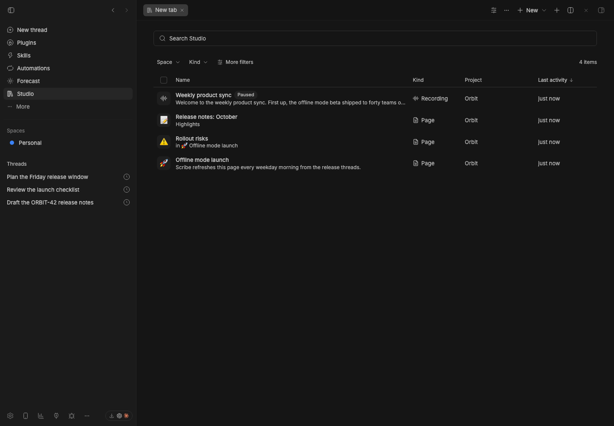

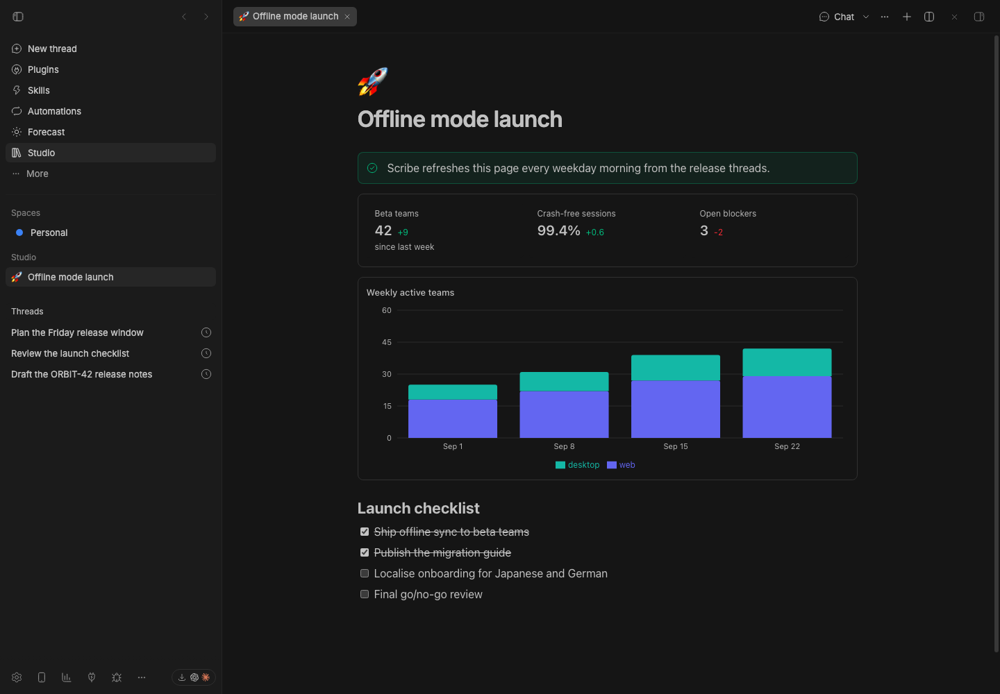

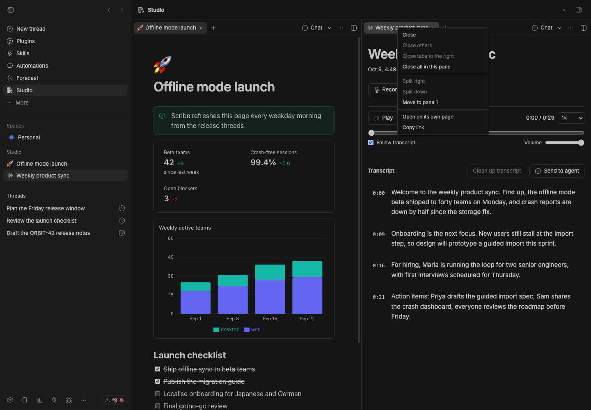

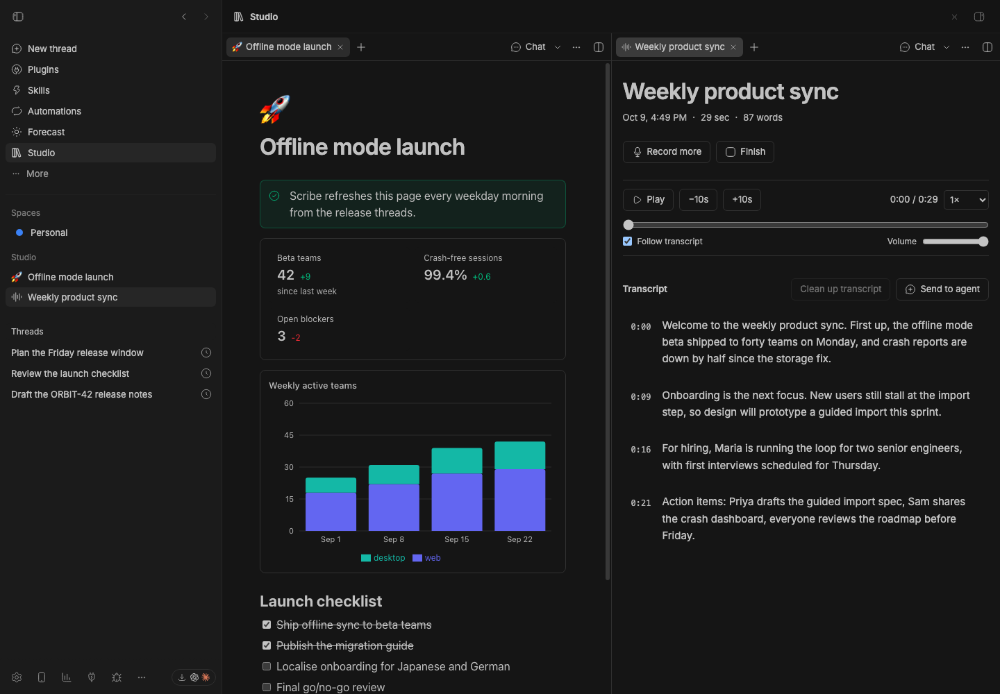

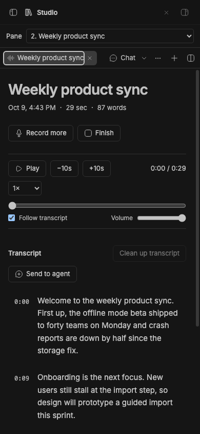

These staged captures check item opening, drag-to-split, layout restoration,
closing and reopening tabs, local editor toolbars, and title sizing after a
viewport change.

## Staged preview

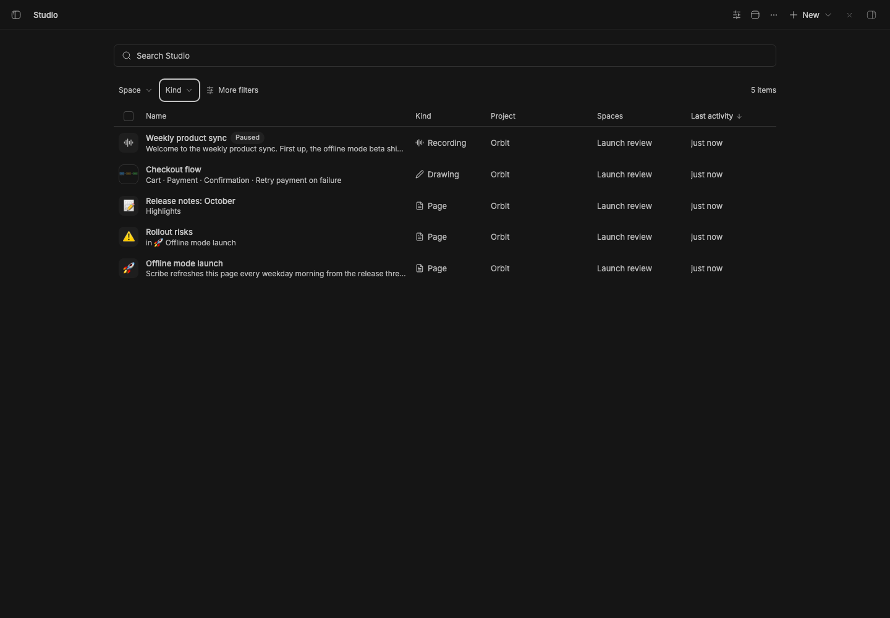

Captured from a staged BB (`node scripts/staged-bb.mjs start`): the Studio
collection as the workspace's new tab, a list with search and compact Space and
Kind menus above it.
Project, Tags and Status are available under **More filters**. The rows show
a paused Talk recording, a drawing and three Orbit pages.

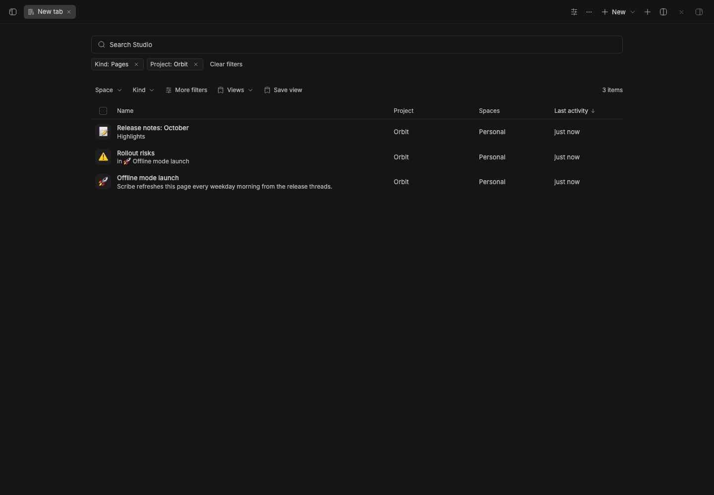

Selected filters appear below search, each with a remove button and an explicit
Include/Exclude menu. Clearing search keeps the filters; **Clear filters** keeps
the search text. **Save view** remembers the query, and **Views** appears once a
view exists. Query syntax such as `kind:page` still completes in search.

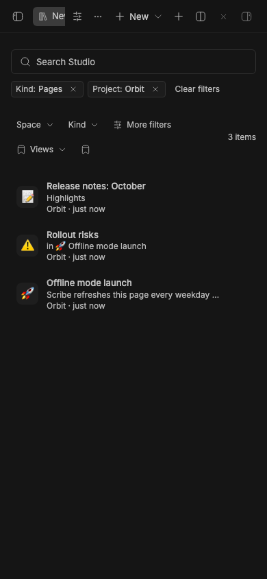

The same controls work at phone width. Both captures check menu selection,
a stored plural filter, text search, exclusion, project filtering, and saving
and reopening a view.

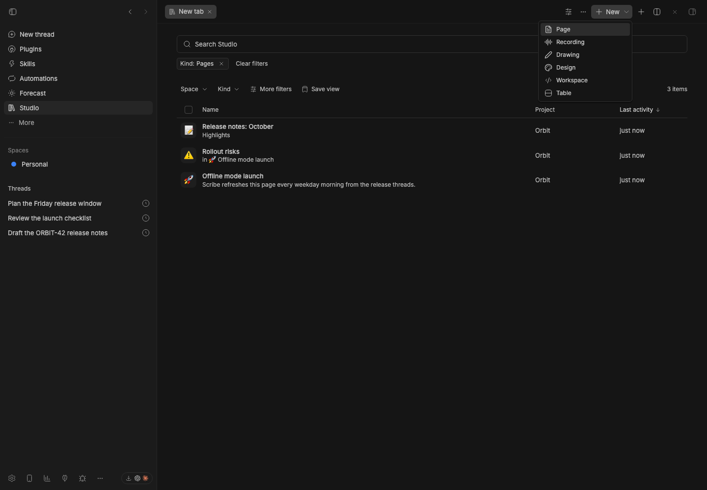

The New menu stays open to every available kind with a Pages filter active.
The capture checks that Drawings and Pages filters offer the same menu as the
unfiltered collection.

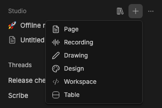

The **+** beside Studio opens a menu of the installed add-ons' creation actions.
The staged capture checks keyboard opening, creates a page in the open thread's
project, and checks that the plus stays visible while its menu is open.

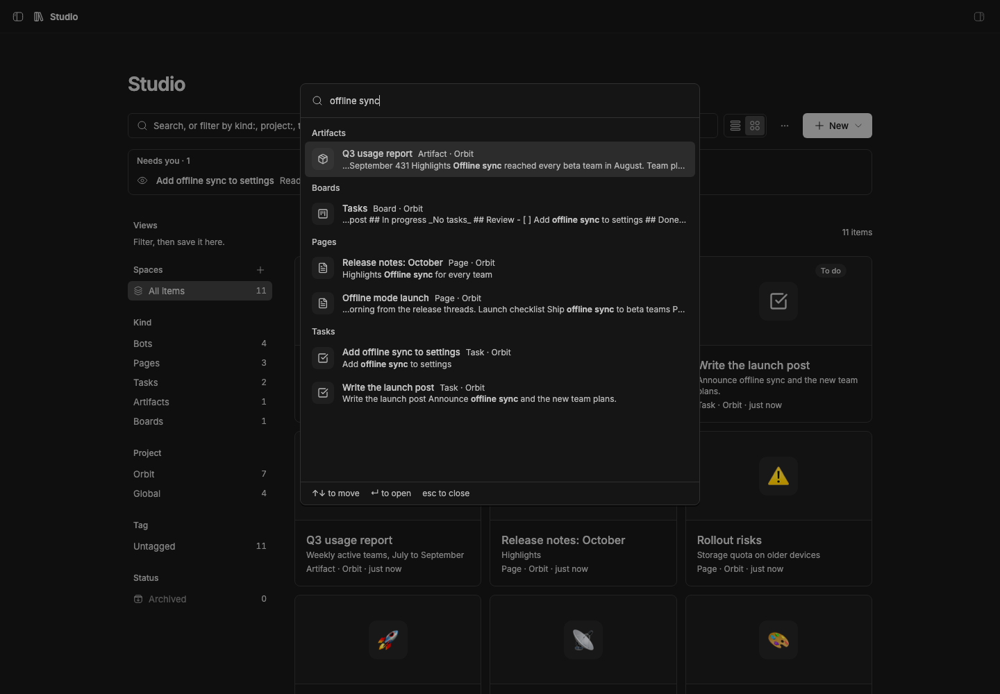

Studio search (Cmd/Ctrl+Shift+K) over the same staged project, searching
"offline sync": an HTML artifact and two pages match on their title or
content, each showing the matching text with the match in bold.

## What you get

Everything opens in BB's main view, and the Studio sidebar lists what you
open. ⌘/Ctrl-click an item or thread link, or choose **Open in split** from
its menu, to open it in a split instead. Right-click any Studio item or
thread link, anywhere, for **Open**, **Open in split**, **Copy reference**
(**Copy link** for a thread) and **New thread with this**. Item, collection and
Activity headers have an **Open in split** button. An editor you leave stays
open in the background, so it's as you left it when you come back.

- **Activity** (Studio's **…** menu) shows measured thread turns, duration and
  failures and recent Studio changes.
  Choose 1, 7 or 30 days. The `home` RPC returns this data, plus what needs
  you (pending approvals and questions, and unresolved comment replies or
  mentions), active threads, recent items and today's automations,
  for other clients such as the iOS app's Today view.
- **One collection** (sidebar → Studio): every add-on's items in one list,
  with search over titles and content, filters by kind, project, space and
  tag, and an Archived view. **Display** groups the list by kind, project,
  space or tag (collapsible, and an item in two spaces shows in both) and
  sorts it by name, kind, project, created or last activity, either way; both
  choices are remembered. The column you group by drops out, and a Spaces
  column appears once items belong to spaces. Drawings show thumbnails;
  recordings show their length and word count. Background kinds, such as Talk's dictations, stay
  out of All and Home; the Kind menu and search still show them.
- **Search from anywhere.** Cmd/Ctrl+Shift+K (or **Studio: Search everything**
  in the command palette, Cmd/Ctrl+Shift+P) opens a quick-open box over any
  page. Studio indexes titles and text from current add-ons, then searches BB threads live. The palette also has recent items and commands for creating items, opening Studio, handing work to an agent and opening threads. Titles match as you type; each add-on also searches its content —
  page text, transcripts, drawing text, artifact files, table rows — and the row shows the text that matched. With nothing typed
  it lists recently changed items. ↑↓ and ↵ open one.
- **Tags** group items across add-ons: a page, a drawing and a table can all
  be tagged "Launch". Tag from an item's ⋯ menu or the selection bar, filter
  by tag (or Untagged) from the tag menu, and click a chip to filter by it.
  The tag menu also renames and deletes the active tag.
- **Spaces** are areas of work. Each BB project belongs to one space, and
  items and threads follow their project; projects nobody filed, and items
  with no project, are in the default space, Personal. A new space gets its
  own catch-all folder under `~/Spaces`, where its new threads and items go.
  A thread can also be added to a space by itself, which moves it there.
  A space can have a lead, one of its threads, which a Heartbeat wakes on a
  schedule. [Studio Sidebar](../bb-studio-sidebar)'s **By space** view shows
  one Space at a time with its lead (a star), pinned threads, open items as
  chips and a **Browse** menu; without it, Studio's own **Spaces** section
  lists them. Nothing is made for a space but its folder. Deleting a space
  hands its projects and threads back to Personal. See
  [`docs/spaces.md`](../../docs/spaces.md).
- **Shared actions**: select items (shift-click for a range) to start a
  **New thread** that mentions them, move them to a project, archive, or
  delete. Actions an add-on defines, like Talk's "Copy transcripts" or Draw's
  "Copy text", appear when the selection is all that kind.
- **Tabs in the sidebar.** With [Studio Sidebar](../bb-studio-sidebar)
  as the thread list, each Studio item you open gets a tab in a Studio section
  above your threads. Tabs can be pinned. × or middle-click closes a tab; closing the one on
  screen opens the next. The section's ⋯ menu groups tabs by app, sorts them,
  and closes other or all tabs. Studio keeps the tabs, so every window shows
  the same ones, and closes tabs of deleted items.
- **New ▾** creates any kind an installed add-on offers, in the current
  project. It always opens the full menu, even with a kind filter active.
- **Takes over from the add-ons.** With Studio installed, each add-on's own
  collection hands over to Studio filtered to its kind, and item pages lead
  back to Studio. Studio's ⋯ menu can hide the add-ons' sidebar rows, so
  Studio is the only entry. Without Studio, each add-on works on its own.
- **The BB Studio theme**: the app icon's colors for all of BB, light and
  dark. Teal-black and pale-teal surfaces, a coral accent, teal file paths.
  Pick **BB Studio** in Settings → Appearance, or run `bb theme set
  plugin:studio:bb-studio`.
- **Short thread titles.** BB titles a thread once, from the start of its
  first message. Studio renames new threads in 2–5 words after their first
  turn, such as "Invoice PDF pagination bug", and again as the conversation
  moves on (after 1, 2, 4 and 8 requests, then every 8). The model sees the
  first request, the latest ones and the agent's latest reply, and keeps the
  current title while it still fits. A title you set, or one a thread was
  spawned with, is never changed. Older threads keep their titles until you
  run `bb studio retitle`. Turn it off with **Short thread titles** in
  Studio's settings. Titles come from the fallback model in Studio Decisions.
- **For agents**: the `studio_list_items`, `studio_list_spaces`,
  `studio_tag_items`, `studio_delete_items`, `studio_space_items` and
  `studio_move_items` tools, the `bb studio` CLI, and a `studio` skill. With
  `studio_workspace`, `studio_open_items` and `studio_close_tabs` an agent sees
  the tabs you have open in the BB window you're using, opens items beside
  them, and closes tabs.

```sh
bb studio list [query…] [--all] [--kind <kind>] [--query <text>] [--tag <tag>] [--space <name>] [--json]
bb studio tags
bb studio spaces
bb studio move <item-link|plugin:id|thread-id>… (--space <name|id> | --project <name|id|global>)
bb studio providers
bb studio health [--json]
bb studio reindex
bb studio retitle (<thread-id>… | --self | --recent <count>)
```

## How it works

- Add-ons implement the Studio provider contract (`studio_describe`,
  `studio_list`, `studio_search`, `studio_create`, `studio_move`,
  `studio_archive`, `studio_delete`, `studio_action`) from
  [`@bb-studio/kit`](../bb-studio-kit), and publish them for RPC discovery.
  Studio finds them with `bb.sdk.plugins.experimental_discoverRpc` and calls
  them with `callRpc`. Any plugin can join the suite this way.
- Studio keeps an FTS5 index of item titles and `studio_read` text. `studio_changed` updates changed items; `bb studio reindex` rebuilds the index. The `searchAll` RPC returns ranked items and thread matches with snippet ranges.
- An add-on tells Studio when its items change (`studio_changed`); Studio
  relays that over realtime and the open collection refetches.
- A stopped or failing add-on shows up as unavailable instead of breaking the
  collection.
- Studio stores tags, open tabs, saved views and spaces itself, keyed by
  `<plugin id>:<item id>` where items are involved, so add-ons don't need to
  know about them. Tags on items an add-on no longer lists are
  dropped. Each add-on owns its data, editors, tools, CLI and mentions.

See [`docs/studio.md`](../../docs/studio.md) for the design.

## Setup

**Studio → Setup** (`/plugins/studio/studio/setup`) is the one place to set up
BB Studio. It lists every add-on from this repository's marketplace with its
one-line description and status: **Installed**, **Not installed**, **Turned
off**, **Needs setup** or **Broken**, with its health checks under it.

- **Install** and **Install all** install missing add-ons from the
  `bb-studio` marketplace, and **Turn on** enables one that's off. Install all
  skips Studio Mobile, which only the iOS app needs. Each action shows the
  same CLI command with a Copy button, for when it fails.
- If BB doesn't know the `bb-studio` marketplace yet, the page shows
  `bb marketplace add git:github.com/patleeman/bb-studio@main` first.
- **Retired plugins** shows `studio-chat`, `studio-navigation`, `float` and
  `bot-teams` if they're installed: why each is retired, what removing it
  keeps and deletes, and what to do first. **Remove…** asks before it removes
  anything. Studio Chat can't be removed until its chat links are in Studio
  (`bb studio-chat migrate` reports **Migration complete**), and Studio
  Navigation can't until Studio Sidebar is installed and on.
- Problems with plugins outside BB Studio are listed at the bottom.

`bb studio setup` prints the same status, the retired plugins and the
commands left to run; `--json` prints the whole summary.

## Backup and restore

`bb studio backup [--out <file|folder>]` saves every Studio item into one
`.zip`. That covers pages, recordings with their audio, drawings, artifacts,
tables, designs, and Studio's tags, Spaces, views, links, comments and
versions. `bb studio restore <file>` shows what would change, and `--yes`
restores it. Restore matches each item by its original id, so running it
again changes nothing, and it never overwrites a copy that is newer here.
Projects are matched by path or name; items whose project isn't on the BB
become global items. The Setup page has the same **Back up** and **Restore…**
actions; restoring there shows the dry run and asks before it changes
anything. [docs/backup.md](../../docs/backup.md) describes the file format,
what's left out and how conflicts are handled.

## Plugin health

Studio checks every enabled plugin when it starts and every 3 minutes after
that. It reads two things:

- **BB's own status for every plugin.** A plugin that needs setup, stopped
  with an error, doesn't work with this BB version, or has a background
  service that keeps restarting.
- **Plugins' own checks.** A plugin can publish `studio_health` with
  `registerHealth` from `@bb-studio/kit/health`. It reports problems only the
  plugin can see, like a missing API key. Each problem has a fix link, which
  defaults to the plugin's settings page. Studio Decisions reports a missing
  or failing Jev provider and an unavailable fallback model.

The **Plugin health** item in the sidebar footer lists the problems. It opens
by itself when a problem you haven't seen is found twice in a row, 30 seconds
apart, so a plugin that's only reloading doesn't open it. It closes by itself
once those problems are fixed or hidden, or with its close button. Each problem has three
actions: **Fix** opens the place to fix it, **Turn off plugin** disables the
plugin, and **Hide** hides it until it changes or goes away and comes back.
**Open plugin setup** goes to the Setup page, which also shows hidden
problems and what passed. `bb studio health` prints every plugin's problems
and exits 1 when a problem isn't hidden.

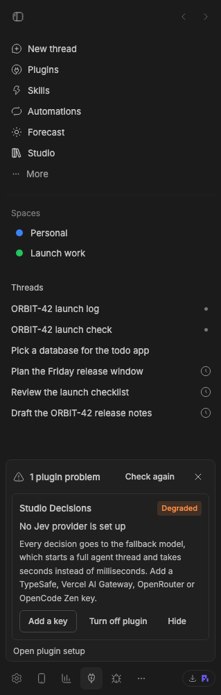

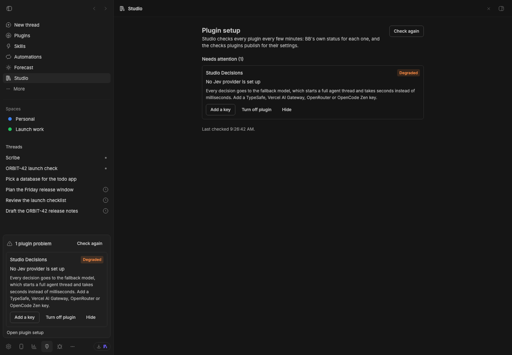

## Development

```sh
pnpm typecheck
pnpm test
bb plugin build .
```

`@bb-studio/kit` is a `file:../bb-studio-kit` dependency. Keep
`package-lock.json` current (regenerate it in a clean clone, not the pnpm
workspace), because BB's Git install runs `npm install` from it.

## Templates and export

Pages and drawings can be saved as templates from an item's menu. The New menu lists those templates.

The hub offers `duplicate`, `setTemplate`, `instantiateTemplate`, `templates`, `exportItem`, and `exportBulk` RPCs. `exportBulk` returns a base64 ZIP containing the provider's files. Individual exports use the item's menu. Template fields use `{{name}}` style variables; unknown variables remain visible.

## Space Command view

Open **Command view** from a Space's ⋯ menu in the sidebar. It shows the
Space's ordinary threads as native transcripts in a grid of panes.

- **Panes.** With nothing opened, one pane follows whichever thread is working
  (**Follow work**, ⚡). Open more threads from the list beside the composer;
  each joins as a pane you can rearrange. Closing a pane only hides it.
  **⌘N** or **+** opens a New thread pane with the Space's project picked.
- **Status.** Working panes glow blue, idle ones dim, and a thread with
  something new gets an orange ring and a **New** badge until you click into it.
- **Aliases.** Each thread has a one-letter alias: type **@b** to address
  thread B, @mention a title, or use @all. A thread keeps its letter while it
  is in the Space.
- **To.** "To" follows whoever the draft addresses. With nobody addressed, a
  message goes to the lead, or to the thread you picked with ↩ or reacted to.
  The lead forwards it if it is clearly meant for another thread. Files reach
  every recipient and are copied to the threads the lead may forward to;
  pasted images can't be forwarded, so the lead asks you to send those.
- **Retries.** If a send misses some threads, the draft stays and "To"
  becomes **Retry to** the ones it missed.

Drafts, permissions and send modes use BB's composer.

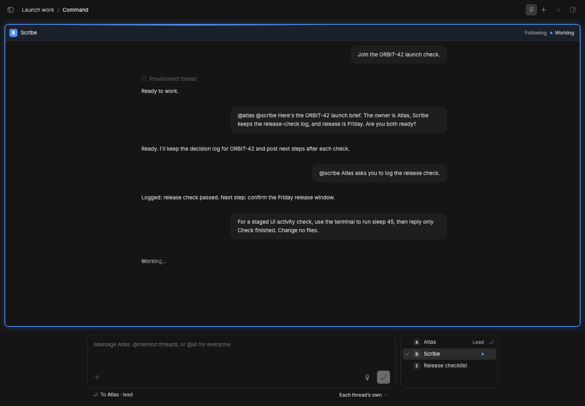

Captured in staged stable BB with the Launch work Space, ordinary Atlas and Scribe threads, and deterministic ORBIT-42 replies. Live assertions check thread membership, recipient selection, the breadcrumb, typed mention searches, draft retention, reactions, following a working thread, opening, closing and rearranging panes, starting a thread in a pane through to joining the Space, unread threads and reading them, the thread list beside the composer, and desktop and phone layouts. The fixture puts its standing instructions in agent-only context, so native transcripts show the conversation.

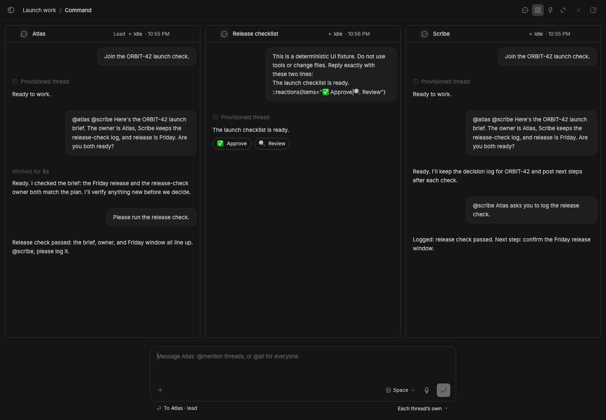

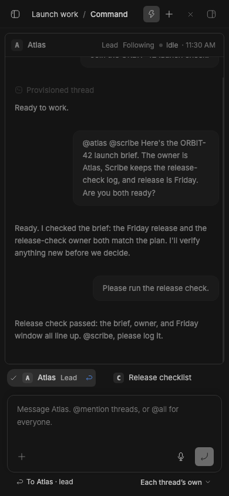

The same run checks [the overview](assets/command.png), [rearranging panes](assets/command-grid-arrange.png), [closing and reopening a pane](assets/command-close.png), [starting a thread in a pane](assets/command-new-thread.png), [sending an image by alias](assets/command-attach.png), and [the grid on a phone](assets/command-grid-mobile.png).

## Item chat

Studio owns each item's **Chat** action, conversation picker, linked thread and
quotes. Everything **Chat** opens goes in a split beside the item, which stays
on screen. **Chat** opens the item's linked thread. Without one, it opens a
new-conversation composer, and sending turns that pane into the new thread.
**Choose conversation…** opens a thread picker in the same split. A new
conversation keeps the item's context, project and draft; a quote goes to its
linked thread, or opens the composer with the quote when there is none. Where
BB doesn't split (a small screen, or splits turned off), these open in the
main view. Pages keeps its
page-chat history; standalone Pages still provides its own chat when Studio is
absent.

Existing Studio Chat installs must [migrate their links](../bb-studio-chat/README.md)
before removing the old plugin; the [Setup page](#setup) checks this for you.
Old draft keys and quote storage are retained.

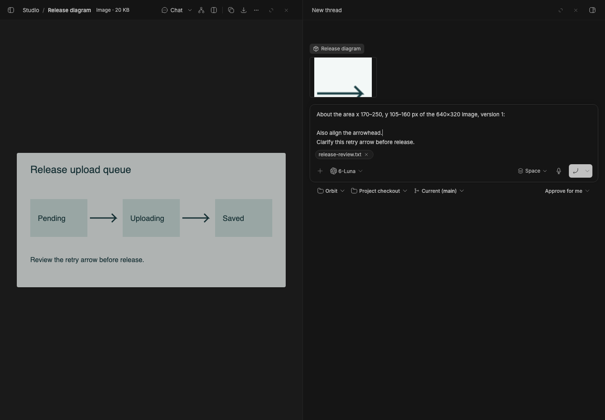
