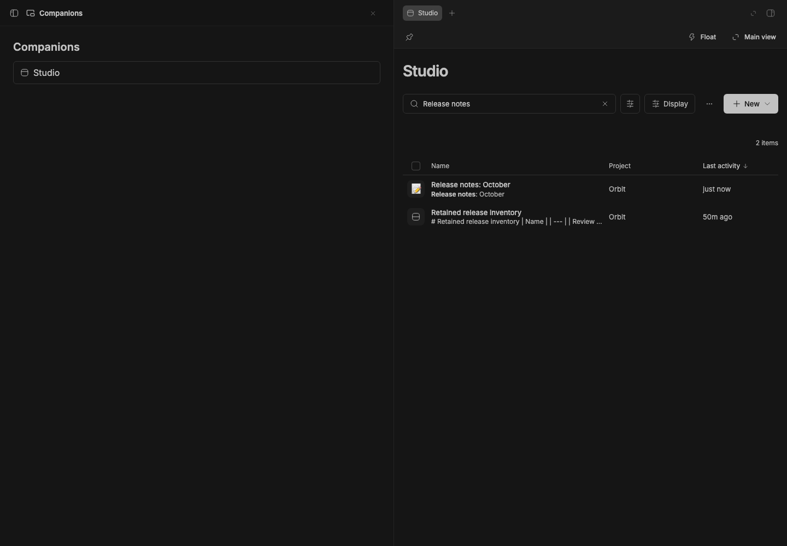
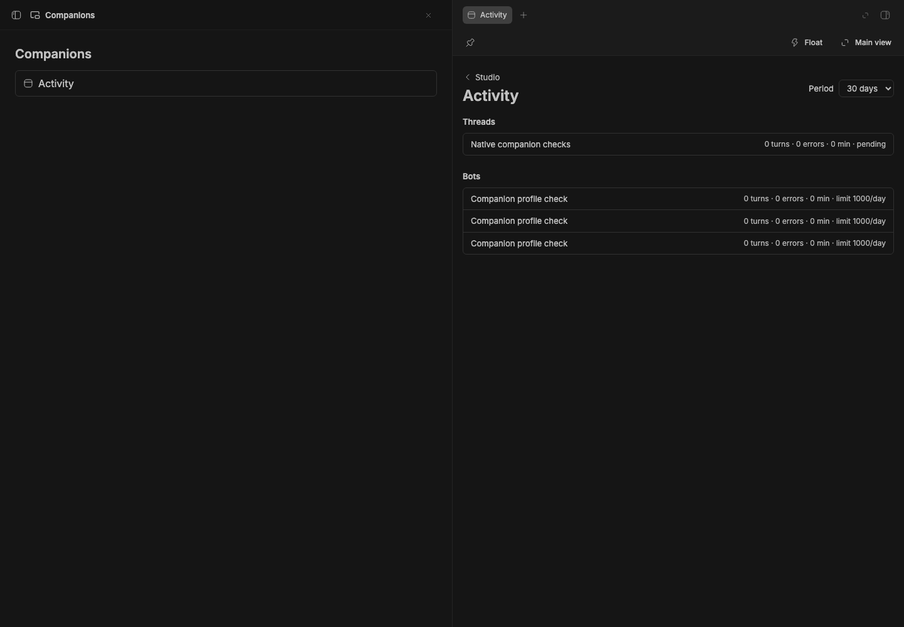

# Studio

> **Studio** is the core of **BB Studio**, a suite of plugins for writing, talking, drawing, running bot teams, and keeping what your agents make. See the [suite overview](../../README.md).

Studio opens on the collection: everything the Studio add-ons make, including pages, Talk
recordings and dictations, drawings, and saved artifacts. Search across all of them, filter by
kind, project and tag, and hand any of them to an agent. Spaces gather projects and
threads into one place, each with an optional lead thread.

## Staged preview


Captured from a staged BB (`node scripts/staged-bb.mjs start`): the Studio
collection as a list, with search and compact Space and Kind menus above it.
Project, Tags and Status are available under **More filters**. The rows show
a paused Talk recording, a drawing and three Orbit pages.


Selected filters appear below search, each with a remove button and an explicit
Include/Exclude menu. Clearing search keeps the filters; **Clear filters** keeps
the search text. **Save view** remembers the query, and **Views** appears once a
view exists. Query syntax such as `kind:page` still completes in search.


The same controls work at phone width. Both captures check menu selection,
a stored plural filter, text search, exclusion, project filtering, and saving
and reopening a view.


The New menu stays open to every available kind with a Pages filter active.
The capture checks that Drawings and Pages filters offer the same menu as the
unfiltered collection.


The **+** beside Studio opens a menu of the installed add-ons' creation actions.
The staged capture checks keyboard opening, creates a page in the open thread's
project, and checks that the plus stays visible while its menu is open.


Studio search (Cmd/Ctrl+Shift+K) over the same staged project, searching
"offline sync": an HTML artifact and two pages match on their title or
content, each showing the matching text with the match in bold.

## What you get

The collection header's **Move** menu offers **Float this** and **Open in
split**. Companion controls return it to the main view or, on a host with
native companion support, move it to the right workbench.



The isolated transfer check keeps the same search input and its "Release
notes" query through Float, workbench, main, Float and workbench. The
[stable capture](assets/companion-transfers-stable.png) checks Float/main
round trips with the same input and visible seeded release notes.

The same checks pass the legacy `/collection` address and Activity with its
original **30 days** selector.
Activity now offers Move; the legacy address keeps its own target so moving
it carries the existing search input.



See the [stable Activity](assets/studio-activity-companion-transfers-stable.png),
[stable legacy collection](assets/studio-collection-companion-transfers-stable.png)
and [native legacy collection](assets/studio-collection-companion-transfers-native.png).


- **Activity** (Studio's **…** menu) shows measured thread turns, duration and
  failures, Teams bot usage and configured limits, and recent Studio changes.
  Choose 1, 7 or 30 days. The `home` RPC returns this data, plus what needs
  you (pending approvals and questions, and unresolved comment replies or
  mentions), active threads and bots, recent items and today's automations,
  for other clients such as the iOS app's Today view.
- **One collection** (sidebar → Studio): every add-on's items in one list,
  with search over titles and content, filters by kind, project, space and
  tag, and an Archived view. **Display** groups the list by kind, project,
  space or tag (collapsible, and an item in two spaces shows in both) and
  sorts it by name, kind, project, created or last activity, either way; both
  choices are remembered. The column you group by drops out, and a Spaces
  column appears once items belong to spaces. Drawings show thumbnails;
  recordings show their length and word count. Background kinds, such as Talk's dictations, stay
  out of All and Home; the Kind menu and search still show them.
- **Search from anywhere.** Cmd/Ctrl+Shift+K (or **Studio: Search everything**
  in the command palette, Cmd/Ctrl+Shift+P) opens a quick-open box over any
  page. Studio indexes titles and text from current add-ons, then searches BB threads live. The palette also has recent items and commands for creating items, opening Studio, handing work to an agent and opening threads. Titles match as you type; each add-on also searches its content —
  page text, transcripts, drawing text, artifact files, table rows — and the row shows the text that matched. With nothing typed
  it lists recently changed items. ↑↓ and ↵ open one.
- **Tags** group items across add-ons: a page, a drawing and a table can all
  be tagged "Launch". Tag from an item's ⋯ menu or the selection bar, filter
  by tag (or Untagged) from the tag menu, and click a chip to filter by it.
  The tag menu also renames and deletes the active tag.
- **Spaces are meta-projects.** Each BB project belongs to one space, and
  items and threads follow their project; projects nobody filed, and items
  with no project, are in the default space, Personal. A new space gets its
  own catch-all project under `~/Spaces`, where its new threads and items go.
  A thread can also be added to a space by itself, which moves it there.
  A space can have a lead: one of its threads, which a Heartbeat wakes on a
  schedule (see [`docs/spaces.md`](../../docs/spaces.md)). Nothing is made
  for a space but its folder. Deleting a space hands its projects and threads
  back to Personal.
- **Shared actions**: select items (shift-click for a range) to start a
  **New thread** that mentions them, move them to a project, archive, or
  delete. Actions an add-on defines, like Talk's "Copy transcripts" or Draw's
  "Copy text", appear when the selection is all that kind.
- **Tabs in the sidebar.** With [Studio Sidebar](../bb-studio-sidebar)
  as the thread list, each Studio item you open gets a tab in a Studio section
  above your threads. × or middle-click closes a tab; closing the one on
  screen opens the next. The section's ⋯ menu groups tabs by app, sorts them,
  and closes other or all tabs. Studio keeps the tabs, so every window shows
  the same ones, and closes tabs of deleted items.
- **New ▾** creates any kind an installed add-on offers, in the current
  project. It always opens the full menu, even with a kind filter active.
- **Takes over from the add-ons.** With Studio installed, each add-on's own
  collection hands over to Studio filtered to its kind, and item pages lead
  back to Studio. Studio's ⋯ menu can hide the add-ons' sidebar rows, so
  Studio is the only entry. Without Studio, each add-on works on its own.
- **The BB Studio theme**: the app icon's colors for all of BB, light and
  dark. Teal-black and pale-teal surfaces, a coral accent, teal file paths.
  Pick **BB Studio** in Settings → Appearance, or run `bb theme set
  plugin:studio:bb-studio`.
- **For agents**: the `studio_list_items`, `studio_tag_items` and
  `studio_delete_items` tools, the
  `bb studio` CLI, and a `studio` skill.

```sh
bb studio list [--all] [--kind <kind>] [--query <text>] [--tag <tag>] [--json]
bb studio tags
bb studio providers
bb studio reindex
```

## How it works

- Add-ons implement the Studio provider contract (`studio_describe`,
  `studio_list`, `studio_search`, `studio_create`, `studio_move`,
  `studio_archive`, `studio_delete`, `studio_action`) from
  [`@bb-studio/kit`](../bb-studio-kit), and publish them for RPC discovery.
  Studio finds them with `bb.sdk.plugins.experimental_discoverRpc` and calls
  them with `callRpc`. Any plugin can join the suite this way.
- Studio keeps an FTS5 index of item titles and `studio_read` text. `studio_changed` updates changed items; `bb studio reindex` rebuilds the index. The `searchAll` RPC returns ranked items and thread matches with snippet ranges.
- An add-on tells Studio when its items change (`studio_changed`); Studio
  relays that over realtime and the open collection refetches.
- A stopped or failing add-on shows up as unavailable instead of breaking the
  collection.
- Studio stores tags, open tabs, saved views and spaces itself, keyed by
  `<plugin id>:<item id>` where items are involved, so add-ons don't need to
  know about them. Tags on items an add-on no longer lists are
  dropped. Each add-on owns its data, editors, tools, CLI and mentions.

See [`docs/studio.md`](../../docs/studio.md) for the design.

## Development

```sh
pnpm typecheck
pnpm test
bb plugin build .
```

`@bb-studio/kit` is a `file:../bb-studio-kit` dependency. Keep
`package-lock.json` current (regenerate it in a clean clone, not the pnpm
workspace), because BB's Git install runs `npm install` from it.

## Templates and export

Pages and drawings can be saved as templates from an item's menu. The New menu lists those templates.

The hub offers `duplicate`, `setTemplate`, `instantiateTemplate`, `templates`, `exportItem`, and `exportBulk` RPCs. `exportBulk` returns a base64 ZIP containing the provider's files. Individual exports use the item's menu. Template fields use `{{name}}` style variables; unknown variables remain visible.
