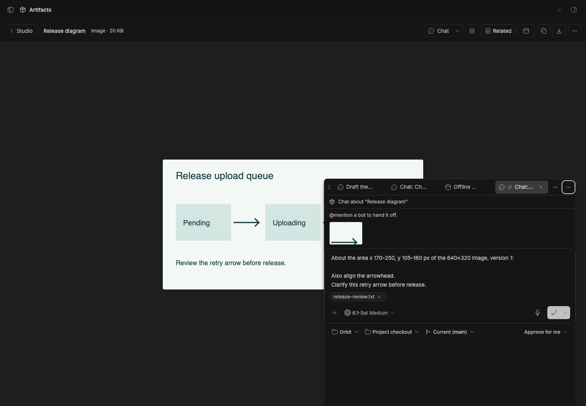
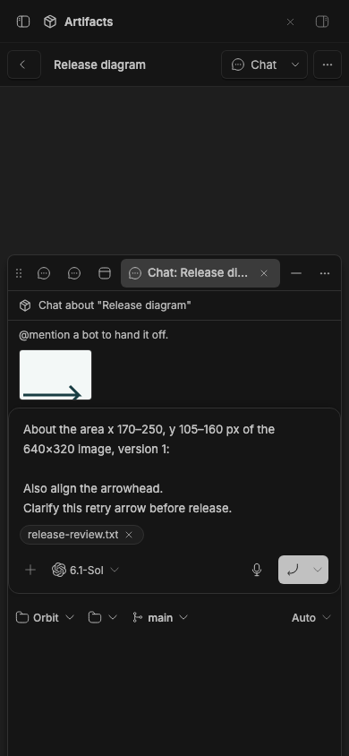
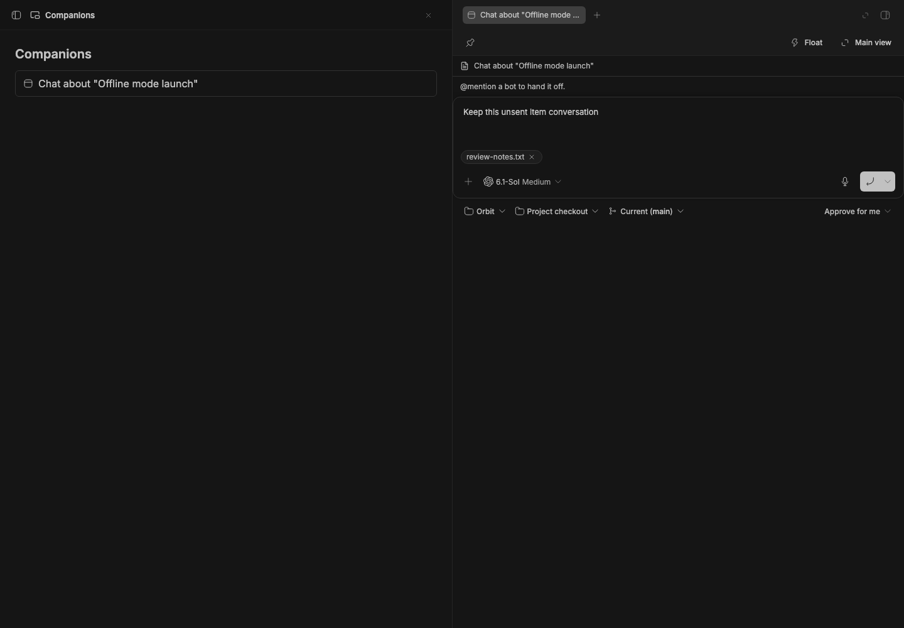
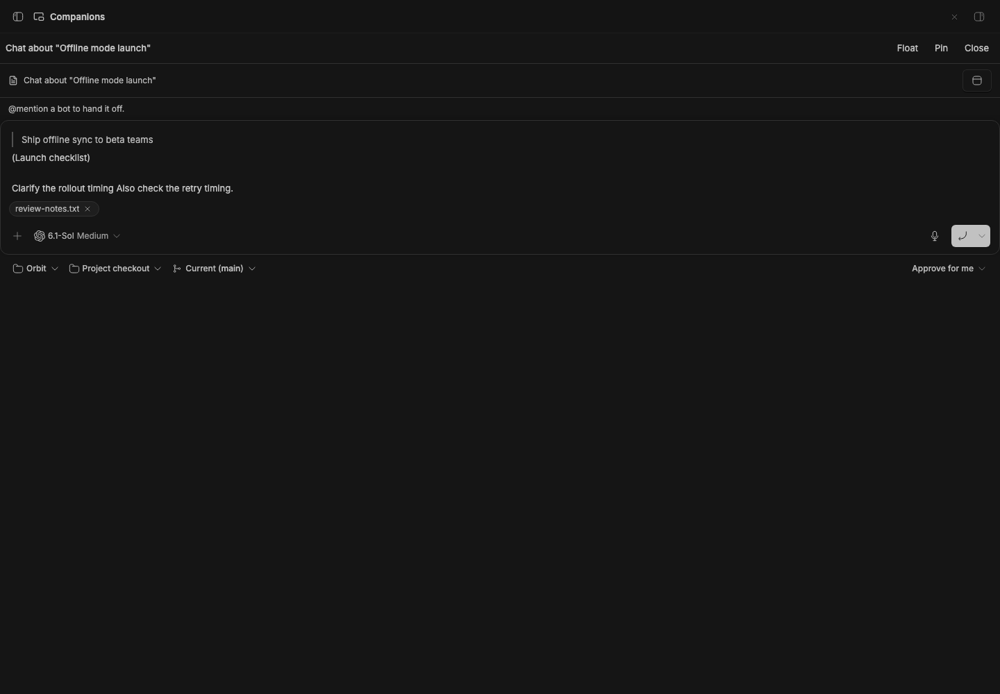

# Studio Chat

Built into the `studio` plugin.

> **Studio Chat** is part of **BB Studio**, a suite of plugins for writing, talking, drawing, tracking tasks, running bot teams, and keeping what your agents make: [Studio](../../../../bb-studio), [Studio Pages](../../../../bb-studio-pages), [Studio Talk](../../../../bb-studio-talk), [Studio Draw](../../../../bb-studio-draw), [Studio Artifacts](../../../../bb-studio-artifacts), [Studio Tasks](../../../../bb-studio/src/modules/tasks), Studio Chat, and [Studio Teams](../../../../bb-studio-teams).

One **Chat** action in a Studio item's header opens its linked conversation
or a new composer. Its menu lets you start another conversation, choose an
existing one, or unlink it. Chat and quotes target the chosen item, including
items inside [Float](../../../../bb-studio-float) tabs while the main pane shows
something else.

## Staged preview



Captured from stable BB 0.45.0 with the suite installed from pushed Git
sources. A cropped area of "Release diagram" opens in a retained chat tab.
Its image, edited prompt, and attached release review survive a browser
reload. The live capture also checks conversation selection and reuse,
two independent item drafts, exact composer and attachment retention while
switching and folding tabs, and companion-item targeting during real sidebar
navigation. No agent runs.



The same recovered crop, edited prompt, and attachment fit at 390 by 844
pixels. Resizing keeps the exact native composer mounted; the capture checks
the image and every visible composer button's bounds and click target.
Run `BB_CAPTURE_CHAT_COMPACT=1 BB_CAPTURE_ONLY=studio-chat node scripts/capture-plugin-screenshots.mjs --plugin studio-chat` after sourcing staged BB's `capture.env`.

## What you get

Main-view conversation drafts have the shared **Move** menu. Moving an item
chat carries its existing composer and attachment into Float. Companion
controls return it to the main view or the native right workbench when the
host supports it.



The live check preserves the original prompt editor, file input, attachment
control, unsent wording and encoded item route through every placement. The
[stable capture](assets/companion-transfers-stable.png) verifies the same
draft and attachment through two Float/main round trips. No message is sent.



Plain and saved-quote routes pass the same matrix, retaining the original
prompt, file input and one selected attachment control. The quote keeps the
source text, location, note and appended unsent wording after reopening from
its saved route. See [plain/main](assets/chat-plain-companion-transfers-stable.png),
[plain/workbench](assets/chat-plain-companion-transfers-native.png) and
[quote/workbench](assets/chat-quote-companion-transfers-native.png).


- **Chat.** Continue the item's linked conversation or start one in its
  project. New messages carry an item pill that tells the agent which tools
  read and edit it.
- **Conversation options.** Choose a thread from recent conversations or
  search. Start another without changing the current link until you send.
  Unlink prevents the thread that created the item from standing in.
- **Quotes.** Selected artifact text or an image area goes to the linked
  conversation and waits behind its active turn. Without a link, the item's
  composer opens with the quote.
- **Correct context across panes.** A composer or picker stays bound to its
  item when you navigate. It uses that item's title, project, and link.
- **Retained new chats.** New-conversation composers use the shared companion
  tabs. Reopening an item's draft focuses that tab; switching, folding, and
  changing placement keeps its native composer. Quote drafts save their
  passage and image locally for restoration. Without Float, the composer
  remains available in a compact overlay.
- **Existing conversations.** Page chats still go through Pages and remain
  in its Chats menu. Threads that created other items can serve as their
  linked conversation until you choose one.
- **Viewing chip.** Float thread tabs name the Studio item in the main pane.
  That label does not add it to the conversation automatically.
- **Saved views.** Teams views contain their own chat. Chat leaves their
  composer unobstructed and does not discover another item conversation.

## Limits

The shared companion controller prefers BB's native right workbench when
the host supports retained companion views. BB's host implementation and its
live release verification remain in the [full-suite delivery work](../../../../../docs/unified-workbench.md).
Stable BB currently opens threads in Float, or in the main view without Float.
Without Studio Chat, Pages uses the same companion tabs with its own native
new-conversation composer.

On stable SDK 0.5.29, embedded `ThreadChat` does not scope `useComposer()` to
its thread. The Viewing chip only offers **Add to message** when the scope
matches. Type `@` in the thread to mention an item. Main-pane discovery
follows BB navigation and polls every 400ms as a fallback.

More in [docs/studio-chat.md](../../../../../docs/studio-chat.md).

## Develop

```sh
pnpm install
pnpm --filter @bb-studio/studio-chat test
pnpm --filter @bb-studio/studio-chat typecheck
bb plugin build packages/bb-studio
node scripts/staged-bb.mjs start --plugin studio-chat
```

Requires [Studio](../../../../bb-studio) to resolve item context. The item header and
shared host live in [the kit](../../../../bb-studio-kit/src/app/item-chat.ts).
