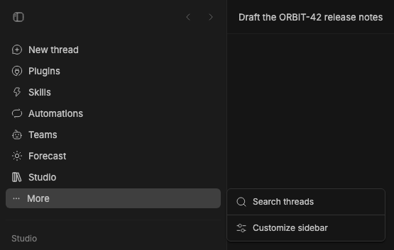

# Studio Navigation

This module retains the legacy navigation server integration and import identity.
The Office UI now registers both sidebar slots in `src/ui/office/` through
`moduleApp` gates. The superseded module UI and its vendored components have
been removed.

The server entry remains available for the legacy Navigation module import.

## Staged preview



This historical capture records the working module before the Office UI replaced
its slot registration. Current UI verification belongs to the Office sidebar.

## Development

```sh
pnpm --filter @bb-studio/studio typecheck
pnpm --filter @bb-studio/studio test
```

See [UPSTREAM.md](UPSTREAM.md) for retained source provenance and
[LICENSE](LICENSE) for its license.
