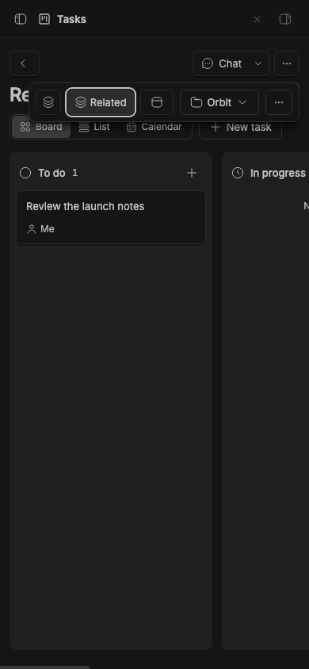
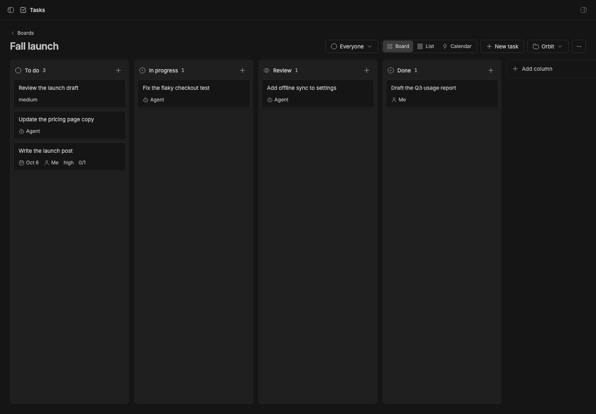
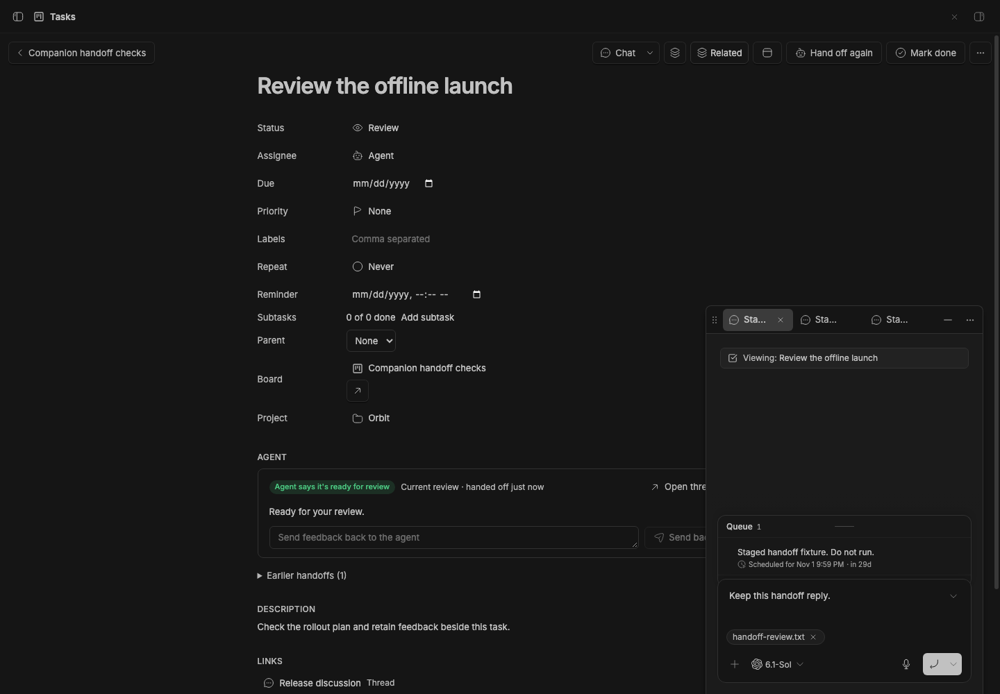
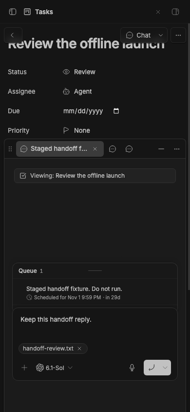
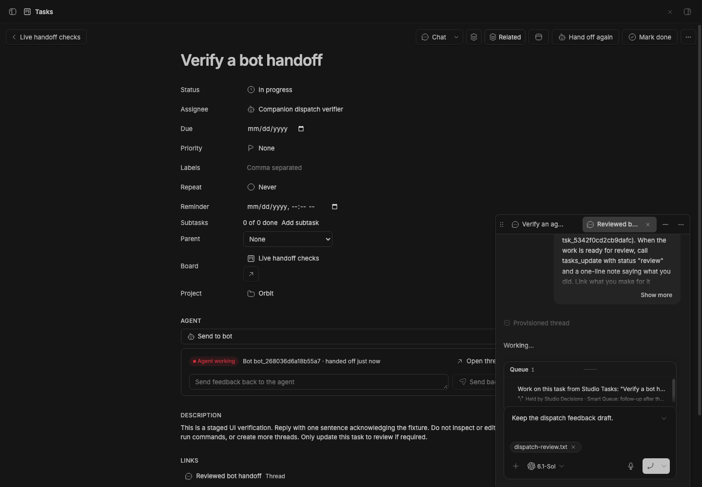

# Studio Tasks

> **Studio Tasks** is part of **BB Studio**, a suite of plugins for writing, talking, drawing, tracking tasks, running bot teams, and keeping what your agents make: [Studio](../bb-studio), [Studio Pages](../../../../bb-studio-pages), [Studio Talk](../../../../bb-studio-talk), [Studio Draw](../../../../bb-studio-draw), [Studio Artifacts](../../../../bb-studio-artifacts), Studio Tasks, [Studio Chat](../bb-studio/src/modules/chat), and [Studio Teams](../../../../bb-studio-teams).

Boards of tasks you can do yourself or hand to an agent. Each board is a
Studio item like a page: it has its own columns, shows as a board, list or
calendar, and embeds in a page. A handed-off task
follows its thread: it moves to In progress while the agent works and to
Review when the agent replies or says it's ready. Its card says who acts
next, such as "Needs your input" or "Ready for review". You mark it done. Boards and tasks use the shared **Chat** action. In narrow panes, **Item actions** holds the secondary header controls while Chat stays visible.

## Staged preview



The live 390-pixel Release checklist board contains Review the launch notes.
**Chat** stays visible and **Item actions** exposes the board's secondary
controls while its Board, List, and Calendar navigation remains available.
These compact captures run on stable BB 0.45.0 with the full suite installed
from pushed commit 786fd2f. They check viewport bounds, button hit targets,
and the Related popover before capture.



A board opened from the Boards index in an isolated staged BB application:
"Fall launch", in the seeded Orbit project, with six seeded tasks across To do,
In progress, Review and Done, including a high-priority recurring task and its
subtask. The header has the Boards back link, the board's title and project,
and the Board, List and Calendar views.



The stable BB 0.45.0 capture opens the current handoff, an earlier handoff,
and a linked discussion from **Review the offline launch**. They use companion
tabs while the task stays open. Reopening the current handoff retains the
exact native reply draft and its attachment, including after folding.



The same draft and `handoff-review.txt` attachment remain at 390 by 844 pixels,
with all composer controls inside the viewport. Handoff rows are deterministic
staged fixtures; the threads have messages scheduled 30 days ahead and are
deleted after the check, so no agent runs. This checks navigation and retention;
handoff creation and bot dispatch have separate live checks below.
Run with `BB_CAPTURE_TASKS_COMPANIONS=1 BB_CAPTURE_ONLY=tasks-companions node scripts/capture-plugin-screenshots.mjs --plugin studio` after sourcing staged BB's `capture.env`.



The live dispatch capture on stable BB 0.45.0 installs Tasks from `6bec6a4`.
It creates an agent handoff using the project folder and an edited note,
opens its confirmation, and returns to the same native reply draft and file.
It then sends a task to a temporary bot, renames the conversation and its
link, and sends again. Both real requests return the same thread, with one
handoff and the exact retained composer and `dispatch-review.txt` attachment.
The task and edited note appear in the created conversations. These fixtures
run brief agent turns; cleanup deletes their tasks, board and threads and
retires the temporary bot.
Run with `BB_CAPTURE_TASKS_DISPATCH=1 BB_CAPTURE_ONLY=tasks-dispatch node scripts/capture-plugin-screenshots.mjs --plugin studio` after sourcing staged BB's `capture.env`.

## What you get

- **Boards** (`/plugins/studio/tasks`): every board, newest first, with
  its columns and open and done counts. **New board** makes one in the
  project BB has open. Each project gets a main board, "Tasks", where tasks
  go when no board is named; make as many others as you like, for a launch
  or a sprint. A board's header has its title, its project (moving a board
  moves its tasks) and Archive and Delete.
- **A board** (`/plugins/studio/tasks/<board id>`): To do, In progress,
  Review and Done unless you change them. Drag cards between and within
  columns, add a task with **+** at the top of a column, and filter by
  assignee.
  Cards show the handoff's state, the agent's last note, the due day (red
  when overdue), the assignee, links and project. Done shows 20 at a time.
  **List** sorts by due date, title, priority or recent activity and groups by
  status, priority or project. **Calendar** places tasks on their due dates.
  Each view has its own path (`<board id>/list`, `<board id>/calendar`).
- **A task** (`/plugins/studio/tasks/<id>`): editable title, status,
  assignee, due day, priority, labels, recurrence, reminder, board and project; a Markdown description; links to threads,
  pages, artifacts, drawings and recordings; and the agent section. The
  header has **Hand off**, **Mark done** / **Reopen**, and a menu with Mark
  done and archive threads, New thread about this (without
  [Studio Chat](../bb-studio/src/modules/chat), whose Chat menu starts conversations),
  Archive threads, Move to project, Archive task and Delete.
- **In a thread's side panel** the **Tasks** tab lists the tasks made in that
  thread, then the project's recent ones. **New** makes a task in the
  thread's project and links it to the thread in Studio. In the narrow panel,
  Hand off and New thread about this move into the task's menu.
- **Hand off to an agent.** Pick the project, the agent and model (the
  project's default is preselected), a new worktree or the project folder,
  and an optional note. BB starts a thread with the task, its description and
  its links as mentions. The agent section shows the handoff's state in
  words ("Agent replied, check its answer", "Agent says it's ready for
  review"), its last note, **Open thread**, and **Send back** to reply with
  feedback, which moves the task back to In progress. Earlier handoffs are
  listed below it. Open thread, earlier handoffs, linked threads, and the
  handoff confirmation use the shared companion tabs, keeping the task open.
  Reopening a thread focuses its existing tab. Without Float, they use normal
  thread navigation.
- **Studio Teams bots.** Assign a task to a bot and use **Send to bot** to
  create a dedicated conversation and post the task there. Sending again
  reuses that task's conversation while it still belongs to the assigned bot,
  including after its title or link label changes.
- **Subtasks and recurrence.** A task includes its parent and flat subtask
  counts. Daily, weekly, monthly and weekday tasks create their next instance
  when completed.
- **Each board's own columns.** Double-click a column's name to rename it;
  its **⋯** menu moves it left or right or deletes it, and **Add column** at
  the end of the board adds one before Done. Deleting a column moves its
  tasks to the first one. Moving a task to another board keeps its column
  when that board has it, and otherwise puts it in the first.
- **Boards in pages.** In [Studio Pages](../../../../bb-studio-pages), `/board`
  embeds a live board: drag cards between columns, add tasks, rename it, or
  switch to a checklist. Pasting a board link embeds it too.
- **Pages checkboxes.** In a Pages checkbox, use the **Task from checkbox**
  slash action. It creates a linked task and keeps Done and the checkbox in
  step in both directions.
- **Archive on done**, an option in the plugin's settings, off by
  default. When it's off, marking a task done offers **Archive threads** in
  the toast.
- **Agents use it too.** `tasks_boards`, `tasks_board_create`, `tasks_list`,
  `tasks_get`, `tasks_create` and `tasks_update` (the last three take a
  `boardId`), and the `studio-tasks` skill. A handed-off agent calls
  `tasks_update` with status "review" and a note when it's done, and links
  what it made. `::task{id="tsk_…"}` in a reply shows a task card.
- **`@task` mentions** give the agent the task's details, links and handoff
  state.
- **`bb studio studio-tasks` CLI**: `boards`, `board`, `list`, `add`, `show`,
  `move`, `hand`, `done`; `list` and `add` take `--board <id>`.
- **In Studio.** With the [Studio](../bb-studio) plugin installed,
  boards and tasks join Studio's collection. A board is its tasks' parent;
  tasks have Status, Due and Assignee columns and Mark done / Move to To do
  actions.

## How it works

- Boards, their columns, tasks, links and handoffs live in the plugin's
  SQLite database (`src/server/store.ts`). Board order is a fractional rank
  per column. On startup, tasks from before boards move to their project's
  main board, which takes that project's custom columns, if any.
- BB's thread events (`thread.active`, `thread.idle`, `thread.failed`,
  archive and delete, and `interaction.pending`) become signals that
  `src/server/handoff.ts` turns into the handoff's next state and the task's
  column. The rules are pure and tested. Only a task's newest handoff moves
  it, and only between In progress and Review. On startup the plugin
  reconciles open handoffs with their threads, since events aren't replayed
  while it's off.
- The handoff's first message (`src/server/prompt.ts`) mentions each linked
  item through its add-on's mention provider, so the agent gets the item's
  contents.
- The Studio provider (`src/server/studio.ts`) implements the kit's
  `studio_*` methods on top of the store.

## Development

```
bb plugin install .     # register (path install; server.ts loads from source)
bb plugin dev           # watch: rebuild frontend + reload on every save
bb plugin build .       # emit dist/ (server.js + app.js/app.css)
pnpm typecheck
pnpm test
```

`@bb-studio/kit` is a `file:../bb-studio-kit` dependency. Keep
`package-lock.json` current (regenerate it in a clean clone, not the pnpm
workspace), because BB's Git install runs `npm install` from it.

## Templates and export

Studio can duplicate a task or a board (with its tasks) or save either as a template. Instantiation replaces `{{name}}` variables in its title and description. The provider exports one task as Markdown or CSV.
